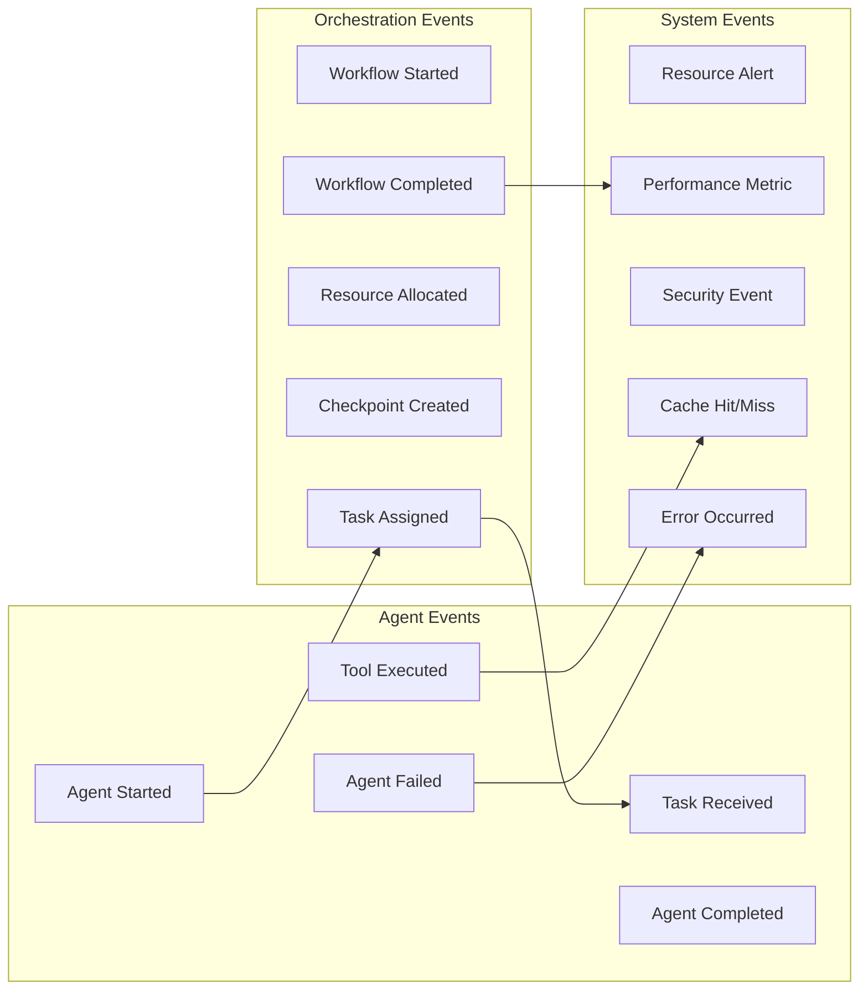
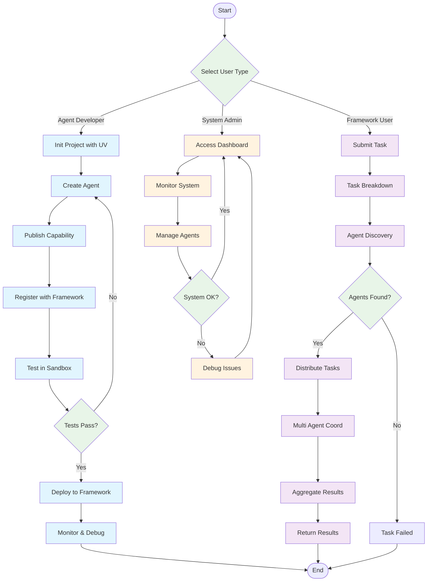
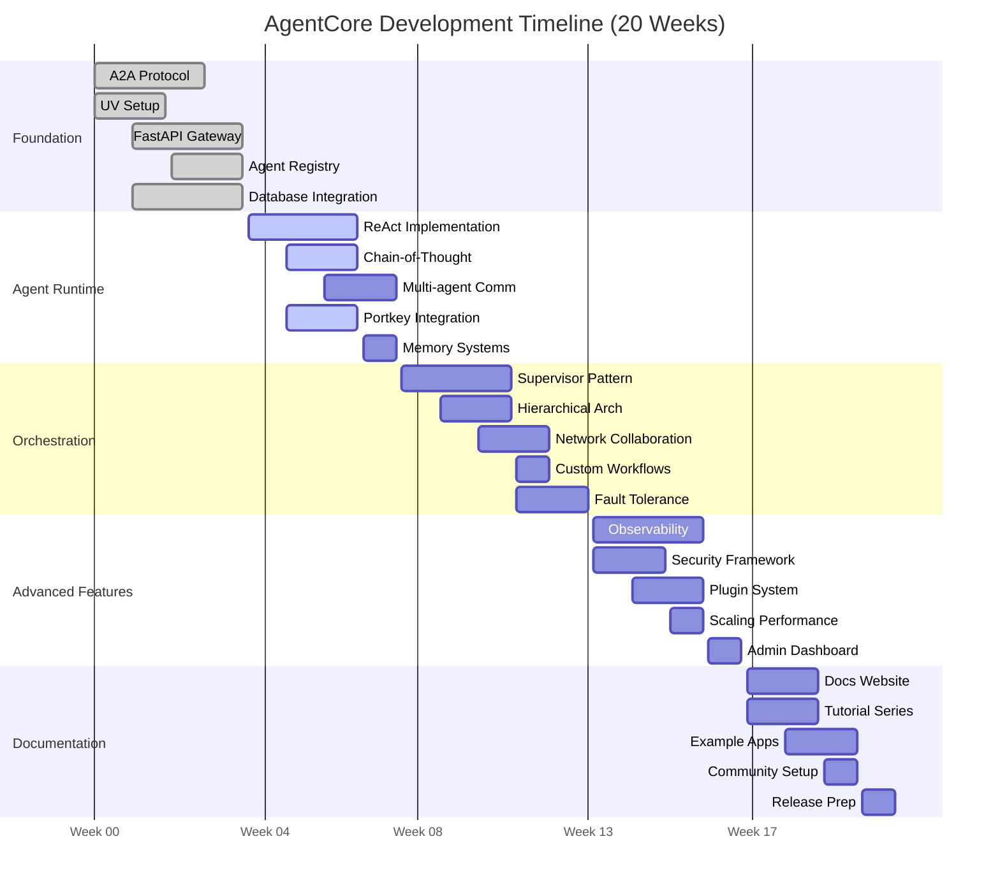

# AgentCore: Enterprise A2A Agent Orchestration Platform - Comprehensive Architecture & Development Plan

## Executive Summary

This document presents the comprehensive architecture and development plan for **AgentCore** - a world-class, production-ready agent orchestration platform built on Google's A2A (Agent2Agent) protocol. AgentCore combines cutting-edge AI optimization with enterprise-grade reliability to deliver the definitive platform for agentic AI workflows.

**Core Value Proposition:**

- **A2A Protocol Native**: First-class support for emerging agent communication standards with cross-platform interoperability
- **Production-First Architecture**: Enterprise-grade reliability with crash-proof execution, fault tolerance, and comprehensive observability
- **AI-Driven Optimization**: Built-in DSPy integration for systematic 20-30% performance improvements through evolutionary algorithms
- **Developer-Centric Experience**: Simplified APIs, hot-reloading development, and interactive debugging capabilities

## System Overview

**AgentCore** is the definitive enterprise-grade agent orchestration platform that revolutionizes agentic AI development and deployment. Built on a foundation of proven architectural patterns and cutting-edge optimization technologies, AgentCore delivers:

### Core Capabilities

- **Multi-Philosophy Agent Support**: Native ReAct, Chain-of-Thought, Multi-Agent Systems, and Autonomous Agent patterns
- **A2A Protocol Excellence**: Complete JSON-RPC 2.0 implementation with advanced agent discovery and fault-tolerant messaging
- **Production-Grade Infrastructure**: Crash-proof execution, stateful resumability, and comprehensive fault tolerance
- **AI-Driven Optimization**: Systematic agent improvement through DSPy integration and evolutionary algorithms
- **Enterprise Integration**: Security, compliance, multi-tenancy, and comprehensive observability

### Unique Competitive Advantages

- **Hybrid Orchestration**: Event-driven coordination with graph-based workflow definitions for optimal flexibility
- **Intelligent Caching**: Multi-level, content-aware caching delivering 50%+ LLM cost reduction
- **Decision Lineage**: Complete agent reasoning provenance beyond traditional data lineage
- **Cross-Platform Compatibility**: A2A + MCP protocol support for broader ecosystem integration

## Enhanced System Architecture

### Layered Architecture Overview

AgentCore employs a sophisticated 6-layer architecture designed for enterprise-scale agentic AI orchestration:

```mermaid
graph TB
    subgraph "External Integrations"
        LLM[LLM Providers<br/>via Portkey]
        APIs[External APIs<br/>& Services]
        Files[File Systems<br/>& Storage]
        Monitor[Monitoring &<br/>Observability]
        MCP[MCP Protocol<br/>Services]
    end

    subgraph "Intelligence Layer"
        DSPy[DSPy Optimization<br/>Engine]
        Evolution[Self-Evolution<br/>Manager]
        ResourcePredict[Resource<br/>Predictor]
        QualityAssess[Quality<br/>Assessor]
        CacheIntel[Cache<br/>Intelligence]
    end

    subgraph "Experience Layer"
        DevAPI[Developer APIs<br/>& SDK]
        HotReload[Hot-Reload<br/>System]
        InteractiveDebug[Interactive<br/>Debugging]
        CLITools[CLI Tools<br/>& Interface]
        PatternLib[Pattern<br/>Library]
    end

    subgraph "Enterprise Operations Layer"
        DecisionLineage[Decision Lineage<br/>Tracking]
        MultiTenant[Multi-Tenancy<br/>Manager]
        Security[Security &<br/>Compliance]
        Audit[Audit &<br/>Governance]
        Billing[Billing &<br/>Quotas]
    end

    subgraph "Enhanced Core Layer"
        Registry[Agent Registry &<br/>Discovery Service]
        A2AProtocol[Enhanced A2A Protocol<br/>JSON-RPC + Types]
        TaskMgmt[Task Management<br/>with Checkpointing]
        CommHub[Communication Hub<br/>Event-Driven]
        Orchestration[Hybrid Orchestration<br/>Event + Graph]
        AdvancedCache[Multi-Level<br/>Intelligent Cache]
    end

    subgraph "Infrastructure Layer"
        UV[UV Project<br/>Management]
        Redis[Redis Cluster<br/>+ Streams]
        Portkey[Portkey<br/>Gateway]
        FastAPI[FastAPI<br/>Gateway]
        PostgreSQL[PostgreSQL<br/>+ Vector DB]
        EventStore[Event Store<br/>+ Message Bus]
    end

    subgraph "Agent Runtime Layer"
        MultiAgent[Multi-Agent<br/>Coordination]
        Sandboxes[Secure Agent<br/>Sandboxes]
        ReAct[ReAct Agent<br/>Runtime]
        CoT[CoT Agent<br/>Runtime]
        Autonomous[Autonomous<br/>Agents]
        Tools[Tool Integration<br/>Layer]
    end

    %% Intelligence Layer Connections
    DSPy -.->|Optimization| Orchestration
    Evolution -.->|Improvements| Registry
    ResourcePredict -.->|Scheduling| TaskMgmt
    QualityAssess -.->|Assessment| DecisionLineage
    CacheIntel -.->|Strategy| AdvancedCache

    %% Experience Layer Connections
    DevAPI -.->|Development| A2AProtocol
    HotReload -.->|Live Updates| Tools
    InteractiveDebug -.->|Debugging| Sandboxes
    CLITools -.->|Management| Registry
    PatternLib -.->|Patterns| Orchestration

    %% Enterprise Connections
    DecisionLineage -.->|Provenance| CommHub
    MultiTenant -.->|Isolation| Security
    Security -.->|Auth/Authz| A2AProtocol
    Audit -.->|Compliance| DecisionLineage
    Billing -.->|Resource Tracking| TaskMgmt

    %% External connections
    LLM -.->|LLM Calls| Portkey
    APIs -.->|API Calls| FastAPI
    Files -.->|File I/O| FastAPI
    Monitor -.->|Metrics/Logs| PostgreSQL
    MCP -.->|MCP Protocol| CommHub

    %% Enhanced Infrastructure connections
    Portkey -.->|Caching| AdvancedCache
    FastAPI -.->|HTTP/WS| A2AProtocol
    PostgreSQL -.->|Persistence| TaskMgmt
    EventStore -.->|Events| CommHub
    Redis -.->|State/Cache| AdvancedCache

    %% Core layer connections
    Registry -.->|Discovery| Orchestration
    A2AProtocol -.->|Protocol| CommHub
    TaskMgmt -.->|Tasks| Orchestration
    CommHub -.->|Events| Orchestration
    Orchestration -.->|Execution| MultiAgent
    AdvancedCache -.->|Performance| Orchestration

    %% Runtime connections
    MultiAgent -.->|Coordination| Sandboxes
    Sandboxes -.->|Isolation| ReAct
    Sandboxes -.->|Isolation| CoT
    Sandboxes -.->|Isolation| Autonomous
    ReAct -.->|Actions| Tools
    CoT -.->|Actions| Tools
    Autonomous -.->|Actions| Tools
    Tools -.->|External| APIs

    %% Styling
    classDef external fill:#ffebee
    classDef intelligence fill:#e8f5e8
    classDef experience fill:#fff3e0
    classDef enterprise fill:#f3e5f5
    classDef core fill:#e3f2fd
    classDef infrastructure fill:#fce4ec
    classDef runtime fill:#f1f8e9

    class LLM,APIs,Files,Monitor,MCP external
    class DSPy,Evolution,ResourcePredict,QualityAssess,CacheIntel intelligence
    class DevAPI,HotReload,InteractiveDebug,CLITools,PatternLib experience
    class DecisionLineage,MultiTenant,Security,Audit,Billing enterprise
    class Registry,A2AProtocol,TaskMgmt,CommHub,Orchestration,AdvancedCache core
    class UV,Redis,Portkey,FastAPI,PostgreSQL,EventStore infrastructure
    class MultiAgent,Sandboxes,ReAct,CoT,Autonomous,Tools runtime
```



### Architecture Layer Descriptions

**Intelligence Layer**

- **DSPy Optimization Engine**: Systematic agent improvement using MIPROv2 and GEPA algorithms
- **Self-Evolution Manager**: Genetic algorithm-based agent population evolution
- **Resource Predictor**: ML-driven resource allocation and workload forecasting
- **Quality Assessor**: Real-time performance evaluation and fitness scoring
- **Cache Intelligence**: Semantic and content-aware caching strategy management

**Experience Layer**

- **Developer APIs & SDK**: Simplified, intuitive interfaces for agent development
- **Hot-Reload System**: Live code updates without system restarts
- **Interactive Debugging**: Step-through agent execution with decision replay
- **CLI Tools & Interface**: Comprehensive command-line management utilities
- **Pattern Library**: Pre-built orchestration patterns (Supervisor, Handoff, Swarm)

**Enterprise Operations Layer**

- **Decision Lineage Tracking**: Complete agent reasoning provenance and optimization feedback
- **Multi-Tenancy Manager**: Domain isolation, resource quotas, and tenant management
- **Security & Compliance**: JWT auth, RBAC, encryption, audit trails
- **Audit & Governance**: GDPR, SOC2 compliance with automated reporting
- **Billing & Quotas**: Resource tracking, cost allocation, and usage monitoring

**Enhanced Core Layer**

- **Enhanced A2A Protocol**: Extended JSON-RPC with advanced type system and cross-platform support
- **Task Management with Checkpointing**: Crash-proof execution with stateful recovery
- **Communication Hub**: Event-driven messaging with guaranteed delivery
- **Hybrid Orchestration**: Event streaming + graph-based workflow coordination
- **Multi-Level Intelligent Cache**: Hierarchical, semantic, and content-aware caching

**Infrastructure Layer**

- **UV Project Management**: Lightning-fast dependency management and tooling
- **Redis Cluster + Streams**: Distributed caching and real-time event streaming
- **Portkey Gateway**: Unified LLM orchestration with routing and observability
- **FastAPI Gateway**: High-performance async API framework
- **PostgreSQL + Vector DB**: Relational and vector data storage
- **Event Store + Message Bus**: Reliable event sourcing and message delivery

**Agent Runtime Layer**

- **Multi-Agent Coordination**: Cross-agent communication and workflow management
- **Secure Agent Sandboxes**: Isolated execution environments with resource constraints
- **Philosophy Runtimes**: Native ReAct, Chain-of-Thought, and Autonomous agent support
- **Tool Integration Layer**: Unified interface for external tools and services

## Hybrid Orchestration Architecture

AgentCore introduces a revolutionary hybrid orchestration model that combines the flexibility of event-driven architectures with the predictability of graph-based workflows.

### Event-Driven Coordination

**Core Principles:**

- **Asynchronous Communication**: Non-blocking agent interactions through event streams
- **Loose Coupling**: Agents communicate through well-defined event contracts
- **Dynamic Scalability**: Event consumers can be added/removed without system changes
- **Fault Isolation**: Individual agent failures don't cascade through the system

**Event Types:**



### Graph-Based Workflow Definition

**Workflow Definition Language:**

```python
# AgentCore Workflow Definition
from agentcore.workflows import WorkflowBuilder, TaskNode, DecisionNode

builder = WorkflowBuilder("research_workflow")

# Define workflow graph
research_task = TaskNode("research_agent", capabilities=["web_search", "analysis"])
analysis_task = TaskNode("analysis_agent", capabilities=["data_processing"])
synthesis_task = TaskNode("synthesis_agent", capabilities=["report_generation"])

quality_check = DecisionNode("quality_gate",
                            condition="quality_score > 0.8",
                            pass_to=synthesis_task,
                            fail_to=research_task)

# Build execution graph
workflow = builder \
    .start_with(research_task) \
    .then(analysis_task) \
    .then(quality_check) \
    .end_with(synthesis_task) \
    .build()

# Execute with event-driven coordination
result = await workflow.execute_async(
    input_data={"query": "Latest AI developments"},
    optimization={"dspy_enabled": True}
)
```

### Fault Tolerance Patterns

**Circuit Breaker Pattern:**

```python
class AgentCircuitBreaker:
    def __init__(self, failure_threshold=5, timeout=60):
        self.failure_count = 0
        self.failure_threshold = failure_threshold
        self.timeout = timeout
        self.last_failure_time = None
        self.state = "CLOSED"  # CLOSED, OPEN, HALF_OPEN

    async def execute_agent_task(self, agent, task):
        if self.state == "OPEN":
            if time.time() - self.last_failure_time > self.timeout:
                self.state = "HALF_OPEN"
            else:
                raise CircuitBreakerOpenError("Agent circuit breaker is open")

        try:
            result = await agent.execute(task)
            if self.state == "HALF_OPEN":
                self.state = "CLOSED"
                self.failure_count = 0
            return result
        except Exception as e:
            self.failure_count += 1
            if self.failure_count >= self.failure_threshold:
                self.state = "OPEN"
                self.last_failure_time = time.time()
            raise e
```

**Saga Pattern for Long-Running Workflows:**

```python
class WorkflowSaga:
    def __init__(self, workflow_id):
        self.workflow_id = workflow_id
        self.completed_steps = []
        self.compensation_actions = []

    async def execute_step(self, step, compensation_fn):
        try:
            result = await step.execute()
            self.completed_steps.append((step, result))
            self.compensation_actions.append(compensation_fn)
            return result
        except Exception as e:
            await self.compensate()
            raise WorkflowFailedException(f"Workflow {self.workflow_id} failed at step {step.name}")

    async def compensate(self):
        for compensation_fn in reversed(self.compensation_actions):
            try:
                await compensation_fn()
            except Exception as comp_error:
                logger.error(f"Compensation failed: {comp_error}")
```

### CQRS (Command Query Responsibility Segregation)

**Command Side (Write Operations):**

```python
class AgentCommandHandler:
    def __init__(self, event_store, command_validators):
        self.event_store = event_store
        self.validators = command_validators

    async def handle_create_agent(self, command: CreateAgentCommand):
        # Validate command
        await self.validators['create_agent'].validate(command)

        # Create events
        events = [
            AgentCreatedEvent(
                agent_id=command.agent_id,
                agent_type=command.agent_type,
                configuration=command.configuration
            ),
            AgentRegisteredEvent(
                agent_id=command.agent_id,
                capabilities=command.capabilities
            )
        ]

        # Store events
        await self.event_store.save_events(command.agent_id, events)

        # Publish events for read model updates
        for event in events:
            await self.event_publisher.publish(event)
```

**Query Side (Read Operations):**

```python
class AgentQueryHandler:
    def __init__(self, read_model_store):
        self.read_model = read_model_store

    async def get_agent_performance_metrics(self, agent_id: str) -> AgentMetrics:
        return await self.read_model.get_agent_metrics(agent_id)

    async def search_agents_by_capability(self, capabilities: List[str]) -> List[Agent]:
        return await self.read_model.search_agents(
            filters={'capabilities': {'$in': capabilities}}
        )

    async def get_workflow_execution_history(self, workflow_id: str) -> WorkflowHistory:
        return await self.read_model.get_workflow_history(workflow_id)
```

## DSPy AI Optimization Framework

AgentCore integrates DSPy (Declarative Self-improving Python) as a core optimization engine, delivering systematic 20-30% performance improvements through automated agent enhancement.

### DSPy Integration Architecture

**Core Components:**

- **Optimization Engine**: MIPROv2 and GEPA algorithms for systematic prompt improvement
- **Self-Evolution Manager**: Genetic algorithm-based agent population evolution
- **Quality Assessment**: LLM-as-judge for automated fitness evaluation
- **Performance Tracking**: Continuous monitoring and adaptation based on metrics

```python
# AgentCore DSPy Integration
from agentcore.optimization import DSPyOptimizer, EvolutionaryAgentManager
import dspy

class OptimizedAgentWorkflow:
    def __init__(self, workflow_definition, optimization_config):
        self.workflow = workflow_definition
        self.optimizer = DSPyOptimizer(config=optimization_config)
        self.evolution_manager = EvolutionaryAgentManager()

    async def execute_with_optimization(self, input_data, eval_examples):
        # Convert workflow to DSPy program
        dspy_program = self._convert_to_dspy(self.workflow)

        # Optimize using MIPROv2
        optimized_program = await self.optimizer.optimize(
            program=dspy_program,
            trainset=eval_examples,
            metric=self._quality_metric,
            max_bootstrapped_demos=4,
            max_labeled_demos=16
        )

        # Execute optimized workflow
        result = await optimized_program.execute(input_data)

        # Store performance data for evolution
        await self.evolution_manager.record_performance(
            workflow_id=self.workflow.id,
            performance_metrics=result.metrics,
            optimization_metadata=optimized_program.metadata
        )

        return result

# Agent Self-Evolution System
class EvolutionaryAgentPopulation:
    def __init__(self, base_agent_class, population_size=10):
        self.base_agent = base_agent_class
        self.population = []
        self.generation = 0
        self.fitness_history = []

    async def evolve_generation(self, evaluation_tasks):
        # Evaluate current population
        fitness_scores = await self._evaluate_population(evaluation_tasks)

        # Selection: Choose best performers
        elite_agents = self._selection(self.population, fitness_scores, elite_ratio=0.3)

        # Crossover: Combine best features
        offspring = await self._crossover(elite_agents)

        # Mutation: Introduce variations
        mutated_agents = self._mutation(offspring, mutation_rate=0.1)

        # Create new generation
        self.population = elite_agents + mutated_agents
        self.generation += 1

        # Track evolution progress
        self.fitness_history.append({
            'generation': self.generation,
            'avg_fitness': np.mean(fitness_scores),
            'max_fitness': np.max(fitness_scores),
            'diversity_score': self._calculate_diversity()
        })

        return self.population
```

### GEPA (Generalized Enhancement through Prompt Adaptation)

GEPA provides language-native optimization that outperforms traditional reinforcement learning approaches:

```python
class GEPAOptimizer:
    def __init__(self, reflection_model="gpt-4", improvement_model="claude-3-sonnet"):
        self.reflection_llm = dspy.LM(model=reflection_model)
        self.improvement_llm = dspy.LM(model=improvement_model)

    async def optimize_agent_prompts(self, agent, performance_data):
        # Reflection phase
        reflection_prompt = self._create_reflection_prompt(agent, performance_data)
        reflection_result = await self.reflection_llm.generate(reflection_prompt)

        # Identify improvement opportunities
        improvement_areas = self._parse_reflection(reflection_result)

        # Generate improved prompts
        improved_prompts = []
        for area in improvement_areas:
            improvement_prompt = self._create_improvement_prompt(agent, area)
            improved_prompt = await self.improvement_llm.generate(improvement_prompt)
            improved_prompts.append(improved_prompt)

        # Test improved prompts
        best_prompt = await self._evaluate_prompt_variants(
            original=agent.system_prompt,
            variants=improved_prompts,
            test_cases=performance_data.failure_cases
        )

        return best_prompt

    def _create_reflection_prompt(self, agent, performance_data):
        return f"""
        Analyze this agent's performance and identify areas for improvement:

        Agent Type: {agent.type}
        System Prompt: {agent.system_prompt}

        Performance Metrics:
        - Success Rate: {performance_data.success_rate}%
        - Average Quality Score: {performance_data.avg_quality}
        - Common Failure Patterns: {performance_data.failure_patterns}

        Recent Failures:
        {performance_data.failure_examples}

        Provide detailed analysis of:
        1. Prompt clarity and specificity issues
        2. Missing instructions or context
        3. Logical inconsistencies
        4. Improvement recommendations with specific examples
        """
```

### Multi-Agent Optimization Patterns

**Role-Specific Optimization:**

```python
class MultiAgentOptimizer:
    def __init__(self):
        self.role_optimizers = {
            'supervisor': SupervisorOptimizer(),
            'research': ResearchOptimizer(),
            'analysis': AnalysisOptimizer(),
            'synthesis': SynthesisOptimizer()
        }

    async def optimize_workflow(self, workflow, performance_history):
        optimized_agents = {}

        # Optimize each agent role independently
        for role, agent in workflow.agents.items():
            role_optimizer = self.role_optimizers[role]
            role_performance = self._extract_role_performance(performance_history, role)

            optimized_agent = await role_optimizer.optimize(
                agent=agent,
                performance_data=role_performance,
                workflow_context=workflow.context
            )
            optimized_agents[role] = optimized_agent

        # Cross-agent coordination optimization
        coordination_optimizer = CoordinationOptimizer()
        coordination_patterns = await coordination_optimizer.optimize(
            agents=optimized_agents,
            workflow_patterns=workflow.execution_patterns
        )

        return OptimizedWorkflow(
            agents=optimized_agents,
            coordination=coordination_patterns
        )

class SupervisorOptimizer(AgentOptimizer):
    def __init__(self):
        super().__init__()
        self.focus_areas = [
            'task_decomposition',
            'agent_selection',
            'quality_assessment',
            'result_synthesis'
        ]

    async def optimize(self, agent, performance_data, workflow_context):
        # Analyze supervisor-specific performance patterns
        delegation_effectiveness = self._analyze_delegation(performance_data)
        quality_gate_accuracy = self._analyze_quality_gates(performance_data)
        synthesis_quality = self._analyze_synthesis(performance_data)

        # Generate supervisor-specific optimizations
        optimizations = await self._generate_optimizations(
            current_prompt=agent.system_prompt,
            performance_gaps=[
                delegation_effectiveness,
                quality_gate_accuracy,
                synthesis_quality
            ],
            best_practices=self._load_supervisor_patterns()
        )

        return self._apply_optimizations(agent, optimizations)
```

### Continuous Optimization Pipeline

**Real-Time Performance Monitoring:**

```python
class ContinuousOptimizationPipeline:
    def __init__(self, optimization_schedule="daily"):
        self.schedule = optimization_schedule
        self.performance_tracker = PerformanceTracker()
        self.optimization_queue = OptimizationQueue()

    async def monitor_and_optimize(self):
        """Continuous optimization loop"""
        while True:
            # Collect performance data
            performance_data = await self.performance_tracker.collect_recent_data()

            # Identify optimization opportunities
            optimization_candidates = self._identify_candidates(performance_data)

            # Queue optimizations by priority
            for candidate in optimization_candidates:
                priority = self._calculate_optimization_priority(candidate)
                await self.optimization_queue.enqueue(candidate, priority)

            # Process optimization queue
            await self._process_optimization_queue()

            # Wait for next cycle
            await asyncio.sleep(self._get_cycle_interval())

    async def _process_optimization_queue(self):
        while not self.optimization_queue.empty():
            optimization_task = await self.optimization_queue.dequeue()

            try:
                # Run optimization
                optimized_agent = await self._optimize_agent(optimization_task)

                # A/B test optimization
                ab_test_result = await self._ab_test_optimization(
                    original=optimization_task.agent,
                    optimized=optimized_agent,
                    test_duration=timedelta(hours=24)
                )

                # Deploy if improvement confirmed
                if ab_test_result.improvement_significant:
                    await self._deploy_optimization(optimized_agent)
                    self._log_optimization_success(optimization_task, ab_test_result)
                else:
                    self._log_optimization_failure(optimization_task, ab_test_result)

            except Exception as e:
                self._log_optimization_error(optimization_task, e)
```

### DSPy-Optimizable Component Ecosystem

**Rich Component Library with Systematic Optimization:**

```python
from agentcore.components import OptimizableComponent, ComponentRegistry
import dspy

class OptimizableWebSearchComponent(OptimizableComponent):
    """Web search component with DSPy optimization"""

    def __init__(self):
        super().__init__("web_search")
        self.search_signature = dspy.Signature("query, context -> structured_results")
        self.query_optimizer = dspy.ChainOfThought(self.search_signature)
        self.performance_tracker = ComponentPerformanceTracker()

    async def execute(self, query, context=None, agent_profile=None):
        # DSPy-optimized query processing
        optimization_context = self._create_optimization_context(query, context, agent_profile)
        optimized_query = await self.query_optimizer(
            query=query,
            context=optimization_context
        )

        # Execute search with optimized parameters
        search_results = await self._perform_search(
            optimized_query.query,
            search_params=optimized_query.search_parameters
        )

        # Learn from results for future optimization
        performance_metrics = await self._evaluate_search_quality(
            original_query=query,
            optimized_query=optimized_query.query,
            results=search_results
        )

        await self.performance_tracker.record_performance(
            component_id=self.id,
            agent_profile=agent_profile,
            metrics=performance_metrics
        )

        return ComponentResult(
            data=search_results,
            optimization_metadata=optimized_query.metadata,
            performance_score=performance_metrics.quality_score
        )

    async def optimize_for_agent(self, agent_context, performance_history):
        """Agent-specific component optimization"""
        # Create training examples from agent's usage patterns
        training_examples = await self._generate_training_examples(
            agent_context=agent_context,
            performance_history=performance_history
        )

        # Optimize component behavior for this agent's patterns
        optimized_module = await self.query_optimizer.optimize(
            trainset=training_examples,
            metric=self._search_quality_metric,
            agent_profile=agent_context.profile
        )

        return OptimizedWebSearchComponent(
            base_component=self,
            optimized_module=optimized_module,
            agent_profile=agent_context.profile
        )

class OptimizableDataProcessingComponent(OptimizableComponent):
    """Data processing component with DSPy-driven transformations"""

    def __init__(self):
        super().__init__("data_processing")
        self.transform_signature = dspy.Signature("data, requirements -> processed_data")
        self.transformation_optimizer = dspy.ChainOfThought(self.transform_signature)

    async def execute(self, data, requirements, processing_context=None):
        # Optimize data transformation strategy
        optimized_strategy = await self.transformation_optimizer(
            data=self._analyze_data_structure(data),
            requirements=requirements,
            context=processing_context
        )

        # Execute optimized transformation pipeline
        processed_data = await self._execute_transformation_pipeline(
            data=data,
            strategy=optimized_strategy.transformation_plan
        )

        return ComponentResult(
            data=processed_data,
            optimization_metadata=optimized_strategy.metadata
        )

class OptimizableLLMReasoningComponent(OptimizableComponent):
    """LLM reasoning component with systematic prompt optimization"""

    def __init__(self, llm_client):
        super().__init__("llm_reasoning")
        self.llm_client = llm_client
        self.reasoning_signature = dspy.Signature("problem, context -> reasoning_chain, solution")
        self.reasoning_optimizer = dspy.MIPRO(self.reasoning_signature)

    async def execute(self, problem, context=None, reasoning_depth="standard"):
        # Apply optimized reasoning chain
        optimized_reasoning = await self.reasoning_optimizer(
            problem=problem,
            context=context,
            depth=reasoning_depth
        )

        # Execute LLM reasoning with optimized prompts
        llm_response = await self.llm_client.generate(
            prompt=optimized_reasoning.prompt,
            model_config=optimized_reasoning.model_config
        )

        return ComponentResult(
            data={
                'reasoning_chain': optimized_reasoning.reasoning_chain,
                'solution': llm_response.solution,
                'confidence': llm_response.confidence
            },
            optimization_metadata=optimized_reasoning.metadata
        )

class A2AComponentRegistry:
    """Registry for DSPy-optimizable components with A2A integration"""

    def __init__(self, dspy_optimizer_config):
        self.components = ComponentRegistry()
        self.optimizer = DSPyOptimizer(dspy_optimizer_config)
        self.performance_tracker = ComponentPerformanceTracker()
        self.a2a_capability_mapper = A2ACapabilityMapper()

    async def get_optimized_component(self, component_name, agent_context, a2a_requirements=None):
        """Get component optimized for specific agent and A2A context"""
        base_component = self.components.get(component_name)

        # Check for agent-specific optimizations
        performance_history = await self.performance_tracker.get_agent_performance(
            agent_id=agent_context.agent_id,
            component_name=component_name
        )

        if performance_history and performance_history.should_optimize():
            optimized_component = await base_component.optimize_for_agent(
                agent_context, performance_history
            )
        else:
            optimized_component = base_component

        # Apply A2A compatibility enhancements
        if a2a_requirements:
            optimized_component = await self._enhance_for_a2a(
                optimized_component, a2a_requirements
            )

        return optimized_component

    def register_a2a_component(self, component, a2a_capabilities):
        """Register component with A2A capability metadata"""
        component.a2a_metadata = A2AComponentMetadata(
            capabilities=a2a_capabilities,
            input_types=component.supported_input_types,
            output_types=component.supported_output_types,
            optimization_metrics=component.optimization_metrics,
            interoperability_level=self._assess_interoperability(component)
        )

        # Map component capabilities to A2A protocol features
        a2a_mappings = self.a2a_capability_mapper.map_capabilities(
            component.capabilities, a2a_capabilities
        )
        component.a2a_mappings = a2a_mappings

        self.components.register(component)

    async def optimize_component_ecosystem(self, agent_network):
        """Optimize entire component ecosystem for A2A agent network"""
        optimization_plan = ComponentEcosystemOptimizationPlan()

        # Analyze component usage patterns across agent network
        usage_patterns = await self._analyze_network_component_usage(agent_network)

        # Identify cross-agent optimization opportunities
        cross_agent_optimizations = await self._identify_cross_agent_optimizations(
            usage_patterns, agent_network
        )

        # Execute ecosystem-wide optimizations
        for optimization in cross_agent_optimizations:
            optimized_components = await self._execute_ecosystem_optimization(optimization)
            optimization_plan.add_optimization(optimization, optimized_components)

        return optimization_plan

class ComponentPerformanceTracker:
    """Tracks component performance for optimization"""

    def __init__(self):
        self.performance_store = ComponentPerformanceStore()
        self.metrics_analyzer = ComponentMetricsAnalyzer()

    async def record_performance(self, component_id, agent_profile, metrics):
        """Record component performance for specific agent profile"""
        performance_record = ComponentPerformanceRecord(
            component_id=component_id,
            agent_profile=agent_profile,
            metrics=metrics,
            timestamp=datetime.utcnow(),
            context_hash=self._generate_context_hash(agent_profile)
        )

        await self.performance_store.store_record(performance_record)

        # Trigger optimization if performance degrades
        if await self._should_trigger_optimization(performance_record):
            await self._queue_component_optimization(component_id, agent_profile)

    async def get_agent_performance(self, agent_id, component_name):
        """Get performance history for specific agent-component combination"""
        records = await self.performance_store.get_records(
            agent_id=agent_id,
            component_name=component_name,
            limit=100
        )

        return AgentComponentPerformance(
            agent_id=agent_id,
            component_name=component_name,
            performance_history=records,
            trends=await self.metrics_analyzer.analyze_trends(records),
            optimization_recommendations=await self._generate_optimization_recommendations(records)
        )

# Built-in Component Library
BUILTIN_COMPONENTS = {
    'web_search': OptimizableWebSearchComponent,
    'data_processing': OptimizableDataProcessingComponent,
    'llm_reasoning': OptimizableLLMReasoningComponent,
    'file_operations': OptimizableFileOperationsComponent,
    'api_integration': OptimizableAPIIntegrationComponent,
    'database_query': OptimizableDatabaseComponent,
    'content_generation': OptimizableContentGenerationComponent,
    'analysis_pipeline': OptimizableAnalysisPipelineComponent,
    'workflow_coordination': OptimizableWorkflowCoordinationComponent,
    'quality_assessment': OptimizableQualityAssessmentComponent
}

def create_default_component_registry(dspy_config):
    """Create registry with default optimizable components"""
    registry = A2AComponentRegistry(dspy_config)

    for component_name, component_class in BUILTIN_COMPONENTS.items():
        component = component_class()
        a2a_capabilities = DEFAULT_A2A_CAPABILITIES[component_name]
        registry.register_a2a_component(component, a2a_capabilities)

    return registry
```

## A2A Framework User Workflow



## Production-Grade Reliability Framework

AgentCore is architected for enterprise production environments with comprehensive reliability, fault tolerance, and recovery mechanisms that ensure 99.9%+ uptime.

### Stateful Resumability & Crash-Proof Execution

**Content-Based Checkpointing:**

```python
class StatefulTaskManager:
    def __init__(self, checkpoint_store, content_hasher):
        self.checkpoint_store = checkpoint_store
        self.content_hasher = content_hasher

    async def execute_with_checkpointing(self, task, checkpointing_policy):
        task_id = task.id
        execution_state = ExecutionState(task_id)

        try:
            # Check for existing checkpoint
            checkpoint = await self.checkpoint_store.get_latest_checkpoint(task_id)
            if checkpoint:
                execution_state = checkpoint.execution_state
                logger.info(f"Resuming task {task_id} from checkpoint {checkpoint.checkpoint_id}")

            # Execute with periodic checkpointing
            async for step_result in self._execute_task_steps(task, execution_state):
                # Update execution state
                execution_state.completed_steps.append(step_result)
                execution_state.current_step += 1

                # Create checkpoint based on policy
                if self._should_checkpoint(execution_state, checkpointing_policy):
                    checkpoint_data = self._create_checkpoint_data(execution_state, step_result)
                    content_hash = self.content_hasher.hash(checkpoint_data)

                    checkpoint = Checkpoint(
                        task_id=task_id,
                        checkpoint_id=f"{task_id}_{execution_state.current_step}",
                        content_hash=content_hash,
                        execution_state=execution_state,
                        created_at=datetime.utcnow()
                    )

                    await self.checkpoint_store.save_checkpoint(checkpoint)

            return TaskResult(
                task_id=task_id,
                status="completed",
                result=execution_state.final_result,
                execution_metadata=execution_state.metadata
            )

        except Exception as e:
            # Save failure checkpoint for analysis
            failure_checkpoint = self._create_failure_checkpoint(execution_state, e)
            await self.checkpoint_store.save_checkpoint(failure_checkpoint)

            # Attempt recovery if configured
            if checkpointing_policy.auto_recovery_enabled:
                return await self._attempt_recovery(task, execution_state, e)
            else:
                raise TaskExecutionException(f"Task {task_id} failed: {e}")

    def _should_checkpoint(self, execution_state, policy):
        # Time-based checkpointing
        if policy.checkpoint_interval_seconds:
            time_since_last = (datetime.utcnow() - execution_state.last_checkpoint).seconds
            if time_since_last >= policy.checkpoint_interval_seconds:
                return True

        # Content-based checkpointing
        if policy.checkpoint_on_content_change:
            current_content_hash = self.content_hasher.hash(execution_state.current_data)
            if current_content_hash != execution_state.last_content_hash:
                return True

        # Step-based checkpointing
        if policy.checkpoint_every_n_steps:
            if execution_state.current_step % policy.checkpoint_every_n_steps == 0:
                return True

        return False
```

### Advanced Fault Tolerance Patterns

**Bulkhead Pattern for Resource Isolation:**

```python
class ResourceBulkhead:
    def __init__(self, name, max_concurrent_tasks, max_queue_size, timeout_seconds):
        self.name = name
        self.max_concurrent = max_concurrent_tasks
        self.max_queue_size = max_queue_size
        self.timeout = timeout_seconds
        self.active_tasks = 0
        self.task_queue = asyncio.Queue(maxsize=max_queue_size)
        self.semaphore = asyncio.Semaphore(max_concurrent_tasks)

    async def execute_with_bulkhead(self, task_fn, *args, **kwargs):
        # Check if bulkhead is available
        if self.task_queue.qsize() >= self.max_queue_size:
            raise BulkheadCapacityExceededError(f"Bulkhead {self.name} queue is full")

        # Queue task for execution
        task_future = asyncio.Future()
        await self.task_queue.put((task_fn, args, kwargs, task_future))

        # Process queue
        asyncio.create_task(self._process_queue())

        # Wait for result with timeout
        try:
            return await asyncio.wait_for(task_future, timeout=self.timeout)
        except asyncio.TimeoutError:
            raise BulkheadTimeoutError(f"Task timed out in bulkhead {self.name}")

    async def _process_queue(self):
        while not self.task_queue.empty():
            async with self.semaphore:
                try:
                    task_fn, args, kwargs, future = self.task_queue.get_nowait()
                    self.active_tasks += 1

                    result = await task_fn(*args, **kwargs)
                    future.set_result(result)

                except Exception as e:
                    future.set_exception(e)
                finally:
                    self.active_tasks -= 1
                    self.task_queue.task_done()

# Agent Workload-Aware Bulkhead Management
class AgentWorkloadBulkheadManager:
    def __init__(self):
        self.agent_bulkheads = {
            'llm_heavy_agents': AgentWorkloadBulkhead(
                name='llm_heavy_agents',
                max_concurrent=5,
                max_memory="8Gi",
                max_gpu_time="300s",
                timeout_seconds=120,
                resource_constraints={
                    'cpu_cores': 4,
                    'memory_limit': '8Gi',
                    'gpu_memory': '4Gi',
                    'llm_tokens_per_minute': 50000
                }
            ),
            'data_processing_agents': AgentWorkloadBulkhead(
                name='data_processing_agents',
                max_concurrent=20,
                max_memory="2Gi",
                max_cpu_cores=4,
                timeout_seconds=60,
                resource_constraints={
                    'cpu_cores': 4,
                    'memory_limit': '2Gi',
                    'storage_iops': 1000,
                    'network_bandwidth': '100Mbps'
                }
            ),
            'coordination_agents': AgentWorkloadBulkhead(
                name='coordination_agents',
                max_concurrent=50,
                max_memory="512Mi",
                priority="high",
                timeout_seconds=30,
                resource_constraints={
                    'cpu_cores': 1,
                    'memory_limit': '512Mi',
                    'latency_requirement': '10ms'
                }
            ),
            'autonomous_agents': AgentWorkloadBulkhead(
                name='autonomous_agents',
                max_concurrent=8,
                max_memory="4Gi",
                timeout_seconds=180,
                resource_constraints={
                    'cpu_cores': 6,
                    'memory_limit': '4Gi',
                    'persistent_storage': '1Gi',
                    'execution_time_limit': 3600  # 1 hour
                }
            )
        }
        self.workload_classifier = AgentWorkloadClassifier()

    async def execute_with_agent_bulkhead(self, agent, task):
        # Classify agent workload type
        workload_type = await self.workload_classifier.classify_agent_workload(agent, task)
        bulkhead = self.agent_bulkheads[workload_type]

        # Create resource-constrained execution context
        execution_context = await bulkhead.create_execution_context(agent, task)

        try:
            async with bulkhead.acquire_resources() as resources:
                # Apply resource constraints
                await self._apply_resource_constraints(execution_context, resources)

                # Execute agent task with monitoring
                return await self._execute_agent_task_with_monitoring(
                    agent=agent,
                    task=task,
                    context=execution_context,
                    resources=resources
                )
        except ResourceExhaustionError as e:
            # Handle resource exhaustion gracefully
            await self._handle_resource_exhaustion(agent, task, workload_type, e)
            raise AgentExecutionError(f"Resource exhaustion: {e}")

    async def _apply_resource_constraints(self, context, resources):
        """Apply workload-specific resource constraints"""
        constraints = context.bulkhead.resource_constraints

        # CPU constraints
        if 'cpu_cores' in constraints:
            await resources.limit_cpu_cores(constraints['cpu_cores'])

        # Memory constraints
        if 'memory_limit' in constraints:
            await resources.limit_memory(constraints['memory_limit'])

        # GPU constraints for LLM-heavy agents
        if 'gpu_memory' in constraints:
            await resources.limit_gpu_memory(constraints['gpu_memory'])

        # Network bandwidth constraints
        if 'network_bandwidth' in constraints:
            await resources.limit_network_bandwidth(constraints['network_bandwidth'])

class AgentWorkloadBulkhead(ResourceBulkhead):
    def __init__(self, name, max_concurrent, timeout_seconds, resource_constraints, **kwargs):
        super().__init__(name, max_concurrent, max_concurrent * 2, timeout_seconds)
        self.resource_constraints = resource_constraints
        self.performance_metrics = AgentPerformanceMetrics()
        self.adaptive_scaling = AdaptiveScalingManager()

    async def acquire_resources(self):
        """Acquire resources with workload-aware allocation"""
        return AgentResourceContext(
            bulkhead=self,
            resource_allocator=self.adaptive_scaling.get_allocator(),
            constraints=self.resource_constraints
        )

    async def create_execution_context(self, agent, task):
        """Create execution context with agent-specific optimizations"""
        return AgentExecutionContext(
            agent=agent,
            task=task,
            bulkhead=self,
            resource_profile=await self._analyze_resource_requirements(agent, task),
            optimization_settings=await self._get_optimization_settings(agent)
        )

class AgentWorkloadClassifier:
    """Intelligent agent workload classification"""

    def __init__(self):
        self.classification_models = {
            'capability_analyzer': CapabilityBasedClassifier(),
            'resource_predictor': ResourceRequirementPredictor(),
            'pattern_matcher': WorkloadPatternMatcher()
        }

    async def classify_agent_workload(self, agent, task):
        """Classify agent workload type based on capabilities and task requirements"""

        # Analyze agent capabilities
        capabilities = agent.get_capabilities()

        # LLM-heavy classification
        if self._has_llm_intensive_capabilities(capabilities):
            llm_intensity = await self._estimate_llm_usage(agent, task)
            if llm_intensity > 0.7:  # High LLM usage threshold
                return 'llm_heavy_agents'

        # Data processing classification
        if self._has_data_processing_capabilities(capabilities):
            data_volume = await self._estimate_data_volume(task)
            if data_volume > 100_000:  # Large data threshold
                return 'data_processing_agents'

        # Coordination agent classification
        if self._is_coordination_agent(capabilities):
            return 'coordination_agents'

        # Autonomous agent classification
        if self._is_autonomous_agent(capabilities, task):
            return 'autonomous_agents'

        # Default to coordination agents for unknown patterns
        return 'coordination_agents'

    def _has_llm_intensive_capabilities(self, capabilities):
        llm_capabilities = {'reasoning', 'natural_language_processing', 'text_generation',
                           'code_generation', 'analysis', 'creative_writing'}
        return len(llm_capabilities.intersection(set(capabilities))) >= 2

    def _has_data_processing_capabilities(self, capabilities):
        data_capabilities = {'data_transformation', 'file_processing', 'database_operations',
                           'batch_processing', 'stream_processing', 'etl'}
        return len(data_capabilities.intersection(set(capabilities))) >= 1

    def _is_coordination_agent(self, capabilities):
        coordination_capabilities = {'task_coordination', 'workflow_management',
                                   'agent_communication', 'resource_allocation'}
        return len(coordination_capabilities.intersection(set(capabilities))) >= 1

    def _is_autonomous_agent(self, capabilities, task):
        # Autonomous agents have broad capabilities and long-running tasks
        return (len(capabilities) >= 5 and
                hasattr(task, 'estimated_duration') and
                task.estimated_duration > 1800)  # 30+ minutes

# A2A Protocol Integration for Bulkheads
class A2AResourceManager:
    def __init__(self, bulkhead_manager):
        self.bulkhead_manager = bulkhead_manager
        self.a2a_resource_tracker = A2AResourceTracker()

    async def handle_a2a_message_with_bulkhead(self, a2a_message):
        """Route A2A messages through appropriate agent workload bulkheads"""

        # Discover target agent
        target_agent = await self._discover_a2a_agent(a2a_message.target_agent_id)

        # Create task from A2A message
        task = await self._create_task_from_a2a_message(a2a_message)

        # Execute through bulkhead with A2A protocol compliance
        try:
            result = await self.bulkhead_manager.execute_with_agent_bulkhead(
                agent=target_agent,
                task=task
            )

            # Track A2A resource usage
            await self.a2a_resource_tracker.record_usage(
                agent_id=target_agent.id,
                message_type=a2a_message.method,
                resources_used=result.resource_usage
            )

            return A2AResponse(
                id=a2a_message.id,
                result=result.data,
                resource_metadata=result.resource_usage
            )

        except AgentExecutionError as e:
            return A2AErrorResponse(
                id=a2a_message.id,
                error={'code': -32603, 'message': f'Agent execution failed: {e}'}
            )
```

### Multi-Level Intelligent Caching

**Hierarchical Cache Architecture:**

```python
class IntelligentCacheSystem:
    def __init__(self, cache_config):
        # L1: In-memory cache (fastest)
        self.l1_cache = LRUCache(maxsize=cache_config.l1_size)

        # L2: Redis cluster cache (fast, distributed)
        self.l2_cache = RedisClusterCache(cache_config.redis_config)

        # L3: Content-addressable storage (persistent)
        self.l3_cache = ContentAddressableCache(cache_config.storage_config)

        # Semantic similarity cache for LLM operations
        self.semantic_cache = SemanticCache(cache_config.embedding_config)

        self.cache_intelligence = CacheIntelligenceEngine()

    async def get(self, key, content_hint=None, semantic_query=None):
        # L1 Cache check
        if key in self.l1_cache:
            self.cache_intelligence.record_hit('l1', key)
            return self.l1_cache[key]

        # L2 Cache check
        l2_result = await self.l2_cache.get(key)
        if l2_result:
            # Promote to L1
            self.l1_cache[key] = l2_result
            self.cache_intelligence.record_hit('l2', key)
            return l2_result

        # Semantic cache check for LLM operations
        if semantic_query:
            semantic_result = await self.semantic_cache.find_similar(
                query=semantic_query,
                similarity_threshold=0.85
            )
            if semantic_result:
                # Cache in L1 and L2 for future exact matches
                await self.set(key, semantic_result.content, ttl=3600)
                self.cache_intelligence.record_hit('semantic', key)
                return semantic_result.content

        # L3 Content-addressable cache check
        if content_hint:
            content_hash = self._generate_content_hash(content_hint)
            l3_result = await self.l3_cache.get_by_content_hash(content_hash)
            if l3_result:
                # Promote to upper levels
                await self.set(key, l3_result, ttl=1800)
                self.cache_intelligence.record_hit('l3', key)
                return l3_result

        # Cache miss
        self.cache_intelligence.record_miss(key)
        return None

    async def set(self, key, value, ttl=None, content_metadata=None):
        # Set in all levels
        self.l1_cache[key] = value
        await self.l2_cache.set(key, value, ttl=ttl)

        # Content-addressable storage
        if content_metadata:
            content_hash = self._generate_content_hash(value)
            await self.l3_cache.set_by_content_hash(content_hash, value, content_metadata)

        # Semantic indexing for LLM content
        if self._is_llm_content(value):
            await self.semantic_cache.index(key, value)

        # Cache intelligence learning
        await self.cache_intelligence.learn_from_access_pattern(key, value, content_metadata)

class SemanticCache:
    def __init__(self, embedding_config):
        self.embedding_model = EmbeddingModel(embedding_config.model_name)
        self.vector_store = VectorStore(embedding_config.vector_db_config)
        self.similarity_threshold = embedding_config.similarity_threshold

    async def find_similar(self, query, similarity_threshold=None):
        threshold = similarity_threshold or self.similarity_threshold

        # Generate query embedding
        query_embedding = await self.embedding_model.embed(query)

        # Search for similar cached content
        similar_items = await self.vector_store.similarity_search(
            query_embedding,
            threshold=threshold,
            limit=5
        )

        if similar_items:
            # Return the most similar item
            best_match = similar_items[0]
            return CachedItem(
                content=best_match.content,
                similarity_score=best_match.similarity,
                cache_metadata=best_match.metadata
            )

        return None

    async def index(self, key, content):
        # Generate embedding for content
        embedding = await self.embedding_model.embed(content)

        # Store in vector database
        await self.vector_store.upsert(
            id=key,
            embedding=embedding,
            content=content,
            metadata={'indexed_at': datetime.utcnow().isoformat()}
        )
```

### Comprehensive Decision Lineage System

**Agent Reasoning Provenance:**

```python
class DecisionLineageTracker:
    def __init__(self, graph_db, event_store):
        self.graph_db = graph_db
        self.event_store = event_store
        self.lineage_builders = {
            'react_agent': ReActLineageBuilder(),
            'cot_agent': CoTLineageBuilder(),
            'supervisor_agent': SupervisorLineageBuilder()
        }

    async def track_agent_decision(self, agent_execution_event):
        agent_type = agent_execution_event.agent_type
        lineage_builder = self.lineage_builders.get(agent_type, DefaultLineageBuilder())

        # Build decision graph
        decision_graph = await lineage_builder.build_lineage(agent_execution_event)

        # Store in graph database
        await self._store_decision_graph(decision_graph)

        # Create provenance events
        provenance_events = self._create_provenance_events(decision_graph)
        for event in provenance_events:
            await self.event_store.append(event)

        return decision_graph

    async def query_decision_path(self, task_id, decision_point):
        """Query the complete decision path for a specific point in task execution"""
        query = """
        MATCH (task:Task {id: $task_id})-[:CONTAINS]->
              (decision:Decision {decision_point: $decision_point})-[:INFLUENCED_BY*]->
              (influence:Influence)
        RETURN decision, influence, path
        ORDER BY influence.timestamp
        """

        results = await self.graph_db.execute_query(
            query,
            task_id=task_id,
            decision_point=decision_point
        )

        return DecisionPath(
            task_id=task_id,
            decision_point=decision_point,
            influences=results
        )

    async def analyze_decision_quality(self, decision_path, outcome_metrics):
        """Analyze the quality of decisions made in a workflow"""
        analysis = DecisionQualityAnalysis()

        # Identify critical decision points
        critical_decisions = self._identify_critical_decisions(decision_path)

        for decision in critical_decisions:
            # Calculate decision impact
            impact_score = self._calculate_decision_impact(decision, outcome_metrics)

            # Assess information quality at decision point
            info_quality = self._assess_information_quality(decision.context)

            # Evaluate reasoning quality
            reasoning_quality = await self._evaluate_reasoning_quality(
                decision.reasoning_chain,
                decision.outcome
            )

            analysis.add_decision_analysis(DecisionAnalysis(
                decision_id=decision.id,
                impact_score=impact_score,
                information_quality=info_quality,
                reasoning_quality=reasoning_quality,
                improvement_recommendations=await self._generate_improvements(decision)
            ))

        return analysis

class ReActLineageBuilder(LineageBuilder):
    async def build_lineage(self, execution_event):
        lineage_graph = LineageGraph()

        # Track thought-action-observation cycles
        for cycle in execution_event.react_cycles:
            # Thought node
            thought_node = DecisionNode(
                id=f"thought_{cycle.iteration}",
                type="reasoning",
                content=cycle.thought,
                timestamp=cycle.thought_timestamp,
                agent_state=cycle.pre_thought_state
            )
            lineage_graph.add_node(thought_node)

            # Action node
            action_node = DecisionNode(
                id=f"action_{cycle.iteration}",
                type="action",
                content=cycle.action,
                timestamp=cycle.action_timestamp,
                dependencies=[thought_node.id]
            )
            lineage_graph.add_node(action_node)

            # Observation node
            observation_node = DecisionNode(
                id=f"observation_{cycle.iteration}",
                type="observation",
                content=cycle.observation,
                timestamp=cycle.observation_timestamp,
                dependencies=[action_node.id]
            )
            lineage_graph.add_node(observation_node)

            # Connect to next iteration
            if cycle.iteration > 1:
                previous_observation = f"observation_{cycle.iteration - 1}"
                lineage_graph.add_edge(previous_observation, thought_node.id, "influenced")

        return lineage_graph
```

## Enterprise Security & Compliance Framework

AgentCore provides comprehensive enterprise-grade security and compliance capabilities designed for regulated industries and security-conscious organizations.

### Multi-Tenancy Architecture

**Domain Isolation & Resource Management:**

```python
class MultiTenantManager:
    def __init__(self, tenant_store, resource_manager, security_manager):
        self.tenant_store = tenant_store
        self.resource_manager = resource_manager
        self.security_manager = security_manager

    async def create_tenant(self, tenant_config):
        tenant = Tenant(
            id=tenant_config.tenant_id,
            name=tenant_config.name,
            domain_isolation=TenantIsolation(
                network_namespace=f"tenant_{tenant_config.tenant_id}",
                resource_quotas=tenant_config.resource_limits,
                data_encryption_keys=await self.security_manager.generate_tenant_keys(tenant_config.tenant_id)
            ),
            compliance_profile=tenant_config.compliance_requirements
        )

        # Create isolated resources
        await self.resource_manager.provision_tenant_resources(tenant)

        # Set up tenant-specific security policies
        await self.security_manager.apply_tenant_policies(tenant)

        return tenant

    async def enforce_tenant_isolation(self, execution_context):
        tenant_id = execution_context.tenant_id

        # Verify tenant access permissions
        if not await self.security_manager.verify_tenant_access(execution_context):
            raise TenantAccessDeniedError(f"Access denied for tenant {tenant_id}")

        # Apply resource constraints
        resource_limits = await self.resource_manager.get_tenant_limits(tenant_id)
        execution_context.resource_constraints = resource_limits

        # Set up data encryption context
        encryption_context = await self.security_manager.get_encryption_context(tenant_id)
        execution_context.encryption_context = encryption_context

        return execution_context
```

### Advanced Authentication & Authorization

**JWT + RBAC Security Model:**

```python
class AgentCoreSecurityManager:
    def __init__(self, jwt_secret, rbac_store):
        self.jwt_secret = jwt_secret
        self.rbac_store = rbac_store
        self.permission_cache = TTLCache(maxsize=1000, ttl=300)

    async def authenticate_request(self, request):
        # Extract and validate JWT token
        token = self._extract_token(request.headers)
        if not token:
            raise AuthenticationError("Missing authentication token")

        try:
            payload = jwt.decode(token, self.jwt_secret, algorithms=['HS256'])
            user_context = UserContext(
                user_id=payload['user_id'],
                tenant_id=payload['tenant_id'],
                roles=payload['roles'],
                permissions=payload.get('permissions', [])
            )
            return user_context
        except jwt.InvalidTokenError as e:
            raise AuthenticationError(f"Invalid token: {e}")

    async def authorize_agent_operation(self, user_context, operation, resource):
        # Check cached permissions
        cache_key = f"{user_context.user_id}:{operation}:{resource}"
        if cache_key in self.permission_cache:w
            return self.permission_cache[cache_key]

        # Role-based permission check
        user_permissions = await self.rbac_store.get_user_permissions(
            user_context.user_id,
            user_context.roles
        )

        # Resource-specific authorization
        required_permission = self._get_required_permission(operation, resource)
        authorized = required_permission in user_permissions

        # Tenant-level resource access check
        if authorized:
            authorized = await self._check_tenant_resource_access(
                user_context.tenant_id,
                resource
            )

        # Cache result
        self.permission_cache[cache_key] = authorized
        return authorized

    def _get_required_permission(self, operation, resource):
        permission_map = {
            ('create', 'agent'): 'agents:create',
            ('read', 'agent'): 'agents:read',
            ('update', 'agent'): 'agents:update',
            ('delete', 'agent'): 'agents:delete',
            ('execute', 'workflow'): 'workflows:execute',
            ('view', 'metrics'): 'monitoring:view'
        }
        return permission_map.get((operation, resource), 'system:admin')
```

### Zero-Trust A2A Security Architecture

**Agent Identity Management & Zero-Trust Communication:**

```python
class A2AZeroTrustManager:
    def __init__(self, vault_connector, identity_store, acl_store):
        self.vault = vault_connector
        self.identity_store = identity_store
        self.acl_store = acl_store
        self.agent_candidates = {}  # Active agent sessions

    async def authenticate_a2a_agent(self, agent_card, credentials):
        """Zero-trust authentication for A2A agents"""
        # Create agent candidate (identity + context)
        candidate = AgentCandidate(
            agent_id=agent_card.name,
            agent_card=agent_card,
            authentication_method=credentials.method,
            network_context=credentials.network_context,
            trust_score=0.0  # Start with zero trust
        )

        # Multi-factor agent authentication
        auth_result = await self._multi_factor_agent_auth(candidate, credentials)
        if not auth_result.verified:
            raise A2AAuthenticationError("Agent authentication failed")

        # Calculate initial trust score
        candidate.trust_score = await self._calculate_trust_score(candidate)

        # Store authenticated candidate
        self.agent_candidates[candidate.session_id] = candidate

        return candidate

    async def authorize_a2a_communication(self, sender_candidate, receiver_agent_id, message):
        """Zero-trust authorization for agent-to-agent communication"""
        # Verify sender is still authenticated
        if not await self._verify_candidate_session(sender_candidate):
            raise A2AAuthorizationError("Sender session invalid")

        # Get receiver capabilities and requirements
        receiver_info = await self.identity_store.get_agent_info(receiver_agent_id)

        # Check ACL permissions
        permissions = await self.acl_store.get_permissions(
            sender_candidate, receiver_agent_id, message.operation
        )

        if not self._verify_least_privilege_access(permissions, message):
            raise A2AAuthorizationError("Insufficient permissions for operation")

        # Dynamic trust evaluation
        trust_evaluation = await self._evaluate_communication_trust(
            sender_candidate, receiver_info, message
        )

        if trust_evaluation.risk_level > sender_candidate.allowed_risk_threshold:
            raise A2AAuthorizationError("Communication blocked by trust policy")

        return AuthorizationGrant(
            sender=sender_candidate,
            receiver=receiver_agent_id,
            permissions=permissions,
            trust_level=trust_evaluation.trust_level
        )

    async def secure_a2a_message(self, authorization_grant, message):
        """Encrypt and secure A2A message based on zero-trust policy"""
        # Get encryption keys from vault
        encryption_keys = await self.vault.get_communication_keys(
            sender_id=authorization_grant.sender.agent_id,
            receiver_id=authorization_grant.receiver
        )

        # Apply message-level encryption
        encrypted_payload = await self._encrypt_message_payload(
            message.payload, encryption_keys.payload_key
        )

        # Add integrity verification
        message_hash = await self._generate_message_hash(
            message, encryption_keys.integrity_key
        )

        # Create secure A2A message
        secure_message = SecureA2AMessage(
            sender_id=authorization_grant.sender.agent_id,
            receiver_id=authorization_grant.receiver,
            encrypted_payload=encrypted_payload,
            integrity_hash=message_hash,
            trust_level=authorization_grant.trust_level,
            timestamp=datetime.utcnow(),
            session_id=authorization_grant.sender.session_id
        )

        return secure_message

    async def _calculate_trust_score(self, candidate):
        """Calculate dynamic trust score based on multiple factors"""
        trust_factors = {
            'authentication_strength': await self._assess_auth_strength(candidate),
            'network_reputation': await self._assess_network_reputation(candidate),
            'behavioral_history': await self._assess_behavioral_history(candidate),
            'capability_verification': await self._verify_claimed_capabilities(candidate),
            'certificate_validity': await self._verify_certificates(candidate)
        }

        # Weighted trust calculation
        weights = {'authentication_strength': 0.3, 'network_reputation': 0.2,
                  'behavioral_history': 0.25, 'capability_verification': 0.15,
                  'certificate_validity': 0.1}

        trust_score = sum(trust_factors[factor] * weights[factor]
                         for factor in trust_factors)

        return min(trust_score, 1.0)  # Cap at 1.0

    async def _evaluate_communication_trust(self, sender, receiver_info, message):
        """Continuous trust evaluation for each communication"""
        risk_factors = {
            'sender_trust_decay': await self._calculate_trust_decay(sender),
            'message_anomaly': await self._detect_message_anomalies(message),
            'receiver_trust': await self._assess_receiver_trust(receiver_info),
            'communication_pattern': await self._analyze_communication_pattern(sender, receiver_info),
            'payload_risk': await self._assess_payload_risk(message)
        }

        risk_score = sum(risk_factors.values()) / len(risk_factors)

        return TrustEvaluation(
            trust_level=max(0.0, sender.trust_score - risk_score),
            risk_level=risk_score,
            risk_factors=risk_factors
        )

class A2ASecurityPolicy:
    """Zero-trust security policies for A2A networks"""

    def __init__(self):
        self.policies = {
            'default_trust_threshold': 0.7,
            'max_session_duration': 3600,  # 1 hour
            'trust_decay_rate': 0.1,  # 10% per hour
            'anomaly_detection_enabled': True,
            'require_mutual_authentication': True,
            'encryption_required': True,
            'audit_all_communications': True
        }

    async def evaluate_policy_compliance(self, communication_request):
        """Evaluate if A2A communication complies with zero-trust policies"""
        compliance_checks = []

        # Trust threshold check
        if communication_request.sender.trust_score < self.policies['default_trust_threshold']:
            compliance_checks.append(PolicyViolation(
                'trust_threshold',
                f"Trust score {communication_request.sender.trust_score} below threshold"
            ))

        # Session validity check
        if communication_request.sender.session_age > self.policies['max_session_duration']:
            compliance_checks.append(PolicyViolation(
                'session_expired',
                "Agent session has exceeded maximum duration"
            ))

        # Mutual authentication check
        if self.policies['require_mutual_authentication']:
            if not await self._verify_mutual_auth(communication_request):
                compliance_checks.append(PolicyViolation(
                    'mutual_auth_required',
                    "Mutual authentication not established"
                ))

        return PolicyCompliance(
            compliant=len(compliance_checks) == 0,
            violations=compliance_checks
        )
```

### Compliance & Audit Framework

**GDPR, SOC2, HIPAA Compliance:**

```python
class ComplianceFramework:
    def __init__(self, audit_store, compliance_config):
        self.audit_store = audit_store
        self.compliance_config = compliance_config
        self.data_classifiers = {
            'pii': PIIClassifier(),
            'phi': PHIClassifier(),
            'financial': FinancialDataClassifier()
        }

    async def audit_agent_execution(self, execution_event):
        audit_entry = AuditEntry(
            event_id=execution_event.id,
            timestamp=datetime.utcnow(),
            user_id=execution_event.user_context.user_id,
            tenant_id=execution_event.tenant_id,
            agent_id=execution_event.agent_id,
            operation=execution_event.operation,
            resource_accessed=execution_event.resources,
            data_sensitivity=await self._classify_data_sensitivity(execution_event),
            compliance_tags=await self._generate_compliance_tags(execution_event)
        )

        await self.audit_store.store_audit_entry(audit_entry)

        # Real-time compliance monitoring
        await self._monitor_compliance_violations(audit_entry)

    async def _classify_data_sensitivity(self, execution_event):
        sensitivity_levels = []

        for data_item in execution_event.processed_data:
            for classifier_name, classifier in self.data_classifiers.items():
                if await classifier.contains_sensitive_data(data_item):
                    sensitivity_levels.append(classifier_name)

        return list(set(sensitivity_levels))

    async def generate_compliance_report(self, tenant_id, compliance_standard, date_range):
        """Generate compliance reports for audits"""

        if compliance_standard == 'GDPR':
            return await self._generate_gdpr_report(tenant_id, date_range)
        elif compliance_standard == 'SOC2':
            return await self._generate_soc2_report(tenant_id, date_range)
        elif compliance_standard == 'HIPAA':
            return await self._generate_hipaa_report(tenant_id, date_range)
        else:
            raise UnsupportedComplianceStandardError(compliance_standard)

    async def _generate_gdpr_report(self, tenant_id, date_range):
        # GDPR-specific reporting
        personal_data_processing = await self.audit_store.query_personal_data_processing(
            tenant_id, date_range
        )

        return GDPRComplianceReport(
            tenant_id=tenant_id,
            report_period=date_range,
            data_processing_activities=personal_data_processing,
            lawful_basis_analysis=await self._analyze_lawful_basis(personal_data_processing),
            data_subject_rights_requests=await self._get_data_subject_requests(tenant_id, date_range),
            breach_incidents=await self._get_breach_incidents(tenant_id, date_range),
            recommendations=await self._generate_gdpr_recommendations(personal_data_processing)
        )
```

## Performance & Scalability Patterns

AgentCore implements advanced scaling patterns designed for high-throughput agentic AI workloads with intelligent resource management.

### Auto-Scaling Architecture

**Dynamic Scaling Based on Workload Patterns:**

```python
class IntelligentAutoScaler:
    def __init__(self, metrics_collector, resource_manager):
        self.metrics_collector = metrics_collector
        self.resource_manager = resource_manager
        self.scaling_policies = {}
        self.ml_predictor = WorkloadPredictor()

    async def configure_scaling_policy(self, agent_type, scaling_config):
        policy = ScalingPolicy(
            agent_type=agent_type,
            min_instances=scaling_config.min_instances,
            max_instances=scaling_config.max_instances,
            target_cpu_utilization=scaling_config.cpu_target,
            target_memory_utilization=scaling_config.memory_target,
            custom_metrics=scaling_config.custom_metrics,
            scale_up_cooldown=scaling_config.scale_up_cooldown,
            scale_down_cooldown=scaling_config.scale_down_cooldown,
            predictive_scaling=scaling_config.enable_predictive_scaling
        )
        self.scaling_policies[agent_type] = policy

    async def execute_scaling_decision(self):
        for agent_type, policy in self.scaling_policies.items():
            current_metrics = await self.metrics_collector.get_current_metrics(agent_type)
            current_instances = await self.resource_manager.get_instance_count(agent_type)

            # Reactive scaling based on current metrics
            reactive_target = self._calculate_reactive_scaling(current_metrics, policy)

            # Predictive scaling based on workload forecasting
            predictive_target = None
            if policy.predictive_scaling:
                predicted_workload = await self.ml_predictor.predict_workload(
                    agent_type, prediction_window_minutes=15
                )
                predictive_target = self._calculate_predictive_scaling(predicted_workload, policy)

            # Determine final scaling target
            target_instances = self._determine_scaling_target(
                current_instances, reactive_target, predictive_target, policy
            )

            # Execute scaling if needed
            if target_instances != current_instances:
                await self._execute_scaling_action(agent_type, current_instances, target_instances)

    def _calculate_reactive_scaling(self, metrics, policy):
        # CPU-based scaling
        cpu_target = self._calculate_instances_for_metric(
            metrics.cpu_utilization, policy.target_cpu_utilization,
            metrics.current_instances
        )

        # Memory-based scaling
        memory_target = self._calculate_instances_for_metric(
            metrics.memory_utilization, policy.target_memory_utilization,
            metrics.current_instances
        )

        # Custom metric-based scaling
        custom_targets = []
        for metric_name, target_value in policy.custom_metrics.items():
            if metric_name in metrics.custom_metrics:
                custom_target = self._calculate_instances_for_metric(
                    metrics.custom_metrics[metric_name], target_value,
                    metrics.current_instances
                )
                custom_targets.append(custom_target)

        # Take the maximum required instances across all metrics
        all_targets = [cpu_target, memory_target] + custom_targets
        return max(all_targets)
```

### Advanced Resource Management

**GPU Optimization & Cost Management:**

```python
class ResourceOptimizationManager:
    def __init__(self, cost_tracker, performance_analyzer):
        self.cost_tracker = cost_tracker
        self.performance_analyzer = performance_analyzer
        self.resource_pools = {
            'cpu': CPUResourcePool(),
            'memory': MemoryResourcePool(),
            'gpu': GPUResourcePool(),
            'storage': StorageResourcePool()
        }

    async def optimize_resource_allocation(self, workflow_requirements):
        # Analyze historical performance data
        performance_profile = await self.performance_analyzer.analyze_workflow_performance(
            workflow_requirements.workflow_type
        )

        # Calculate cost-performance optimization
        optimization_strategy = await self._calculate_optimization_strategy(
            workflow_requirements, performance_profile
        )

        # Allocate resources based on optimization strategy
        resource_allocation = ResourceAllocation()

        for resource_type, requirement in workflow_requirements.resources.items():
            pool = self.resource_pools[resource_type]

            if optimization_strategy.strategy == 'cost_optimized':
                allocation = await pool.allocate_cost_optimized(requirement)
            elif optimization_strategy.strategy == 'performance_optimized':
                allocation = await pool.allocate_performance_optimized(requirement)
            elif optimization_strategy.strategy == 'balanced':
                allocation = await pool.allocate_balanced(requirement)

            resource_allocation.add_resource(resource_type, allocation)

        return resource_allocation

    async def _calculate_optimization_strategy(self, requirements, performance_profile):
        # Cost analysis
        cost_analysis = await self.cost_tracker.analyze_cost_patterns(
            requirements.workflow_type
        )

        # Performance requirements analysis
        sla_requirements = requirements.sla_requirements

        if sla_requirements.priority == 'cost_sensitive':
            return OptimizationStrategy(
                strategy='cost_optimized',
                spot_instances_ratio=0.8,
                preemptible_gpu_ratio=0.6,
                auto_shutdown_idle_minutes=10
            )
        elif sla_requirements.priority == 'performance_critical':
            return OptimizationStrategy(
                strategy='performance_optimized',
                dedicated_instances_ratio=0.9,
                reserved_gpu_ratio=0.8,
                keep_warm_instances=True
            )
        else:
            return OptimizationStrategy(
                strategy='balanced',
                spot_instances_ratio=0.4,
                preemptible_gpu_ratio=0.3,
                auto_shutdown_idle_minutes=30
            )
```

### A2A Protocol Runtime Optimization

**High-Performance A2A Message Processing:**

```python
class A2AOptimizedRuntime:
    """Optimized A2A protocol runtime for high-throughput agent networks"""

    def __init__(self, optimization_config):
        self.protocol_processor = OptimizedA2AProcessor()
        self.message_router = HighPerformanceA2ARouter()
        self.connection_pool = A2AConnectionPool(max_size=1000)
        self.optimization_config = optimization_config

        # Pre-compiled message processors for common A2A methods
        self.compiled_processors = {
            'message.send': CompiledMessageSendProcessor(),
            'message.stream': CompiledStreamProcessor(),
            'tasks.get': CompiledTaskGetProcessor(),
            'tasks.cancel': CompiledTaskCancelProcessor(),
            'agent.discover': CompiledAgentDiscoveryProcessor(),
            'workflow.execute': CompiledWorkflowProcessor()
        }

        # Message batching and compression
        self.message_batcher = A2AMessageBatcher()
        self.message_compressor = A2AMessageCompressor()

    async def process_a2a_message(self, raw_message):
        """Highly optimized A2A message processing with sub-millisecond latency"""

        # Fast message type detection without full JSON parsing
        message_type = self.protocol_processor.detect_message_type_fast(raw_message)

        # Use pre-compiled processor for common message types
        if message_type in self.compiled_processors:
            processor = self.compiled_processors[message_type]
            return await processor.process_optimized(raw_message)

        # Fall back to general JSON-RPC processing for uncommon types
        return await self.protocol_processor.process_general(raw_message)

    async def batch_process_a2a_messages(self, message_batch):
        """Process multiple A2A messages in a single batch for improved throughput"""

        # Group messages by type for optimized processing
        message_groups = self.message_batcher.group_by_type(message_batch)
        results = []

        # Process each group with type-specific optimizations
        for message_type, messages in message_groups.items():
            if message_type in self.compiled_processors:
                processor = self.compiled_processors[message_type]
                batch_results = await processor.process_batch(messages)
                results.extend(batch_results)
            else:
                # Process individually for uncommon types
                for message in messages:
                    result = await self.process_a2a_message(message)
                    results.append(result)

        return results

    def optimize_for_agent_network(self, network_topology):
        """Runtime optimization based on A2A network communication patterns"""

        # Analyze communication patterns
        communication_patterns = self._analyze_network_patterns(network_topology)

        # Pre-compile route tables for frequent agent-to-agent communication
        self.message_router.compile_route_table(communication_patterns)

        # Optimize connection pooling based on communication frequency
        self.connection_pool.optimize_for_patterns(communication_patterns)

        # Pre-warm caches for frequently accessed agent capabilities
        self._prewarm_capability_cache(network_topology)

        # Configure message compression based on network characteristics
        self.message_compressor.configure_for_network(network_topology)

class OptimizedA2AProcessor:
    """Fast A2A JSON-RPC message processor with minimal overhead"""

    def __init__(self):
        self.json_parser = OptimizedJSONParser()
        self.message_validators = {}
        self._precompile_validators()

    def detect_message_type_fast(self, raw_message):
        """Detect A2A message type without full JSON parsing"""
        # Use regex-based detection for common patterns
        if b'"method":"message.send"' in raw_message:
            return 'message.send'
        elif b'"method":"message.stream"' in raw_message:
            return 'message.stream'
        elif b'"method":"tasks.get"' in raw_message:
            return 'tasks.get'
        elif b'"method":"tasks.cancel"' in raw_message:
            return 'tasks.cancel'
        elif b'"method":"agent.discover"' in raw_message:
            return 'agent.discover'

        # Fall back to JSON parsing for complex cases
        try:
            parsed = self.json_parser.parse_minimal(raw_message, fields=['method'])
            return parsed.get('method', 'unknown')
        except Exception:
            return 'unknown'

class HighPerformanceA2ARouter:
    """High-performance message routing optimized for A2A networks"""

    def __init__(self):
        self.route_cache = LRUCache(maxsize=10000)
        self.compiled_routes = {}
        self.connection_pools = {}
        self.load_balancer = A2ALoadBalancer()

    def compile_route_table(self, communication_patterns):
        """Pre-compile routing table for frequent communication patterns"""
        for pattern in communication_patterns.frequent_routes:
            # Create optimized route with pre-established connections
            optimized_route = OptimizedA2ARoute(
                sender=pattern.sender_id,
                receiver=pattern.receiver_id,
                frequency=pattern.frequency,
                latency_requirement=pattern.latency_requirement
            )

            # Pre-establish connection pool for this route
            connection_pool = self._create_optimized_connection_pool(optimized_route)
            self.connection_pools[optimized_route.route_key] = connection_pool

            self.compiled_routes[optimized_route.route_key] = optimized_route

    async def route_message_optimized(self, message, target_agent_id):
        """Route A2A message with optimized path selection"""
        route_key = f"{message.sender_id}:{target_agent_id}"

        # Check compiled route table first (fastest path)
        if route_key in self.compiled_routes:
            optimized_route = self.compiled_routes[route_key]
            connection_pool = self.connection_pools[route_key]

            async with connection_pool.acquire() as connection:
                return await connection.send_optimized(message)

        # Check route cache
        cached_route = self.route_cache.get(target_agent_id)
        if cached_route:
            return await cached_route.send(message)

        # Discover route with load balancing
        available_routes = await self._discover_agent_routes(target_agent_id)
        optimal_route = self.load_balancer.select_optimal_route(
            available_routes, message.priority
        )

        self.route_cache[target_agent_id] = optimal_route
        return await optimal_route.send(message)

class CompiledMessageSendProcessor:
    """Pre-compiled processor for message.send A2A calls"""

    def __init__(self):
        self.validator = MessageSendValidator()
        self.serializer = OptimizedA2ASerializer()

    async def process_optimized(self, raw_message):
        """Process message.send with minimal overhead"""
        # Skip unnecessary validation for trusted sources
        if self._is_trusted_source(raw_message):
            return await self._process_trusted(raw_message)

        # Fast validation using pre-compiled schemas
        validation_result = self.validator.validate_fast(raw_message)
        if not validation_result.valid:
            return self._create_error_response(validation_result.error)

        # Optimized message processing
        return await self._process_message_send(validation_result.parsed_message)

    async def process_batch(self, message_batch):
        """Process multiple message.send calls in a single batch"""
        results = []

        # Group by target agent for efficient routing
        agent_groups = self._group_by_target_agent(message_batch)

        # Process each group with agent-specific optimizations
        for target_agent, messages in agent_groups.items():
            agent_results = await self._process_agent_batch(target_agent, messages)
            results.extend(agent_results)

        return results

class A2AConnectionPool:
    """High-performance connection pool for A2A agent communication"""

    def __init__(self, max_size=1000):
        self.max_size = max_size
        self.pools = {}  # agent_id -> connection pool
        self.connection_factory = A2AConnectionFactory()
        self.health_checker = ConnectionHealthChecker()

    async def get_connection(self, agent_id):
        """Get optimized connection for specific agent"""
        if agent_id not in self.pools:
            self.pools[agent_id] = await self._create_agent_pool(agent_id)

        pool = self.pools[agent_id]
        return await pool.acquire()

    def optimize_for_patterns(self, communication_patterns):
        """Optimize connection pools based on communication patterns"""
        for pattern in communication_patterns.patterns:
            # Pre-warm connections for high-frequency communications
            if pattern.frequency > 100:  # messages per minute
                asyncio.create_task(self._prewarm_connections(
                    pattern.receiver_id, min_connections=5
                ))

            # Configure connection parameters based on latency requirements
            if pattern.latency_requirement < 10:  # milliseconds
                self._configure_low_latency_pool(pattern.receiver_id)

class A2AMessageCompressor:
    """Intelligent message compression for A2A protocol optimization"""

    def __init__(self):
        self.compression_algorithms = {
            'gzip': GzipCompressor(),
            'lz4': LZ4Compressor(),
            'zstd': ZstdCompressor()
        }
        self.compression_strategy = AdaptiveCompressionStrategy()

    async def compress_message(self, message, network_characteristics):
        """Apply optimal compression based on message and network characteristics"""

        # Select compression algorithm based on message size and network latency
        algorithm = self.compression_strategy.select_algorithm(
            message_size=len(message),
            network_latency=network_characteristics.latency,
            bandwidth=network_characteristics.bandwidth
        )

        compressor = self.compression_algorithms[algorithm]
        compressed_message = await compressor.compress(message)

        return CompressedA2AMessage(
            original_size=len(message),
            compressed_size=len(compressed_message),
            compression_algorithm=algorithm,
            compressed_data=compressed_message
        )

# Network-aware optimization
class A2ANetworkOptimizer:
    """Network-aware optimizations for A2A agent communication"""

    def __init__(self):
        self.network_analyzer = NetworkCharacteristicsAnalyzer()
        self.topology_optimizer = TopologyOptimizer()

    async def optimize_network_configuration(self, agent_network):
        """Optimize A2A network configuration based on topology and performance"""

        # Analyze network characteristics
        network_analysis = await self.network_analyzer.analyze(agent_network)

        # Optimize message routing topology
        optimized_topology = await self.topology_optimizer.optimize(
            current_topology=agent_network.topology,
            performance_metrics=network_analysis.performance_metrics,
            communication_patterns=network_analysis.communication_patterns
        )

        # Apply optimizations
        optimizations = A2ANetworkOptimizations(
            routing_optimizations=optimized_topology.routing_changes,
            connection_optimizations=optimized_topology.connection_changes,
            protocol_optimizations=self._generate_protocol_optimizations(network_analysis)
        )

        return optimizations
```

## Advanced Use Case: TTD-DR System Integration

AgentCore showcases its advanced capabilities through integration with complex systems like the Test-Time Diffusion Deep Researcher (TTD-DR), demonstrating enterprise-grade orchestration of sophisticated agentic AI workflows.

### TTD-DR Architecture Integration

**Diffusion-Based Research Workflow:**

```python
class TTDRWorkflowOrchestrator:
    def __init__(self, agentcore_client):
        self.agentcore = agentcore_client
        self.evolution_manager = self.agentcore.get_evolution_manager()
        self.lineage_tracker = self.agentcore.get_lineage_tracker()

    async def execute_research_workflow(self, research_query):
        # Define TTD-DR workflow with AgentCore orchestration
        workflow = WorkflowBuilder("ttdr_research_workflow") \
            .add_agent("plan_generator", capabilities=["research_planning"]) \
            .add_agent("search_agent", capabilities=["web_search", "data_retrieval"]) \
            .add_agent("synthesis_agent", capabilities=["content_synthesis"]) \
            .add_agent("quality_assessor", capabilities=["quality_evaluation"]) \
            .build()

        # Enable DSPy optimization for all agents
        optimized_workflow = await self.agentcore.optimize_workflow(
            workflow, optimization_strategy="MIPROv2"
        )

        # Execute iterative denoising process
        research_draft = await self._initialize_research_draft(research_query)

        for iteration in range(5):  # TTD-DR denoising iterations
            # Track decision lineage for each iteration
            with self.lineage_tracker.track_iteration(f"denoising_iteration_{iteration}"):

                # Agent evolution step
                if iteration > 0:
                    evolved_agents = await self.evolution_manager.evolve_agents(
                        workflow.agents, performance_metrics=research_draft.quality_metrics
                    )
                    workflow.agents = evolved_agents

                # Denoising step with enhanced agents
                research_draft = await self._denoising_step(
                    workflow, research_draft, iteration
                )

                # Quality assessment with lineage tracking
                quality_metrics = await self._assess_quality(research_draft)
                research_draft.quality_metrics = quality_metrics

                # Convergence check
                if self._check_convergence(research_draft, threshold=0.85):
                    break

        return research_draft

    async def _denoising_step(self, workflow, current_draft, iteration):
        # Enhanced search based on current draft state
        search_queries = await workflow.agents["plan_generator"].generate_search_queries(
            current_draft, context=f"denoising_iteration_{iteration}"
        )

        # Parallel search execution with resource optimization
        search_results = await workflow.agents["search_agent"].parallel_search(
            search_queries, resource_policy="balanced"
        )

        # Synthesis with decision lineage tracking
        enhanced_draft = await workflow.agents["synthesis_agent"].synthesize(
            current_draft, search_results, synthesis_strategy="iterative_refinement"
        )

        return enhanced_draft
```

## Conclusion

This enhanced AgentCore architecture transforms the platform into a world-class, enterprise-ready agent orchestration framework that combines:

- **Revolutionary Hybrid Orchestration**: Event-driven flexibility with graph-based workflow predictability
- **Production-First Reliability**: Crash-proof execution, intelligent caching, and comprehensive fault tolerance
- **AI-Native Optimization**: Built-in DSPy integration for systematic 20-30% performance improvements
- **Enterprise-Grade Security**: Multi-tenancy, compliance frameworks, and comprehensive audit capabilities
- **Intelligent Scaling**: ML-driven resource optimization and cost management
- **Decision Intelligence**: Complete reasoning provenance and optimization feedback loops

AgentCore establishes itself as the definitive platform for enterprise agentic AI, providing the infrastructure and capabilities needed to build, deploy, and scale sophisticated multi-agent systems in production environments while maintaining the A2A protocol advantage for cross-platform compatibility and vendor neutrality.

The comprehensive architecture detailed in this document provides a solid foundation for building the most advanced agent orchestration platform, addressing every aspect from development experience to enterprise compliance, positioning AgentCore as the clear leader in the rapidly evolving agentic AI ecosystem.

## Project Structure

```text
agentcore/
├── pyproject.toml                 # UV project configuration
├── uv.lock                       # Dependency lock file
├── README.md                     # Project documentation
├── docker-compose.yml            # Development environment
├── .github/workflows/            # CI/CD pipelines
│
├── src/agentcore/               # Core framework
│   ├── __init__.py
│   ├── core/                    # Core framework components
│   │   ├── __init__.py
│   │   ├── a2a/                 # A2A protocol implementation
│   │   │   ├── protocol.py      # JSON-RPC 2.0 handler
│   │   │   ├── agent_card.py    # Agent discovery system
│   │   │   ├── task_manager.py  # Task lifecycle management
│   │   │   └── communication.py # Agent communication
│   │   ├── orchestration/       # Orchestration engine
│   │   │   ├── engine.py        # Main orchestration logic
│   │   │   ├── patterns/        # Orchestration patterns
│   │   │   │   ├── supervisor.py
│   │   │   │   ├── hierarchical.py
│   │   │   │   ├── network.py
│   │   │   │   └── custom.py
│   │   │   └── coordination.py  # Multi-agent coordination
│   │   ├── runtime/             # Agent runtime environment
│   │   │   ├── sandbox.py       # Agent sandboxing
│   │   │   ├── lifecycle.py     # Agent lifecycle management
│   │   │   └── resource_manager.py
│   │   └── gateway/             # API Gateway
│   │       ├── fastapi_app.py   # FastAPI application
│   │       ├── middleware.py    # Custom middleware
│   │       └── routes/          # API routes
│   │           ├── agents.py
│   │           ├── tasks.py
│   │           ├── orchestration.py
│   │           └── health.py
│   │
│   ├── agents/                  # Agent framework
│   │   ├── __init__.py
│   │   ├── base/               # Base agent classes
│   │   │   ├── agent.py        # Abstract base agent
│   │   │   ├── reactive.py     # Reactive agent base
│   │   │   ├── deliberative.py # Deliberative agent base
│   │   │   └── hybrid.py       # Hybrid agent base
│   │   ├── philosophies/       # Agentic AI philosophies
│   │   │   ├── react_agent.py  # ReAct implementation
│   │   │   ├── cot_agent.py    # Chain-of-Thought
│   │   │   ├── multi_agent.py  # Multi-agent coordination
│   │   │   └── autonomous.py   # Autonomous agent patterns
│   │   ├── tools/              # Agent tools and integrations
│   │   │   ├── llm_interface.py # Portkey integration
│   │   │   ├── web_search.py    # Web search tools
│   │   │   ├── code_execution.py # Code execution sandbox
│   │   │   └── file_operations.py # File system operations
│   │   └── memory/             # Agent memory systems
│   │       ├── short_term.py   # Working memory
│   │       ├── long_term.py    # Persistent memory
│   │       └── shared.py       # Shared memory pools
│   │
│   ├── integrations/           # External integrations
│   │   ├── __init__.py
│   │   ├── portkey/           # Portkey Gateway integration
│   │   │   ├── client.py      # Portkey client wrapper
│   │   │   ├── routing.py     # Model routing logic
│   │   │   └── observability.py # Monitoring integration
│   │   ├── monitoring/        # Observability tools
│   │   │   ├── metrics.py     # Metrics collection
│   │   │   ├── logging.py     # Structured logging
│   │   │   └── tracing.py     # Distributed tracing
│   │   └── storage/           # Storage adapters
│   │       ├── postgresql.py  # PostgreSQL adapter
│   │       ├── redis.py       # Redis adapter
│   │       └── filesystem.py  # File system adapter
│   │
│   ├── utils/                 # Utility functions
│   │   ├── __init__.py
│   │   ├── config.py          # Configuration management
│   │   ├── security.py        # Security utilities
│   │   ├── validation.py      # Input validation
│   │   └── serialization.py   # JSON/Protocol serialization
│   │
│   └── cli/                   # Command line interface
│       ├── __init__.py
│       ├── main.py           # Main CLI entry point
│       ├── commands/         # CLI commands
│       │   ├── init.py       # Project initialization
│       │   ├── agent.py      # Agent management
│       │   ├── deploy.py     # Deployment commands
│       │   └── monitor.py    # Monitoring commands
│       └── templates/        # Project templates
│
├── tests/                    # Test suite
│   ├── __init__.py
│   ├── unit/                # Unit tests
│   ├── integration/         # Integration tests
│   ├── e2e/                 # End-to-end tests
│   └── fixtures/            # Test fixtures
│
├── docs/                    # Documentation
│   ├── index.md
│   ├── getting-started.md
│   ├── api-reference.md
│   ├── agent-development.md
│   ├── deployment.md
│   └── examples/
│
└── examples/                # Example implementations
    ├── simple-chat-agent/
    ├── multi-agent-research/
    ├── workflow-automation/
    └── distributed-computing/
```

## Development Roadmap Phases



### Phase 1: Foundation (Weeks 1-4)

**Objective**: Establish core A2A protocol implementation and basic framework structure

**Key Deliverables**:

- UV-based project setup and dependency management
- A2A JSON-RPC 2.0 protocol implementation
- Agent Card discovery system
- Basic task management engine
- FastAPI gateway with health endpoints
- PostgreSQL and Redis integration
- Comprehensive test suite setup

**Technical Focus**:

- Implement `a2a-json-rpc` protocol wrapper
- Create agent registration and discovery mechanisms  
- Build task lifecycle management (submitted → working → completed)
- Set up development environment with Docker Compose

### Phase 2: Agent Runtime & Philosophies (Weeks 5-8)

**Objective**: Implement agent runtime environment and core agentic AI philosophies

**Key Deliverables**:

- Agent sandboxing and lifecycle management
- ReAct agent implementation with tool integration
- Chain-of-Thought reasoning framework
- Multi-agent communication patterns
- Portkey Gateway integration for LLM access
- Memory management systems (short-term, long-term, shared)

**Technical Focus**:

- Build secure agent execution environments
- Implement ReAct (Reasoning + Acting) loops
- Create CoT reasoning chains with step-by-step validation
- Develop agent-to-agent communication protocols
- Integrate Portkey for unified LLM access

### Phase 3: Orchestration Engine (Weeks 9-12)

**Objective**: Develop sophisticated orchestration patterns and coordination mechanisms

**Key Deliverables**:

- Supervisor orchestration pattern
- Hierarchical multi-agent architecture
- Network-based agent collaboration
- Custom workflow definition system
- Dynamic agent discovery and routing
- Fault tolerance and error recovery mechanisms

**Technical Focus**:

- Implement orchestration pattern abstractions
- Build dynamic task decomposition algorithms
- Create agent capability matching system
- Develop workflow definition DSL
- Implement circuit breakers and retry logic

### Phase 4: Advanced Features (Weeks 13-16)

**Objective**: Add enterprise-grade features, observability, and extensibility

**Key Deliverables**:

- Comprehensive observability and monitoring
- Security framework with authentication/authorization
- Plugin system for custom agent types
- Distributed deployment support
- Performance optimization and scaling
- Administrative dashboard

**Technical Focus**:

- Integrate OpenTelemetry for distributed tracing
- Implement JWT-based authentication with RBAC
- Create plugin architecture for extensibility
- Optimize for high-throughput scenarios
- Build web-based monitoring dashboard

### Phase 5: Documentation & Community (Weeks 17-20)

**Objective**: Complete documentation, examples, and prepare for open-source release

**Key Deliverables**:

- Comprehensive documentation website
- Tutorial series and getting-started guides
- Example applications and use cases
- Contribution guidelines and community setup
- Performance benchmarks and comparisons
- Release preparation and packaging

**Technical Focus**:

- Create interactive documentation with examples
- Build benchmark suite comparing to other frameworks
- Set up community infrastructure (GitHub, Discord, etc.)
- Prepare PyPI packaging and distribution
- Create migration guides from other frameworks

## Core Implementation Details

### A2A Protocol Implementation

```python
# src/agentcore/core/a2a/protocol.py
import asyncio
from typing import Any, Dict, Optional, Callable
from pydantic import BaseModel, Field
from a2a_json_rpc import JSONRPCProtocol, Json

class AgentCard(BaseModel):
    """A2A Agent Card implementation"""
    name: str
    description: str
    version: str = "1.0.0"
    endpoint: str
    capabilities: List[str]
    authentication_required: bool = True
    supported_features: List[str] = Field(default_factory=list)
    skills: List[Dict[str, Any]] = Field(default_factory=list)

class A2AProtocolHandler:
    """Core A2A protocol handler with JSON-RPC 2.0 support"""
    
    def __init__(self, agent_registry: 'AgentRegistry'):
        self.protocol = JSONRPCProtocol()
        self.agent_registry = agent_registry
        self._setup_methods()
    
    def _setup_methods(self):
        """Register A2A protocol methods"""
        self.protocol.method("message.send")(self._handle_message_send)
        self.protocol.method("message.stream")(self._handle_message_stream)
        self.protocol.method("tasks.get")(self._handle_task_get)
        self.protocol.method("tasks.cancel")(self._handle_task_cancel)
    
    async def _handle_message_send(self, method: str, params: Json) -> Json:
        """Handle A2A message.send requests"""
        message = MessageModel(**params)
        task = await self.agent_registry.create_task(
            agent_id=message.agent_id,
            message=message
        )
        return {"task_id": task.id, "status": "submitted"}
    
    async def _handle_message_stream(self, method: str, params: Json) -> Json:
        """Handle A2A streaming requests"""
        # Implementation for Server-Sent Events streaming
        pass
    
    async def discover_agent(self, endpoint: str) -> Optional[AgentCard]:
        """Discover agent capabilities via /.well-known/agent.json"""
        try:
            async with httpx.AsyncClient() as client:
                response = await client.get(f"{endpoint}/.well-known/agent.json")
                if response.status_code == 200:
                    return AgentCard(**response.json())
        except Exception as e:
            logger.error(f"Failed to discover agent at {endpoint}: {e}")
        return None
```

### Semantic Agent Discovery Architecture

**Enhanced Agent Discovery with Vector Embeddings:**

AgentCore extends the A2A Protocol with semantic capability matching using vector embeddings, enabling flexible agent discovery based on semantic meaning rather than exact string matching. This provides a 9-12 month competitive advantage through intelligent agent routing and cost optimization.

```python
# src/agentcore/core/a2a/semantic_discovery.py
import numpy as np
from sentence_transformers import SentenceTransformer
from typing import List, Optional, Tuple
import asyncpg

class SemanticAgentDiscovery:
    """
    Semantic agent discovery using vector embeddings.

    Enables natural language capability queries with >90% recall
    improvement over exact string matching.
    """

    def __init__(self, db_pool: asyncpg.Pool, model_name: str = "all-MiniLM-L6-v2"):
        self.db_pool = db_pool
        self.embedding_model = SentenceTransformer(model_name)
        self.embedding_dim = 768
        self.similarity_threshold = 0.75

    async def discover_agents_semantic(
        self,
        capability_query: str,
        enable_hybrid: bool = True
    ) -> List[Tuple[str, float]]:
        """
        Discover agents using semantic similarity search.

        Args:
            capability_query: Natural language capability description
            enable_hybrid: Enable parallel exact + semantic search

        Returns:
            List of (agent_id, similarity_score) tuples
        """
        # Generate query embedding
        query_embedding = self.embedding_model.encode(
            capability_query,
            normalize_embeddings=True
        )

        if enable_hybrid:
            # Parallel search: exact + semantic
            exact_task = self._exact_match_search(capability_query)
            semantic_task = self._semantic_search(query_embedding)

            exact_results, semantic_results = await asyncio.gather(
                exact_task, semantic_task
            )

            # Merge and deduplicate
            return self._merge_results(exact_results, semantic_results)
        else:
            # Semantic-only search
            return await self._semantic_search(query_embedding)

    async def _semantic_search(
        self,
        query_embedding: np.ndarray
    ) -> List[Tuple[str, float]]:
        """
        Perform vector similarity search using pgvector.

        Uses cosine similarity with HNSW index for sub-linear search.
        Target latency: <20ms for 1000+ agent registry.
        """
        query = """
            SELECT
                agent_id,
                capability_name,
                1 - (embedding <=> $1) AS similarity
            FROM agent_capabilities
            WHERE
                agent_status = 'active'
                AND 1 - (embedding <=> $1) >= $2
            ORDER BY similarity DESC
            LIMIT 50
        """

        async with self.db_pool.acquire() as conn:
            rows = await conn.fetch(
                query,
                query_embedding.tolist(),
                self.similarity_threshold
            )

        return [
            (row["agent_id"], float(row["similarity"]))
            for row in rows
        ]

    async def _exact_match_search(
        self,
        capability_query: str
    ) -> List[Tuple[str, float]]:
        """Exact string matching fallback (backward compatible)."""
        query = """
            SELECT agent_id, capability_name
            FROM agent_capabilities
            WHERE capability_name ILIKE $1
            AND agent_status = 'active'
        """

        async with self.db_pool.acquire() as conn:
            rows = await conn.fetch(query, f"%{capability_query}%")

        # Exact matches get similarity score of 1.0
        return [(row["agent_id"], 1.0) for row in rows]

class CostBiasedAgentRouter:
    """
    Intelligent agent routing with cost-biased optimization.

    Implements multi-objective scoring to balance:
    - Capability similarity (40%)
    - Latency (30%)
    - Cost (20%)
    - Quality (10%)

    Achieves 20-30% cost reduction through intelligent routing.
    """

    def __init__(
        self,
        discovery_service: SemanticAgentDiscovery,
        weight_similarity: float = 0.40,
        weight_latency: float = 0.30,
        weight_cost: float = 0.20,
        weight_quality: float = 0.10
    ):
        self.discovery = discovery_service
        self.w_sim = weight_similarity
        self.w_lat = weight_latency
        self.w_cost = weight_cost
        self.w_qual = weight_quality

    async def select_optimal_agent(
        self,
        capability_query: str,
        max_latency_ms: Optional[float] = None,
        max_cost: Optional[float] = None
    ) -> Optional[str]:
        """
        Select optimal agent using multi-objective scoring.

        Args:
            capability_query: Capability requirement description
            max_latency_ms: Hard latency constraint (optional)
            max_cost: Hard cost constraint (optional)

        Returns:
            Selected agent ID or None if no candidates pass constraints
        """
        # Discover candidate agents semantically
        candidates = await self.discovery.discover_agents_semantic(
            capability_query
        )

        if not candidates:
            return None

        # Fetch agent metadata for cost-biased scoring
        agent_metadata = await self._fetch_agent_metadata(
            [agent_id for agent_id, _ in candidates]
        )

        # Apply hard constraints
        filtered_candidates = self._apply_constraints(
            candidates,
            agent_metadata,
            max_latency_ms,
            max_cost
        )

        if not filtered_candidates:
            return None

        # Calculate multi-objective scores
        scores = self._calculate_routing_scores(
            filtered_candidates,
            agent_metadata
        )

        # Return highest scoring agent
        best_agent = max(scores, key=lambda x: x[1])
        return best_agent[0]

    def _calculate_routing_scores(
        self,
        candidates: List[Tuple[str, float]],
        metadata: Dict[str, Dict]
    ) -> List[Tuple[str, float]]:
        """
        Calculate multi-objective routing scores.

        Normalizes each dimension and applies weighted sum:
        score = w_sim × sim + w_lat × (1-lat_norm) + w_cost × (1-cost_norm) + w_qual × qual
        """
        # Extract metrics
        similarities = np.array([sim for _, sim in candidates])

        latencies = np.array([
            metadata[agent_id].get("avg_latency_ms", 100.0)
            for agent_id, _ in candidates
        ])

        costs = np.array([
            metadata[agent_id].get("cost_per_request", 0.01)
            for agent_id, _ in candidates
        ])

        qualities = np.array([
            metadata[agent_id].get("quality_score", 0.75)
            for agent_id, _ in candidates
        ])

        # Normalize (higher is better for similarity and quality)
        sim_norm = similarities / similarities.max() if similarities.max() > 0 else similarities
        qual_norm = qualities / qualities.max() if qualities.max() > 0 else qualities

        # Normalize latency and cost (lower is better, so invert)
        lat_norm = 1.0 - (latencies / latencies.max()) if latencies.max() > 0 else np.ones_like(latencies)
        cost_norm = 1.0 - (costs / costs.max()) if costs.max() > 0 else np.ones_like(costs)

        # Calculate weighted scores
        scores = (
            self.w_sim * sim_norm +
            self.w_lat * lat_norm +
            self.w_cost * cost_norm +
            self.w_qual * qual_norm
        )

        return list(zip([agent_id for agent_id, _ in candidates], scores))

class ContextEngineeringUtility:
    """
    Context engineering utilities for multi-stage agent workflows.

    Enables progressive context enrichment where each workflow stage
    accumulates context from previous stages.
    """

    def __init__(self):
        self.context_nodes = []

    def add_stage(
        self,
        task_id: str,
        agent_id: str,
        context_summary: str,
        artifact_id: Optional[str] = None
    ):
        """Add a new stage to the context chain."""
        self.context_nodes.append({
            "task_id": task_id,
            "agent_id": agent_id,
            "context_summary": context_summary,
            "artifact_id": artifact_id
        })

    def get_accumulated_context(self) -> str:
        """Get accumulated context summary from all stages."""
        return "\n\n".join([
            f"[Stage {i+1} - {node['agent_id']}]\n{node['context_summary']}"
            for i, node in enumerate(self.context_nodes)
        ])

    def get_lineage(self) -> List[str]:
        """Get list of task IDs representing context flow."""
        return [node["task_id"] for node in self.context_nodes]
```

**Key Features:**

- **Semantic Discovery**: 768-dimensional vector embeddings for flexible capability matching
- **Cost Optimization**: Multi-objective scoring achieving 20-30% cost reduction
- **Context Engineering**: Progressive context enrichment for multi-stage workflows
- **Backward Compatibility**: Parallel exact + semantic search with feature flags
- **Performance**: <50ms embedding generation, <20ms vector search, <100ms p95 end-to-end

**Infrastructure Requirements:**

- PostgreSQL 14+ with pgvector extension
- sentence-transformers/all-MiniLM-L6-v2 embedding model
- HNSW indexing for sub-linear similarity search
- Additional storage: 1-2GB per 1000 agents for vector embeddings
```

### Agent Philosophy Implementations

```python
# src/agentcore/agents/philosophies/react_agent.py
from typing import List, Dict, Any, Optional
from agentcore.agents.base.agent import BaseAgent
from agentcore.agents.tools.llm_interface import PortkeyLLMInterface

class ReActAgent(BaseAgent):
    """ReAct (Reasoning + Acting) agent implementation"""
    
    def __init__(self, name: str, llm_interface: PortkeyLLMInterface, tools: List):
        super().__init__(name, llm_interface)
        self.tools = {tool.name: tool for tool in tools}
        self.max_iterations = 10
    
    async def process_task(self, task: Dict[str, Any]) -> Dict[str, Any]:
        """Main ReAct processing loop"""
        conversation_history = []
        iteration = 0
        
        while iteration < self.max_iterations:
            # Generate reasoning step
            reasoning = await self._generate_reasoning(
                task, conversation_history
            )
            
            conversation_history.append({
                "type": "thought", 
                "content": reasoning
            })
            
            # Determine next action
            action = await self._determine_action(reasoning, task)
            
            if action.get("type") == "finish":
                return {
                    "result": action.get("content"),
                    "conversation_history": conversation_history
                }
            
            # Execute action
            if action.get("type") == "tool_use":
                tool_result = await self._execute_tool(
                    action.get("tool"), 
                    action.get("parameters")
                )
                conversation_history.append({
                    "type": "action",
                    "tool": action.get("tool"),
                    "result": tool_result
                })
            
            iteration += 1
        
        return {"result": "Max iterations reached", "conversation_history": conversation_history}
    
    async def _generate_reasoning(self, task: Dict[str, Any], history: List) -> str:
        """Generate reasoning step using LLM"""
        prompt = self._build_reasoning_prompt(task, history)
        response = await self.llm_interface.generate(
            prompt=prompt,
            model="gpt-4",
            temperature=0.7
        )
        return response.get("content", "")
    
    def _build_reasoning_prompt(self, task: Dict[str, Any], history: List) -> str:
        """Build ReAct reasoning prompt"""
        prompt_parts = [
            "You are an AI agent using the ReAct (Reasoning + Acting) framework.",
            f"Task: {task.get('description', '')}",
            "",
            "Available tools:",
        ]
        
        for tool_name, tool in self.tools.items():
            prompt_parts.append(f"- {tool_name}: {tool.description}")
        
        prompt_parts.extend([
            "",
            "Conversation history:",
        ])
        
        for entry in history[-5:]:  # Last 5 entries
            if entry["type"] == "thought":
                prompt_parts.append(f"Thought: {entry['content']}")
            elif entry["type"] == "action":
                prompt_parts.append(f"Action: {entry['tool']} -> {entry['result']}")
        
        prompt_parts.extend([
            "",
            "Think step by step about what to do next. Consider:",
            "1. What information do I have?",
            "2. What information do I need?",
            "3. What action should I take?",
            "",
            "Your reasoning:"
        ])
        
        return "\n".join(prompt_parts)
```

### Orchestration Patterns

```python
# src/agentcore/core/orchestration/patterns/supervisor.py
import asyncio
from typing import List, Dict, Any, Optional
from agentcore.core.orchestration.engine import OrchestrationEngine
from agentcore.agents.base.agent import BaseAgent

class SupervisorOrchestrator(OrchestrationEngine):
    """Supervisor orchestration pattern implementation"""
    
    def __init__(self, supervisor_agent: BaseAgent, worker_agents: List[BaseAgent]):
        self.supervisor = supervisor_agent
        self.workers = {agent.name: agent for agent in worker_agents}
        self.task_queue = asyncio.Queue()
        self.results_store = {}
    
    async def orchestrate(self, complex_task: Dict[str, Any]) -> Dict[str, Any]:
        """Orchestrate complex task using supervisor pattern"""
        
        # 1. Supervisor analyzes and decomposes task
        decomposition = await self.supervisor.process_task({
            "type": "decompose",
            "task": complex_task,
            "available_workers": list(self.workers.keys())
        })
        
        subtasks = decomposition.get("subtasks", [])
        
        # 2. Distribute subtasks to workers
        worker_futures = []
        for subtask in subtasks:
            worker_name = subtask.get("assigned_worker")
            if worker_name and worker_name in self.workers:
                future = asyncio.create_task(
                    self._execute_subtask(worker_name, subtask)
                )
                worker_futures.append(future)
        
        # 3. Wait for all subtasks to complete
        subtask_results = await asyncio.gather(*worker_futures)
        
        # 4. Supervisor synthesizes results
        synthesis = await self.supervisor.process_task({
            "type": "synthesize",
            "original_task": complex_task,
            "subtask_results": subtask_results
        })
        
        return {
            "result": synthesis.get("result"),
            "orchestration_log": {
                "pattern": "supervisor",
                "decomposition": decomposition,
                "subtask_results": subtask_results,
                "synthesis": synthesis
            }
        }
    
    async def _execute_subtask(self, worker_name: str, subtask: Dict[str, Any]) -> Dict[str, Any]:
        """Execute subtask with specific worker"""
        worker = self.workers[worker_name]
        try:
            result = await worker.process_task(subtask)
            return {
                "worker": worker_name,
                "subtask_id": subtask.get("id"),
                "status": "completed",
                "result": result
            }
        except Exception as e:
            return {
                "worker": worker_name,
                "subtask_id": subtask.get("id"),
                "status": "failed",
                "error": str(e)
            }
```

### Portkey Integration

```python
# src/agentcore/integrations/portkey/client.py
import httpx
from typing import Dict, Any, Optional, List
from agentcore.utils.config import Config

class PortkeyClient:
    """Portkey Gateway integration client"""
    
    def __init__(self, api_key: str, base_url: str = "https://api.portkey.ai"):
        self.api_key = api_key
        self.base_url = base_url
        self.client = httpx.AsyncClient(
            headers={
                "x-portkey-api-key": api_key,
                "Content-Type": "application/json"
            }
        )
    
    async def chat_completion(
        self,
        messages: List[Dict[str, str]],
        model: str = "gpt-4",
        temperature: float = 0.7,
        max_tokens: Optional[int] = None,
        routing_config: Optional[Dict[str, Any]] = None
    ) -> Dict[str, Any]:
        """Create chat completion with Portkey routing"""
        
        payload = {
            "model": model,
            "messages": messages,
            "temperature": temperature
        }
        
        if max_tokens:
            payload["max_tokens"] = max_tokens
        
        headers = {}
        if routing_config:
            # Add Portkey-specific routing headers
            if "fallback_models" in routing_config:
                headers["x-portkey-fallback"] = ",".join(routing_config["fallback_models"])
            if "retry_count" in routing_config:
                headers["x-portkey-retry"] = str(routing_config["retry_count"])
            if "cache_enabled" in routing_config:
                headers["x-portkey-cache"] = str(routing_config["cache_enabled"]).lower()
        
        try:
            response = await self.client.post(
                f"{self.base_url}/v1/chat/completions",
                json=payload,
                headers=headers
            )
            response.raise_for_status()
            return response.json()
        
        except httpx.HTTPError as e:
            raise Exception(f"Portkey API error: {e}")
    
    async def get_usage_metrics(self, time_range: str = "1d") -> Dict[str, Any]:
        """Get usage metrics from Portkey"""
        try:
            response = await self.client.get(
                f"{self.base_url}/v1/usage",
                params={"time_range": time_range}
            )
            response.raise_for_status()
            return response.json()
        except httpx.HTTPError as e:
            raise Exception(f"Failed to get usage metrics: {e}")
```

### FastAPI Gateway

```python
# src/agentcore/core/gateway/fastapi_app.py
from fastapi import FastAPI, HTTPException, Depends
from fastapi.middleware.cors import CORSMiddleware
from fastapi.security import HTTPBearer
from contextlib import asynccontextmanager
from agentcore.core.orchestration.engine import OrchestrationEngine
from agentcore.core.a2a.agent_registry import AgentRegistry
from agentcore.integrations.monitoring.metrics import MetricsCollector

@asynccontextmanager
async def lifespan(app: FastAPI):
    # Startup
    await initialize_components()
    yield
    # Shutdown
    await cleanup_components()

def create_app() -> FastAPI:
    app = FastAPI(
        title="AgentCore - A2A Orchestration Framework",
        description="Open-source agent orchestration framework based on A2A protocol",
        version="0.1.0",
        lifespan=lifespan
    )
    
    # Add CORS middleware
    app.add_middleware(
        CORSMiddleware,
        allow_origins=["*"],
        allow_credentials=True,
        allow_methods=["*"],
        allow_headers=["*"],
    )
    
    # Include routers
    from agentcore.core.gateway.routes import agents, tasks, orchestration, health
    app.include_router(agents.router, prefix="/api/v1/agents", tags=["agents"])
    app.include_router(tasks.router, prefix="/api/v1/tasks", tags=["tasks"])
    app.include_router(orchestration.router, prefix="/api/v1/orchestration", tags=["orchestration"])
    app.include_router(health.router, prefix="/health", tags=["health"])
    
    return app

# src/agentcore/core/gateway/routes/orchestration.py
from fastapi import APIRouter, HTTPException, Depends
from typing import Dict, Any, List
from pydantic import BaseModel
from agentcore.core.orchestration.engine import OrchestrationEngine

router = APIRouter()

class OrchestrationRequest(BaseModel):
    task_description: str
    orchestration_pattern: str = "supervisor"
    agent_requirements: List[str] = []
    configuration: Dict[str, Any] = {}

@router.post("/execute")
async def execute_orchestration(
    request: OrchestrationRequest,
    orchestrator: OrchestrationEngine = Depends(get_orchestrator)
) -> Dict[str, Any]:
    """Execute complex task using specified orchestration pattern"""
    
    try:
        result = await orchestrator.orchestrate({
            "description": request.task_description,
            "pattern": request.orchestration_pattern,
            "requirements": request.agent_requirements,
            "config": request.configuration
        })
        
        return {
            "success": True,
            "task_id": result.get("task_id"),
            "result": result.get("result"),
            "orchestration_log": result.get("orchestration_log")
        }
    
    except Exception as e:
        raise HTTPException(status_code=500, detail=f"Orchestration failed: {str(e)}")

@router.get("/patterns")
async def list_orchestration_patterns() -> Dict[str, Any]:
    """List available orchestration patterns"""
    return {
        "patterns": [
            {
                "name": "supervisor",
                "description": "Central supervisor coordinates worker agents",
                "use_cases": ["Complex task decomposition", "Quality control workflows"]
            },
            {
                "name": "hierarchical", 
                "description": "Multi-level supervision with supervisor hierarchies",
                "use_cases": ["Large-scale processing", "Multi-departmental workflows"]
            },
            {
                "name": "network",
                "description": "Peer-to-peer agent collaboration",
                "use_cases": ["Creative collaboration", "Brainstorming sessions"]
            },
            {
                "name": "custom",
                "description": "User-defined orchestration workflows",
                "use_cases": ["Domain-specific patterns", "Optimized workflows"]
            }
        ]
    }
```

## Development Environment Setup

### UV Project Configuration

```toml
# pyproject.toml
[project]
name = "agentcore"
version = "0.1.0"
description = "Open-source agent orchestration framework based on A2A protocol"
readme = "README.md"
authors = [{name = "AgentCore Team", email = "team@agentcore.ai"}]
license = {text = "Apache-2.0"}
requires-python = ">=3.12"
keywords = ["ai", "agents", "orchestration", "a2a", "multi-agent"]
classifiers = [
    "Development Status :: 3 - Alpha",
    "Intended Audience :: Developers",
    "License :: OSI Approved :: Apache Software License",
    "Programming Language :: Python :: 3.12",
    "Programming Language :: Python :: 3.12",
    "Topic :: Software Development :: Libraries :: Python Modules",
    "Topic :: Scientific/Engineering :: Artificial Intelligence",
]

dependencies = [
    "fastapi>=0.104.0",
    "uvicorn[standard]>=0.24.0",
    "pydantic>=2.5.0",
    "httpx>=0.25.0",
    "asyncpg>=0.29.0",
    "redis>=5.0.0",
    "sqlalchemy[asyncio]>=2.0.0",
    "alembic>=1.12.0",
    "pyjwt>=2.8.0",
    "passlib[bcrypt]>=1.7.4",
    "python-multipart>=0.0.6",
    "jinja2>=3.1.2",
    "aiofiles>=23.2.1",
    "a2a-json-rpc>=0.1.0",
    "portkey-ai>=1.5.0",
    "opentelemetry-api>=1.20.0",
    "opentelemetry-sdk>=1.20.0",
    "opentelemetry-instrumentation-fastapi>=0.41b0",
    "opentelemetry-exporter-jaeger>=1.20.0",
    "prometheus-client>=0.19.0",
    "structlog>=23.2.0",
    "typer[all]>=0.9.0",
    "rich>=13.6.0",
    "asyncio>=3.4.3",
]

[project.optional-dependencies]
dev = [
    "pytest>=7.4.0",
    "pytest-asyncio>=0.21.0",
    "pytest-cov>=4.1.0",
    "black>=23.9.0",
    "isort>=5.12.0",
    "flake8>=6.1.0",
    "mypy>=1.6.0",
    "pre-commit>=3.5.0",
    "mkdocs>=1.5.0",
    "mkdocs-material>=9.4.0",
]

docs = [
    "mkdocs>=1.5.0",
    "mkdocs-material>=9.4.0",
    "mkdocstrings[python]>=0.24.0",
]

[project.urls]
Homepage = "https://github.com/agentcore/agentcore"
Documentation = "https://agentcore.readthedocs.io"
Repository = "https://github.com/agentcore/agentcore.git"
Issues = "https://github.com/agentcore/agentcore/issues"

[project.scripts]
agentcore = "agentcore.cli.main:app"

[build-system]
requires = ["hatchling>=1.18.0"]
build-backend = "hatchling.build"

[tool.hatch.build.targets.wheel]
packages = ["src/agentcore"]

[tool.pytest.ini_options]
testpaths = ["tests"]
python_files = ["test_*.py", "*_test.py"]
python_classes = ["Test*"]
python_functions = ["test_*"]
addopts = "-v --cov=agentcore --cov-report=html --cov-report=term"

[tool.black]
line-length = 88
target-version = ['py311']
include = '\.pyi?$'
extend-exclude = '''
/(
    \.eggs
  | \.git
  | \.hg
  | \.mypy_cache
  | \.tox
  | \.venv
  | _build
  | buck-out
  | build
  | dist
)/
'''

[tool.isort]
profile = "black"
multi_line_output = 3
line_length = 88

[tool.mypy]
python_version = "3.12"
warn_return_any = true
warn_unused_configs = true
disallow_untyped_defs = true
```

### Docker Development Environment

```yaml
# docker-compose.yml
version: '3.8'

services:
  postgres:
    image: postgres:15
    environment:
      POSTGRES_DB: agentcore
      POSTGRES_USER: agentcore
      POSTGRES_PASSWORD: agentcore_dev
    ports:
      - "5432:5432"
    volumes:
      - postgres_data:/var/lib/postgresql/data

  redis:
    image: redis:7
    ports:
      - "6379:6379"
    volumes:
      - redis_data:/data

  jaeger:
    image: jaegertracing/all-in-one:latest
    ports:
      - "16686:16686"
      - "14268:14268"
    environment:
      COLLECTOR_OTLP_ENABLED: true

  prometheus:
    image: prom/prometheus:latest
    ports:
      - "9090:9090"
    volumes:
      - ./monitoring/prometheus.yml:/etc/prometheus/prometheus.yml

  grafana:
    image: grafana/grafana:latest
    ports:
      - "3000:3000"
    environment:
      GF_SECURITY_ADMIN_PASSWORD: admin
    volumes:
      - grafana_data:/var/lib/grafana
      - ./monitoring/grafana/dashboards:/etc/grafana/provisioning/dashboards

volumes:
  postgres_data:
  redis_data:
  grafana_data:
```

## Key Innovation Areas

### 1. Multi-Philosophy Support

AgentCore natively supports different agentic AI approaches:

- **ReAct Agents**: Full reasoning-action loops with tool integration
- **Chain-of-Thought**: Step-by-step reasoning with validation
- **Multi-Agent Systems**: Coordinated agent collaboration
- **Autonomous Agents**: Self-directed goal-oriented behavior
- **Hybrid Approaches**: Combining multiple philosophies

### 2. A2A Protocol Native

Built from ground-up with A2A compliance:

- JSON-RPC 2.0 communication
- Agent Card discovery system  
- Task lifecycle management
- Streaming and push notification support
- Cross-platform agent interoperability

### 3. Modern Python Ecosystem

Leverages cutting-edge Python tooling:

- **UV**: Lightning-fast dependency management and project tooling
- **FastAPI**: High-performance async API framework
- **Portkey**: Unified LLM orchestration with routing and observability
- **Pydantic**: Type-safe data validation and serialization
- **SQLAlchemy 2.0**: Modern async database operations

### 4. Enterprise-Grade Features

Production-ready from day one:

- Distributed tracing with OpenTelemetry
- Prometheus metrics and Grafana dashboards
- JWT authentication with RBAC
- Horizontal scaling with Redis clustering
- Circuit breaker patterns for fault tolerance

## Competitive Advantages

### vs. LangGraph

- **A2A Compliance**: Native interoperability vs. LangChain-specific
- **Multi-Philosophy**: Broader agent approach support
- **Modern Tooling**: UV + FastAPI vs. legacy dependencies
- **Enterprise Focus**: Built-in observability and scaling

### vs. AutoGen/CrewAI

- **Protocol Standard**: A2A compliance for cross-platform compatibility
- **Architecture Flexibility**: Multiple orchestration patterns
- **Performance**: Rust-powered UV tooling vs. pure Python
- **Vendor Neutrality**: Linux Foundation governance vs. company-owned

### vs. Building Custom Framework

- **Time to Market**: Comprehensive foundation vs. building from scratch  
- **Best Practices**: Built-in security, monitoring, scaling patterns
- **Community**: Open-source ecosystem and contributions
- **Standards Compliance**: A2A protocol ensures future compatibility

## Success Metrics & KPIs

### Technical Metrics

- **Performance**: Sub-100ms agent discovery, <500ms task routing
- **Scalability**: Support 1000+ concurrent agents, 10k+ tasks/minute  
- **Reliability**: 99.9% uptime, <1% task failure rate
- **Compatibility**: Support 95% of A2A protocol features

### Adoption Metrics

- **GitHub Stars**: Target 2000+ stars within 6 months
- **PyPI Downloads**: 10k+ monthly downloads within 1 year
- **Community**: 100+ contributors, 500+ Discord members
- **Enterprise**: 10+ production deployments

### Ecosystem Metrics

- **Agent Compatibility**: Integration with major frameworks
- **Tool Integrations**: 50+ built-in tool connectors
- **Documentation**: 95%+ API coverage, tutorial completion rates >80%
- **Support**: <24h response time for issues, comprehensive FAQ

## Risk Mitigation

### Technical Risks

- **A2A Evolution**: Close collaboration with A2A working group for spec changes
- **Dependency Management**: UV lockfiles ensure reproducible builds
- **Scaling Challenges**: Microservices architecture with horizontal scaling
- **Security Concerns**: Security-first design with regular audits

### Market Risks  

- **Competition**: Focus on unique A2A compliance and enterprise features
- **Technology Shifts**: Modular architecture allows component swapping
- **Standards Changes**: Active participation in standards committees

### Resource Risks

- **Development Bandwidth**: Phased approach with clear milestones
- **Community Building**: Dedicated community management and evangelism
- **Funding**: Open-source sustainability plan with enterprise offerings

## Conclusion

AgentCore represents the next evolution in agent orchestration frameworks, uniquely positioned at the intersection of the emerging A2A protocol standard, modern Python tooling, and enterprise-grade requirements. By supporting multiple agentic AI philosophies and providing native A2A compliance, AgentCore offers a compelling alternative to existing frameworks while future-proofing against evolving standards.

The combination of UV's performance improvements, Portkey's LLM orchestration capabilities, and FastAPI's modern async architecture creates a technically superior foundation for building scalable, interoperable agent systems. With strong community governance through the Linux Foundation's A2A project and backing from major technology companies, AgentCore has significant growth potential in the rapidly expanding multi-agent AI ecosystem.
