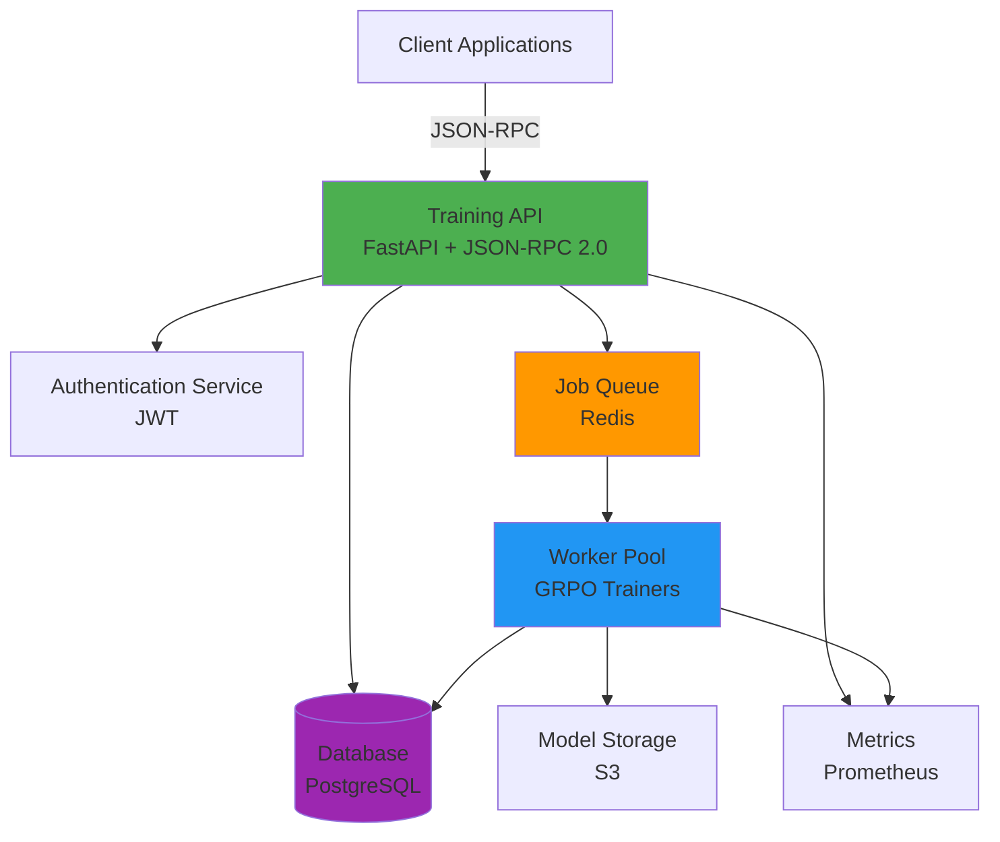
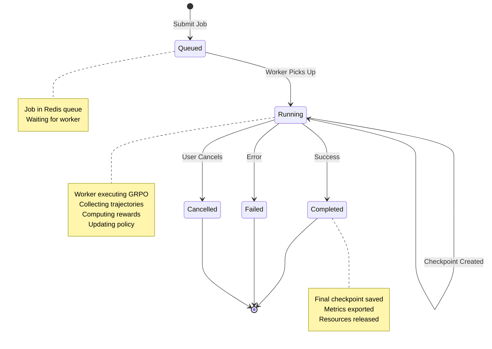
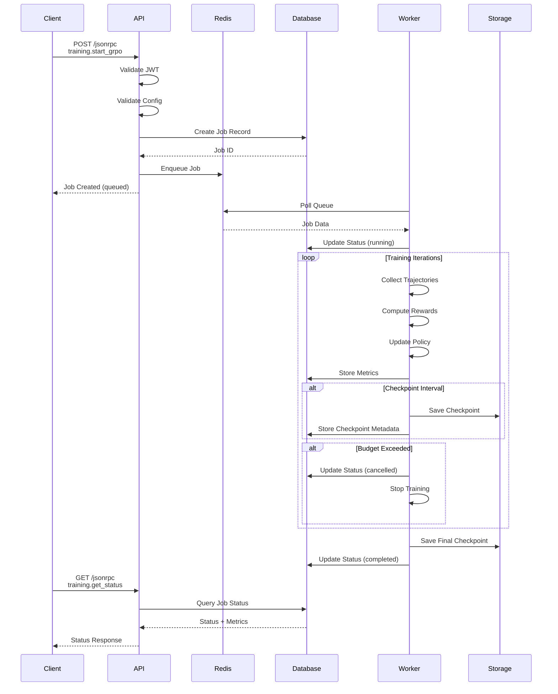
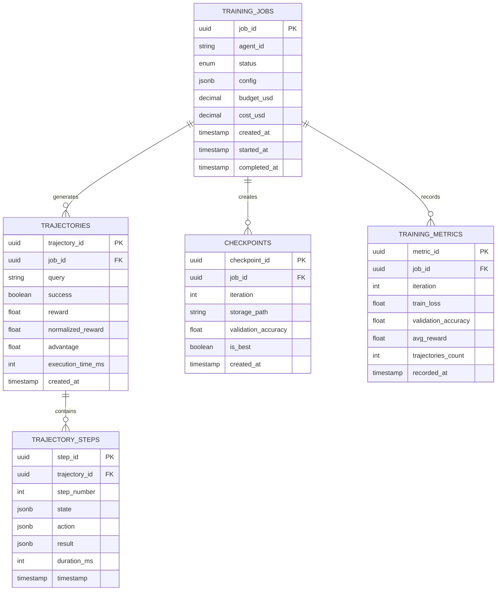
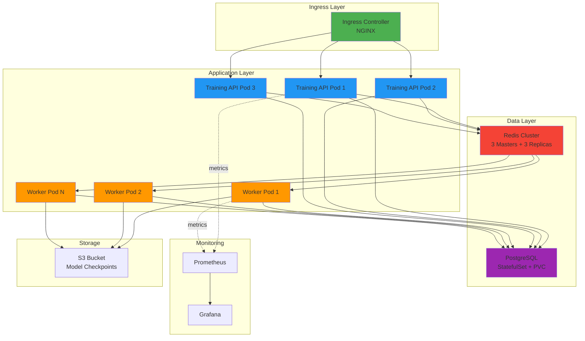
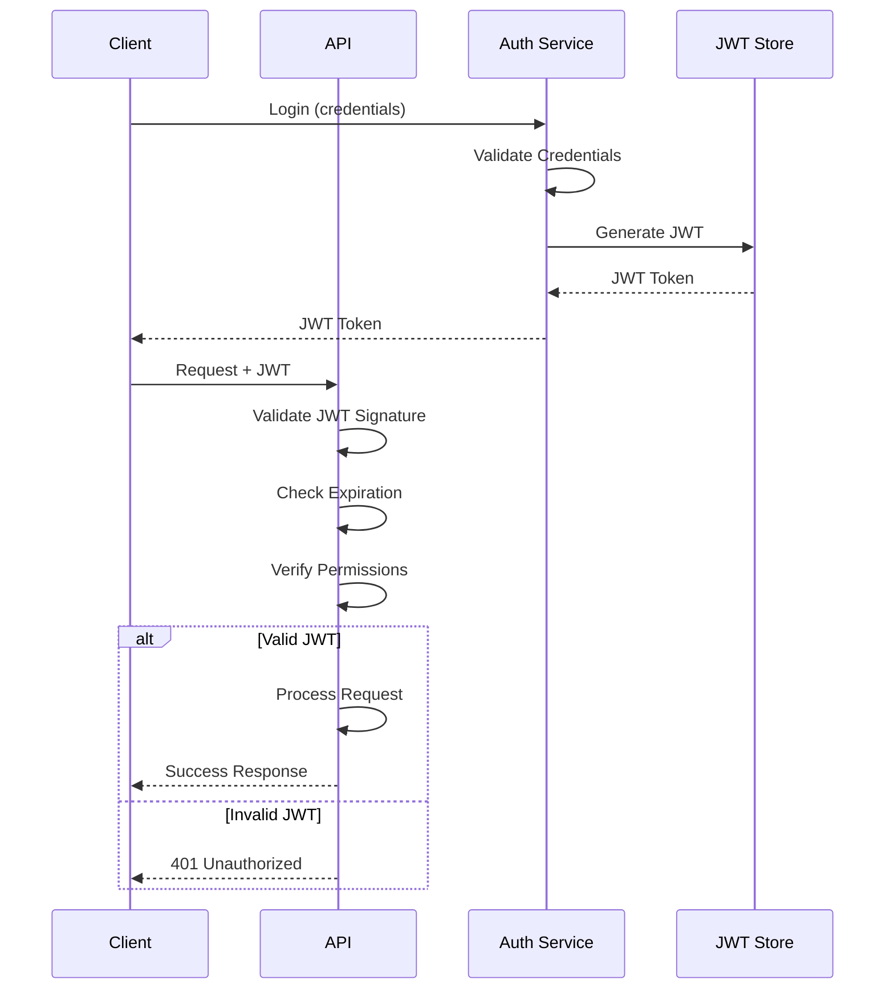
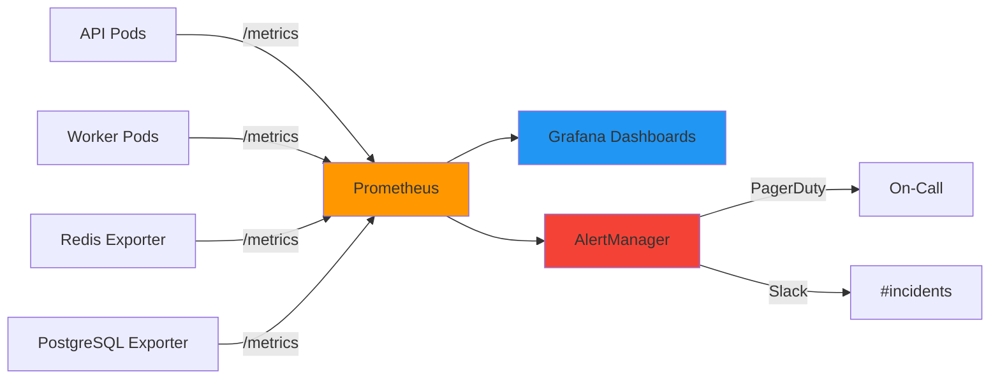
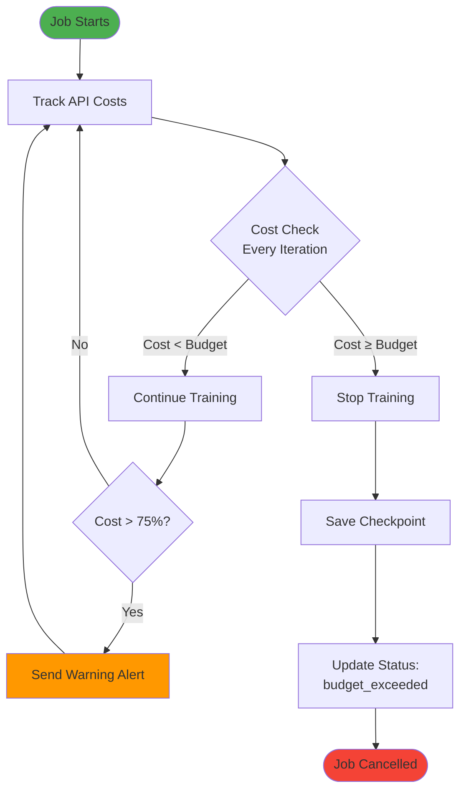
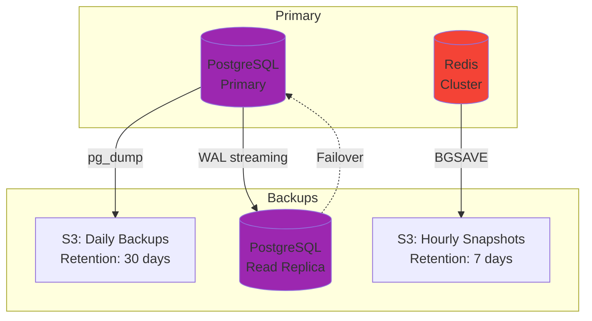

# Training System Architecture

**Version:** 1.0
**Last Updated:** 2025-10-17
**Component:** Flow-Based Optimization (Training Infrastructure)

---

## Overview

The AgentCore training system implements GRPO (Group Refined Policy Optimization) for reinforcement learning of agent policies. The architecture follows a distributed, queue-based design with asynchronous job processing.

---

## System Architecture

### High-Level Components



### Component Details

#### Training API (FastAPI)
- **Technology:** Python 3.12+, FastAPI, Pydantic
- **Protocol:** JSON-RPC 2.0
- **Port:** 8001
- **Responsibilities:**
  - Request validation and authentication
  - Job creation and queueing
  - Status queries and job management
  - Rate limiting and budget enforcement
  - Metrics export

#### Worker Pool
- **Technology:** Python 3.12+, async/await
- **Deployment:** Kubernetes Deployment with HPA
- **Responsibilities:**
  - Job polling from Redis queue
  - Trajectory collection via agent execution
  - Reward computation with custom functions
  - Policy gradient calculation (GRPO algorithm)
  - Model checkpoint creation
  - Cost tracking and budget enforcement

#### Redis Queue
- **Technology:** Redis Cluster
- **Purpose:** Job queue and caching
- **Queue Structure:**
  - `training_jobs` - Pending job queue (FIFO)
  - `job:{job_id}:status` - Job status cache
  - `job:{job_id}:metrics` - Real-time metrics

#### PostgreSQL Database
- **Technology:** PostgreSQL 15 with asyncpg
- **Schema:**
  - `training_jobs` - Job metadata and configuration
  - `trajectories` - Agent execution trajectories
  - `trajectory_steps` - Individual trajectory steps
  - `checkpoints` - Model checkpoints metadata
  - `training_metrics` - Time-series metrics

---

## Training Workflow

### Job Lifecycle



### GRPO Training Loop

```mermaid
flowchart TD
    Start([Start Training Job]) --> Init[Initialize Policy θ]
    Init --> IterStart{Iteration < N?}

    IterStart -->|Yes| Sample[Sample Batch of Queries]
    Sample --> Collect[Collect K Trajectories<br/>per Query]

    Collect --> Reward[Compute Rewards<br/>R = r₀ + γr₁ + γ²r₂ + ...]
    Reward --> Normalize[Normalize Rewards<br/>within Group]

    Normalize --> Advantage[Compute Advantages<br/>A = (R - mean(R)) / std(R)]
    Advantage --> Gradient[Compute Policy Gradient<br/>∇θ = E[A · ∇log π(a|s)]

    Gradient --> Update[Update Policy<br/>θ ← θ + α∇θ]
    Update --> Budget{Budget OK?}

    Budget -->|Yes| Checkpoint{Checkpoint<br/>Interval?}
    Budget -->|No| Cancel[Cancel Job]

    Checkpoint -->|Yes| Save[Save Checkpoint]
    Checkpoint -->|No| IterStart
    Save --> IterStart

    IterStart -->|No| Final[Save Final Checkpoint]
    Final --> End([Training Complete])
    Cancel --> End

    style Start fill:#4CAF50
    style End fill:#4CAF50
    style Cancel fill:#f44336
    style Update fill:#2196F3
    style Reward fill:#FF9800
```

---

## Data Flow

### Request Processing Flow



### Trajectory Collection Flow

```mermaid
flowchart LR
    Query[Query:<br/>User Task] --> Agent[Agent Executor]

    Agent --> Step1[Step 1:<br/>State s₀<br/>Action a₀<br/>Result r₀]
    Step1 --> Step2[Step 2:<br/>State s₁<br/>Action a₁<br/>Result r₁]
    Step2 --> StepN[Step N:<br/>State sₙ<br/>Action aₙ<br/>Result rₙ]

    StepN --> Trajectory[Complete Trajectory:<br/>τ = {s₀,a₀,r₀,...,sₙ,aₙ,rₙ}]
    Trajectory --> Reward[Reward Function:<br/>R(τ) → [0, 1]]

    Reward --> Storage[(Database:<br/>trajectory_steps<br/>trajectories)]

    style Query fill:#4CAF50
    style Trajectory fill:#2196F3
    style Reward fill:#FF9800
    style Storage fill:#9C27B0
```

---

## Database Schema

### Entity Relationship Diagram



---

## Deployment Architecture

### Kubernetes Architecture



---

## Scaling Strategy

### Horizontal Pod Autoscaling

**API Pods:**
- Min replicas: 2
- Max replicas: 10
- Scale up: CPU > 70% or Request rate > 100 req/s
- Scale down: CPU < 30% and Request rate < 20 req/s

**Worker Pods:**
- Min replicas: 5
- Max replicas: 50
- Scale up: Queue length > 100 or CPU > 80%
- Scale down: Queue length < 10 and CPU < 30%

**Database:**
- Vertical scaling (increase resources)
- Read replicas for query offloading
- Connection pooling with PgBouncer

**Redis:**
- Cluster mode with 3 masters + 3 replicas
- Auto-failover enabled
- Horizontal scaling by adding shards

---

## Security Architecture

### Authentication Flow



### Permission Model

| Permission | Description | Required For |
|------------|-------------|--------------|
| `training:start` | Start training jobs | `training.start_grpo` |
| `training:view` | View job status | `training.get_status` |
| `training:cancel` | Cancel running jobs | `training.cancel` |
| `training:evaluate` | Run evaluations | `training.evaluate` |
| `data:export` | Export trajectories | `training.export_trajectories` |

---

## Monitoring and Observability

### Metrics Architecture



### Key Metrics

**Job Metrics:**
- `training_jobs_active` - Active jobs count
- `training_jobs_completed_total` - Completed jobs counter
- `training_jobs_failed_total` - Failed jobs counter
- `training_job_duration_seconds` - Job duration histogram
- `training_iteration_duration_seconds` - Iteration duration histogram

**System Metrics:**
- `http_requests_total` - API request counter
- `http_request_duration_seconds` - Request latency histogram
- `redis_queue_length` - Queue depth gauge
- `pg_connections_active` - Database connections gauge
- `worker_cpu_usage_percent` - Worker CPU utilization

---

## Cost Optimization

### Budget Enforcement Flow



---

## Disaster Recovery

### Backup Strategy



**RPO (Recovery Point Objective):** 1 hour
**RTO (Recovery Time Objective):** 15 minutes

---

## Performance Characteristics

### Throughput

| Metric | Target | Current |
|--------|--------|---------|
| Job submission rate | 10 jobs/min | 15 jobs/min |
| Trajectory generation | 100 traj/s | 120 traj/s |
| Database writes | 1000 TPS | 800 TPS |
| API latency (p95) | < 500ms | 350ms |

### Resource Requirements

**Per API Pod:**
- CPU: 2 cores (request), 4 cores (limit)
- Memory: 4 GB (request), 8 GB (limit)

**Per Worker Pod:**
- CPU: 4 cores (request), 8 cores (limit)
- Memory: 8 GB (request), 16 GB (limit)

**Database:**
- CPU: 8 cores
- Memory: 32 GB
- Storage: 500 GB SSD

**Redis:**
- CPU: 2 cores per node
- Memory: 8 GB per node
- Storage: 20 GB per node

---

## Technology Stack Summary

| Component | Technology | Version | Purpose |
|-----------|-----------|---------|---------|
| API Framework | FastAPI | 0.110+ | JSON-RPC endpoints |
| Language | Python | 3.12+ | Core implementation |
| Database | PostgreSQL | 15+ | Data persistence |
| Queue | Redis | 7.0+ | Job queue |
| Container | Docker | 24+ | Containerization |
| Orchestration | Kubernetes | 1.28+ | Deployment |
| Monitoring | Prometheus | 2.45+ | Metrics collection |
| Visualization | Grafana | 10.0+ | Dashboards |
| Storage | S3 | - | Checkpoint storage |

---

## Further Reading

- [Training API Reference](../api/training-api.md)
- [Developer Guide](../guides/training-agents.md)
- [Operational Runbook](../ops/training-runbook.md)
- [Custom Rewards Guide](../guides/custom_rewards.md)

---

**Document Version:** 1.0
**Last Reviewed:** 2025-10-17
**Next Review:** 2025-11-17
