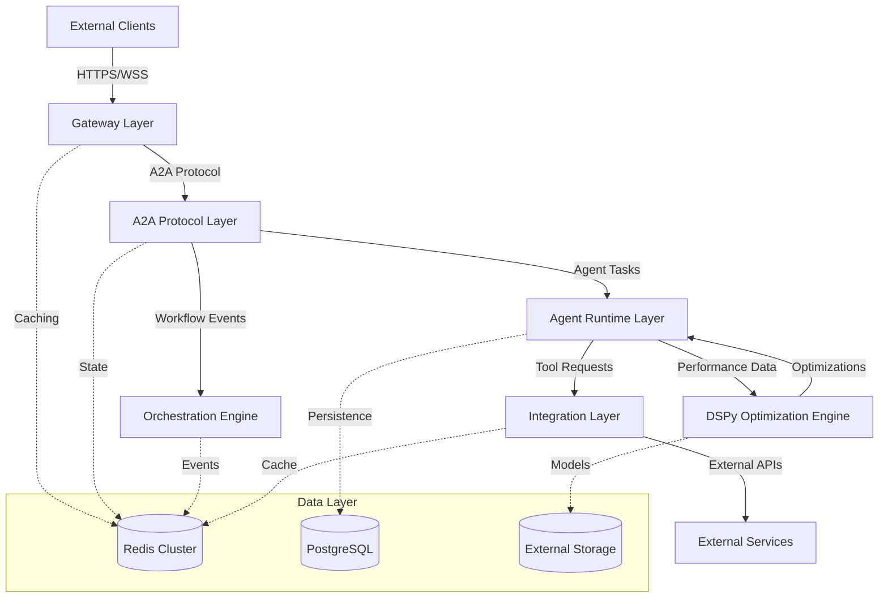

# Component Breakdowns

**Last Updated:** 2025-09-27

## Overview

This directory contains comprehensive technical breakdowns for all AgentCore components. Each breakdown provides detailed implementation guidance, architecture decisions, testing strategies, and operational considerations for development teams.

## Components

| Component | Complexity | Risk | Team Size | Duration | Dependencies | Status |
|-----------|------------|------|-----------|----------|--------------|--------|
| [A2A Protocol Layer](./a2a-protocol.md) | High | High | 3-4 engineers | 6-8 weeks | Redis Cluster, PostgreSQL | ✓ Complete |
| [Agent Runtime Layer](./agent-runtime.md) | High | High | 3-4 engineers | 8-10 weeks | Docker 24.0+, Kubernetes | ✓ Complete |
| [DSPy Optimization Engine](./dspy-optimization.md) | Medium | Medium | 2-3 engineers | 6-8 weeks | DSPy Framework, MLflow | ✓ Complete |
| [Gateway Layer](./gateway-layer.md) | Medium | Low | 2-3 engineers | 4-6 weeks | FastAPI, Redis | ✓ Complete |
| [Integration Layer](./integration-layer.md) | Medium | Medium | 2-3 engineers | 6-8 weeks | Portkey Gateway | ✓ Complete |
| [Orchestration Engine](./orchestration-engine.md) | High | Medium | 3-4 engineers | 8-10 weeks | Redis Streams, NetworkX | ✓ Complete |

## Implementation Priority

### Phase 1: Foundation (Weeks 1-8)
**Critical Path Components**
1. **A2A Protocol Layer** - Foundational communication infrastructure
2. **Gateway Layer** - API access and security enforcement

### Phase 2: Core Capabilities (Weeks 6-16)
**Parallel Development**
3. **Agent Runtime Layer** - Secure agent execution environments
4. **Integration Layer** - External service connectivity

### Phase 3: Advanced Features (Weeks 12-24)
**Enhancement Components**
5. **Orchestration Engine** - Workflow coordination and task management
6. **DSPy Optimization Engine** - AI performance optimization

## Architecture Overview



## Key Integration Points

### Data Flow
- **Upstream:** External clients → Gateway → A2A Protocol → Agent Runtime
- **Downstream:** Agent Runtime → Integration Layer → External Services
- **Coordination:** Orchestration Engine manages multi-agent workflows
- **Optimization:** DSPy Engine provides continuous improvement

### Critical Dependencies
- **Redis Cluster:** Distributed state, caching, event streaming
- **PostgreSQL:** Persistent data, audit trails, analytics
- **Docker/Kubernetes:** Container orchestration and security
- **External APIs:** LLM providers, tools, enterprise systems

## Success Metrics

### Performance Targets
- **Throughput:** 10,000+ messages/sec (A2A Protocol)
- **Latency:** <10ms message routing, <100ms agent initialization
- **Scalability:** 1000+ concurrent agents per cluster node
- **Optimization:** 20-30% performance improvements (DSPy)

### Reliability Targets
- **Availability:** 99.9% uptime across all components
- **Security:** 99.95% sandbox isolation effectiveness
- **Data Integrity:** Zero data loss in production deployments
- **Recovery:** <100ms failover times for critical components

## Development Guidelines

### Code Quality Standards
- **Test Coverage:** 95% for protocol logic, 85% for business logic
- **Security:** Zero critical vulnerabilities, regular security scanning
- **Performance:** Load testing for all scalability targets
- **Documentation:** Comprehensive API docs and operational runbooks

### Deployment Strategy
- **Infrastructure as Code:** Kubernetes manifests and Helm charts
- **CI/CD Pipeline:** Automated testing, security scanning, deployment
- **Environment Management:** Dev, staging, production with GitOps
- **Monitoring:** Prometheus metrics, Grafana dashboards, alerting

## Risk Management

### High-Risk Components
1. **A2A Protocol Layer** - First-to-market implementation, protocol complexity
2. **Agent Runtime Layer** - Container security, multi-philosophy support
3. **Orchestration Engine** - Distributed coordination, fault tolerance

### Mitigation Strategies
- **Incremental Development:** Phased implementation with frequent validation
- **Security Focus:** Container hardening, security testing, audit trails
- **Performance Validation:** Early load testing, optimization iterations
- **Community Engagement:** Active participation in A2A protocol development

## Getting Started

### Prerequisites
- Python 3.11+ with asyncio support
- Docker 24.0+ with security features
- Kubernetes 1.28+ with Pod Security Standards
- UV package manager for dependency management

### Quick Start
```bash
# Clone repository
git clone <agentcore-repo>
cd agentcore

# Setup development environment
uv sync

# Start local infrastructure
docker-compose -f docker-compose.dev.yml up -d

# Run component tests
uv run pytest docs/breakdown/*/tests/

# Deploy to development cluster
kubectl apply -f k8s/dev/
```

### Development Workflow
1. **Component Selection:** Choose component from priority matrix
2. **Technical Review:** Study breakdown for implementation details
3. **Environment Setup:** Configure local development environment
4. **Implementation:** Follow phase-by-phase development plan
5. **Testing:** Comprehensive testing per breakdown specifications
6. **Integration:** Component integration with dependent systems
7. **Deployment:** Production deployment with monitoring setup

## Documentation Structure

Each component breakdown includes:
- **Quick Reference** - Essential metrics and requirements
- **System Context** - Integration points and dependencies
- **Architecture Design** - Component structure and patterns
- **Implementation Details** - Technology stack and configuration
- **Testing Strategy** - Comprehensive test coverage plans
- **Operational Concerns** - Monitoring, security, scaling
- **Risk Analysis** - Technical and business risk mitigation
- **Implementation Checklist** - Phase-by-phase development tasks

## Contributing

### Component Updates
- Update breakdown documentation for any architecture changes
- Validate implementation against breakdown specifications
- Submit pull requests with breakdown review for significant changes

### New Components
- Follow breakdown template for consistency
- Include comprehensive risk analysis and mitigation strategies
- Validate against system architecture and integration requirements

## Support

For technical questions about component breakdowns:
- Review breakdown documentation thoroughly
- Check implementation checklist for development guidance
- Consult system architecture documentation for integration details
- Follow established development workflow and quality standards

---

**Next Steps:** Select a component from the priority matrix and begin implementation following the detailed breakdown guidance. Each breakdown provides comprehensive technical details needed for successful development and deployment.