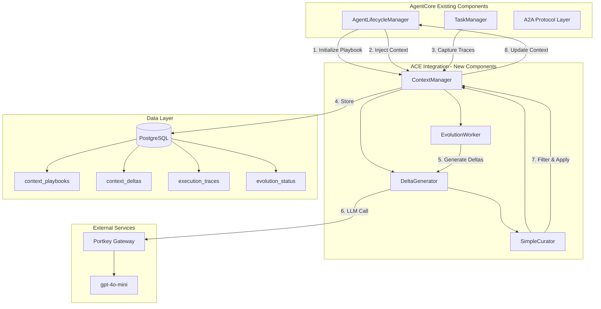
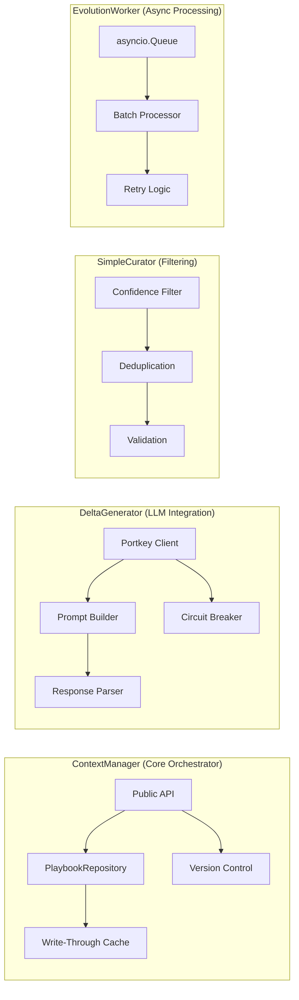

# ACE Integration - Technical Breakdown

**Component:** ACE Integration (Agentic Context Engineering)
**Status:** Planning Complete - Ready for Implementation
**Last Updated:** 2025-10-12

---

## Quick Reference

| Attribute | Value |
|-----------|-------|
| **Complexity** | MEDIUM-HIGH |
| **Risk Level** | MEDIUM |
| **Team Size** | 2-3 Engineers (1 Senior, 1-2 Mid-Level) |
| **Duration** | 8 weeks (4 sprints) |
| **Story Points** | 71 SP |
| **Dependencies** | Agent Runtime Layer (ART-*), A2A Protocol |
| **New Dependencies** | 0 (uses existing AgentCore stack) |
| **Database Changes** | 4 new tables, 8 indexes |
| **API Changes** | 6 new internal service methods |

---

## Component Overview

### Purpose

ACE (Agentic Context Engineering) implements self-supervised context evolution for long-running agents in AgentCore. It prevents context degradation by using LLM-based analysis to generate, evaluate, and apply incremental improvements to agent context playbooks.

### Key Capabilities

1. **Context Playbook Management**: CRUD operations for agent context playbooks with versioning
2. **Delta Generation**: LLM-powered suggestions for context improvements via Portkey/gpt-4o-mini
3. **Confidence-Based Curation**: Automated filtering of deltas based on confidence thresholds
4. **Background Evolution**: Asynchronous processing of context evolution without blocking agent operations
5. **Execution Trace Capture**: Automatic collection of agent performance data for LLM analysis
6. **Integration with Lifecycle**: Seamless injection into AgentLifecycleManager

### Success Metrics

| Metric | Target | Measurement Method |
|--------|--------|-------------------|
| Performance Improvement | +5-7% on long-running agents | A/B testing over 100+ executions |
| System Overhead | <5% | CPU/memory profiling |
| Monthly Cost | <$100 for 100 agents | LLM token usage tracking |
| Context Failure Reduction | 30% fewer failures | Error rate comparison |
| Delta Application Rate | 70%+ confidence deltas applied | Evolution status logs |

---

## System Context

### Architecture Diagram



### Integration Points

| Integration Point | Direction | Data Flow | Frequency |
|------------------|-----------|-----------|-----------|
| **AgentLifecycleManager** | Bidirectional | Playbook init, context injection, evolution triggers | Per agent lifecycle event |
| **TaskManager** | Inbound | Execution traces (task results, errors, metrics) | Per task completion |
| **A2A Protocol** | Inbound | Task execution data, agent interaction logs | Real-time during task execution |
| **PostgreSQL** | Bidirectional | CRUD on 4 new tables (playbooks, deltas, traces, status) | High frequency (async writes) |
| **Portkey/gpt-4o-mini** | Outbound | Delta generation requests with traces + playbooks | Background (batched, rate-limited) |

---

## Architecture Design

### Component Structure



### Key Modules

#### 1. ContextManager (`services/context_manager.py`)

**Responsibilities:**
- Playbook CRUD operations (create, read, update, delete)
- Version control for playbook changes
- Cache management for fast retrieval (<50ms)
- Delta application and validation
- Integration with AgentLifecycleManager

**Key Methods:**
```python
async def create_playbook(agent_id: str, initial_context: dict) -> ContextPlaybook
async def get_playbook(agent_id: str) -> ContextPlaybook
async def update_playbook(agent_id: str, delta: ContextDelta) -> ContextPlaybook
async def capture_execution_trace(agent_id: str, trace: ExecutionTrace) -> None
async def trigger_evolution(agent_id: str) -> None
```

**Design Patterns:**
- Repository Pattern for data access
- Write-Through Cache for performance
- Optimistic Locking for concurrent updates

#### 2. DeltaGenerator (`services/delta_generator.py`)

**Responsibilities:**
- LLM prompt construction from traces + playbooks
- Portkey API integration with retry logic
- Response parsing and validation
- Cost tracking and rate limiting
- Circuit breaker for LLM failures

**Key Methods:**
```python
async def generate_delta(playbook: ContextPlaybook, traces: list[ExecutionTrace]) -> ContextDelta
async def _build_prompt(playbook: dict, traces: list[dict]) -> str
async def _parse_llm_response(response: str) -> dict
async def _track_token_usage(prompt_tokens: int, completion_tokens: int) -> None
```

**Design Patterns:**
- Circuit Breaker for external API resilience
- Bulkhead for cost containment
- Template Method for prompt construction

#### 3. SimpleCurator (`services/simple_curator.py`)

**Responsibilities:**
- Confidence threshold filtering (default 0.7)
- Delta deduplication
- Validation against playbook schema
- Auto-approval for high-confidence deltas

**Key Methods:**
```python
async def curate_delta(delta: ContextDelta, threshold: float = 0.7) -> CurationDecision
async def validate_delta(delta: ContextDelta, playbook: ContextPlaybook) -> bool
async def deduplicate_deltas(deltas: list[ContextDelta]) -> list[ContextDelta]
```

**Design Patterns:**
- Strategy Pattern for curation rules
- Chain of Responsibility for validation

#### 4. EvolutionWorker (`services/evolution_worker.py`)

**Responsibilities:**
- Background async processing via asyncio.Queue
- Batch processing of evolution requests
- Retry logic for transient failures
- Graceful shutdown on app termination

**Key Methods:**
```python
async def start() -> None
async def stop() -> None
async def enqueue_evolution_request(agent_id: str) -> None
async def _process_batch(requests: list[str]) -> None
async def _handle_evolution_request(agent_id: str) -> None
```

**Design Patterns:**
- Queue-Based Processing for async operations
- Worker Pool for concurrency
- Graceful Degradation for failures

---

## Interface Contracts

### Internal Service APIs

#### ContextManager API

```python
# Create new playbook for agent
POST /internal/context/playbooks
Request: {
    "agent_id": "agent-123",
    "initial_context": {
        "goals": ["solve customer issues"],
        "constraints": ["response time <5s"],
        "capabilities": ["search", "reasoning"]
    }
}
Response: {
    "playbook_id": "pb-456",
    "agent_id": "agent-123",
    "version": 1,
    "content": {...},
    "created_at": "2025-10-12T10:00:00Z"
}

# Get current playbook
GET /internal/context/playbooks/{agent_id}
Response: {
    "playbook_id": "pb-456",
    "agent_id": "agent-123",
    "version": 3,
    "content": {...},
    "last_updated": "2025-10-12T15:30:00Z"
}

# Apply delta to playbook
PATCH /internal/context/playbooks/{agent_id}
Request: {
    "delta_id": "delta-789",
    "changes": {
        "goals": ["solve customer issues", "proactive engagement"]
    },
    "confidence": 0.85
}
Response: {
    "playbook_id": "pb-456",
    "version": 4,
    "applied": true,
    "rollback_available": true
}

# Capture execution trace
POST /internal/context/traces
Request: {
    "agent_id": "agent-123",
    "task_id": "task-999",
    "execution_time": 2.5,
    "success": true,
    "output_quality": 0.9,
    "metadata": {...}
}
Response: {
    "trace_id": "trace-111",
    "captured_at": "2025-10-12T16:00:00Z"
}

# Trigger evolution cycle
POST /internal/context/evolution/trigger
Request: {
    "agent_id": "agent-123",
    "force": false
}
Response: {
    "enqueued": true,
    "position": 5
}

# Get evolution status
GET /internal/context/evolution/status/{agent_id}
Response: {
    "agent_id": "agent-123",
    "last_evolution": "2025-10-12T14:00:00Z",
    "pending_traces": 12,
    "deltas_generated": 3,
    "deltas_applied": 2,
    "status": "processing"
}
```

### Data Models

```python
# ContextPlaybook
class ContextPlaybook(BaseModel):
    playbook_id: str
    agent_id: str
    version: int
    content: dict[str, Any]  # Flexible JSON structure
    created_at: datetime
    updated_at: datetime
    metadata: dict[str, Any] = {}

# ContextDelta
class ContextDelta(BaseModel):
    delta_id: str
    playbook_id: str
    changes: dict[str, Any]
    confidence: float  # 0.0 to 1.0
    reasoning: str
    generated_at: datetime
    applied: bool = False
    applied_at: datetime | None = None

# ExecutionTrace
class ExecutionTrace(BaseModel):
    trace_id: str
    agent_id: str
    task_id: str
    execution_time: float
    success: bool
    output_quality: float | None = None
    error_message: str | None = None
    metadata: dict[str, Any] = {}
    captured_at: datetime

# EvolutionStatus
class EvolutionStatus(BaseModel):
    agent_id: str
    last_evolution: datetime | None = None
    pending_traces: int = 0
    deltas_generated: int = 0
    deltas_applied: int = 0
    total_cost: float = 0.0  # USD
    status: Literal["idle", "processing", "failed"]
```

### Database Schema

```sql
-- context_playbooks: 1:1 with agents
CREATE TABLE context_playbooks (
    playbook_id UUID PRIMARY KEY DEFAULT gen_random_uuid(),
    agent_id VARCHAR(255) UNIQUE NOT NULL REFERENCES agents(agent_id) ON DELETE CASCADE,
    version INTEGER NOT NULL DEFAULT 1,
    content JSONB NOT NULL,
    created_at TIMESTAMP WITH TIME ZONE DEFAULT NOW(),
    updated_at TIMESTAMP WITH TIME ZONE DEFAULT NOW(),
    metadata JSONB DEFAULT '{}'::jsonb
);

CREATE INDEX idx_playbooks_agent ON context_playbooks(agent_id);
CREATE INDEX idx_playbooks_updated ON context_playbooks(updated_at DESC);

-- context_deltas: N:1 with playbooks
CREATE TABLE context_deltas (
    delta_id UUID PRIMARY KEY DEFAULT gen_random_uuid(),
    playbook_id UUID NOT NULL REFERENCES context_playbooks(playbook_id) ON DELETE CASCADE,
    changes JSONB NOT NULL,
    confidence FLOAT NOT NULL CHECK (confidence >= 0.0 AND confidence <= 1.0),
    reasoning TEXT NOT NULL,
    generated_at TIMESTAMP WITH TIME ZONE DEFAULT NOW(),
    applied BOOLEAN DEFAULT FALSE,
    applied_at TIMESTAMP WITH TIME ZONE
);

CREATE INDEX idx_deltas_playbook ON context_deltas(playbook_id);
CREATE INDEX idx_deltas_confidence ON context_deltas(confidence DESC);
CREATE INDEX idx_deltas_applied ON context_deltas(applied, applied_at DESC);

-- execution_traces: N:1 with agents
CREATE TABLE execution_traces (
    trace_id UUID PRIMARY KEY DEFAULT gen_random_uuid(),
    agent_id VARCHAR(255) NOT NULL REFERENCES agents(agent_id) ON DELETE CASCADE,
    task_id VARCHAR(255),
    execution_time FLOAT NOT NULL,
    success BOOLEAN NOT NULL,
    output_quality FLOAT CHECK (output_quality >= 0.0 AND output_quality <= 1.0),
    error_message TEXT,
    metadata JSONB DEFAULT '{}'::jsonb,
    captured_at TIMESTAMP WITH TIME ZONE DEFAULT NOW()
);

CREATE INDEX idx_traces_agent ON execution_traces(agent_id, captured_at DESC);
CREATE INDEX idx_traces_success ON execution_traces(success, captured_at DESC);

-- evolution_status: Tracking table
CREATE TABLE evolution_status (
    agent_id VARCHAR(255) PRIMARY KEY REFERENCES agents(agent_id) ON DELETE CASCADE,
    last_evolution TIMESTAMP WITH TIME ZONE,
    pending_traces INTEGER DEFAULT 0,
    deltas_generated INTEGER DEFAULT 0,
    deltas_applied INTEGER DEFAULT 0,
    total_cost FLOAT DEFAULT 0.0,
    status VARCHAR(50) DEFAULT 'idle' CHECK (status IN ('idle', 'processing', 'failed'))
);

CREATE INDEX idx_evolution_status ON evolution_status(status, last_evolution DESC);
```

---

## Implementation Details

### Technology Stack

| Layer | Technology | Version | Purpose |
|-------|-----------|---------|---------|
| **Language** | Python | 3.12+ | Core implementation |
| **Validation** | Pydantic | 2.x | Data models and validation |
| **Database** | PostgreSQL | 14+ | Persistent storage with JSONB |
| **ORM** | SQLAlchemy | 2.x (async) | Database access |
| **Migrations** | Alembic | Latest | Schema versioning |
| **LLM Gateway** | Portkey | Latest | Cost control and monitoring |
| **LLM Model** | gpt-4o-mini | Latest | Delta generation |
| **Async** | asyncio | Built-in | Background workers |
| **HTTP** | httpx | Latest | Portkey API calls |

**Note:** 0 new dependencies - all libraries already in AgentCore stack.

### Design Patterns

1. **Repository Pattern**: All database access through dedicated repositories
   - `PlaybookRepository`, `DeltaRepository`, `TraceRepository`
   - Enables testing with mock repositories
   - Centralizes query logic

2. **Circuit Breaker**: LLM API failure protection
   - Opens after 5 consecutive failures
   - Half-open state after 60s cooldown
   - Prevents cost escalation during outages

3. **Write-Through Cache**: Playbook retrieval optimization
   - Redis cache for active playbooks
   - <50ms retrieval time
   - Invalidation on updates

4. **Queue-Based Processing**: Async evolution requests
   - `asyncio.Queue` with bounded size (1000)
   - Backpressure handling when queue full
   - Graceful shutdown with pending request drain

5. **Modular Monolith**: Single deployment, clear boundaries
   - Not microservices (no network overhead)
   - Each component has clear interface
   - Can extract to service later if needed

### Configuration

```python
# config.py additions
class ACEConfig(BaseSettings):
    # Delta generation
    ace_llm_model: str = "gpt-4o-mini"
    ace_confidence_threshold: float = 0.7
    ace_max_deltas_per_evolution: int = 5

    # Worker settings
    ace_worker_queue_size: int = 1000
    ace_worker_batch_size: int = 10
    ace_worker_batch_timeout: float = 5.0

    # Evolution triggers
    ace_evolution_interval: int = 100  # traces before evolution
    ace_min_traces_for_evolution: int = 10

    # Cost controls
    ace_monthly_budget_usd: float = 100.0
    ace_cost_per_1m_tokens: float = 0.15
    ace_max_tokens_per_request: int = 4096

    # Cache settings
    ace_cache_ttl_seconds: int = 300
    ace_enable_cache: bool = True

    # Circuit breaker
    ace_cb_failure_threshold: int = 5
    ace_cb_recovery_timeout: int = 60
```

### Prompt Engineering

```python
# LLM Prompt Template for Delta Generation
DELTA_GENERATION_PROMPT = """
You are an AI agent context optimization system. Analyze the following agent execution traces and current context playbook, then suggest improvements.

## Current Context Playbook:
{playbook_json}

## Recent Execution Traces (last {trace_count}):
{traces_json}

## Task:
1. Identify patterns in successful vs. failed executions
2. Suggest 1-3 specific improvements to the context playbook
3. For each suggestion, provide:
   - Specific changes (JSON format)
   - Confidence score (0.0 to 1.0)
   - Reasoning (2-3 sentences)

## Output Format (JSON):
{{
  "deltas": [
    {{
      "changes": {{"key": "new_value"}},
      "confidence": 0.85,
      "reasoning": "Based on traces #1-5, adding X improves Y..."
    }}
  ]
}}

Focus on actionable, specific changes. Avoid vague suggestions.
"""
```

---

## Testing Strategy

### Unit Tests (90%+ Coverage Target)

**ContextManager Tests** (`tests/unit/services/test_context_manager.py`):
```python
@pytest.mark.asyncio
async def test_create_playbook_success():
    """Test playbook creation with valid data"""

@pytest.mark.asyncio
async def test_get_playbook_cache_hit():
    """Test cache retrieval <50ms"""

@pytest.mark.asyncio
async def test_update_playbook_version_increment():
    """Test version increments on update"""

@pytest.mark.asyncio
async def test_concurrent_update_optimistic_lock():
    """Test concurrent updates with optimistic locking"""
```

**DeltaGenerator Tests** (`tests/unit/services/test_delta_generator.py`):
```python
@pytest.mark.asyncio
async def test_generate_delta_valid_response():
    """Test delta generation with mocked LLM"""

@pytest.mark.asyncio
async def test_circuit_breaker_opens_on_failures():
    """Test circuit breaker triggers after 5 failures"""

@pytest.mark.asyncio
async def test_token_usage_tracking():
    """Test cost tracking accuracy"""

@pytest.mark.asyncio
async def test_prompt_construction():
    """Test prompt includes all required fields"""
```

**SimpleCurator Tests** (`tests/unit/services/test_simple_curator.py`):
```python
@pytest.mark.asyncio
async def test_filter_by_confidence_threshold():
    """Test filtering at 0.7 threshold"""

@pytest.mark.asyncio
async def test_deduplication():
    """Test duplicate delta removal"""

@pytest.mark.asyncio
async def test_validation_against_schema():
    """Test delta validation"""
```

**EvolutionWorker Tests** (`tests/unit/services/test_evolution_worker.py`):
```python
@pytest.mark.asyncio
async def test_worker_processes_queue():
    """Test queue processing"""

@pytest.mark.asyncio
async def test_batch_processing():
    """Test batch size limits"""

@pytest.mark.asyncio
async def test_graceful_shutdown():
    """Test worker stops cleanly"""
```

### Integration Tests

**E2E Evolution Workflow** (`tests/integration/test_ace_evolution.py`):
```python
@pytest.mark.asyncio
async def test_full_evolution_cycle():
    """
    End-to-end test:
    1. Create agent with playbook
    2. Capture 10 execution traces
    3. Trigger evolution
    4. Verify delta generation
    5. Verify curation and application
    6. Verify playbook updated
    """

@pytest.mark.asyncio
async def test_agent_lifecycle_integration():
    """
    Test integration with AgentLifecycleManager:
    1. Agent registration creates playbook
    2. Task execution captures traces
    3. Context injection uses latest playbook
    """
```

**Database Tests** (`tests/integration/test_ace_database.py`):
```python
@pytest.mark.asyncio
async def test_cascade_delete_on_agent_removal():
    """Test CASCADE delete on agent removal"""

@pytest.mark.asyncio
async def test_jsonb_query_performance():
    """Test JSONB queries <100ms for 10K playbooks"""
```

### Performance Tests

**Load Tests** (`tests/load/test_ace_load.py`):
```python
@pytest.mark.load
async def test_concurrent_evolution_requests():
    """
    Load test: 100 concurrent evolution requests
    Target: <5% system overhead
    """

@pytest.mark.load
async def test_playbook_retrieval_latency():
    """
    Benchmark: 1000 playbook retrievals
    Target: <50ms P95 with cache
    """
```

**Cost Tests** (`tests/integration/test_ace_cost.py`):
```python
@pytest.mark.asyncio
async def test_monthly_cost_projection():
    """
    Simulate 100 agents, 100 executions each
    Target: <$100/month total cost
    """
```

### Testing Checklist

- [ ] Unit tests: 90%+ coverage across all 4 components
- [ ] Integration tests: E2E evolution workflow passes
- [ ] Performance tests: <5% overhead, <50ms P95 retrieval
- [ ] Cost tests: Validate <$100/month projection
- [ ] Database tests: Verify CASCADE deletes, JSONB performance
- [ ] Circuit breaker tests: Verify failure isolation
- [ ] Cache tests: Verify invalidation and TTL
- [ ] Worker tests: Verify graceful shutdown and queue backpressure

---

## Operational Concerns

### Infrastructure Requirements

**Compute:**
- No additional CPU/memory for main app (async workers use existing pool)
- Redis instance for caching (shared with existing AgentCore cache)

**Database:**
- PostgreSQL with JSONB support (existing)
- 4 new tables with 8 indexes
- Estimated storage: 10MB per 1000 agents (playbooks + deltas)

**External Services:**
- Portkey account with gpt-4o-mini access
- API key stored in environment variables

### Monitoring & Observability

**Prometheus Metrics** (to add):
```python
# Evolution metrics
ace_evolution_requests_total = Counter("ace_evolution_requests_total", "Total evolution requests")
ace_evolution_duration_seconds = Histogram("ace_evolution_duration_seconds", "Evolution duration")
ace_deltas_generated_total = Counter("ace_deltas_generated_total", "Deltas generated")
ace_deltas_applied_total = Counter("ace_deltas_applied_total", "Deltas applied")

# LLM metrics
ace_llm_requests_total = Counter("ace_llm_requests_total", "LLM requests")
ace_llm_tokens_used = Counter("ace_llm_tokens_used", "LLM tokens used", ["type"])  # prompt, completion
ace_llm_cost_usd = Counter("ace_llm_cost_usd", "LLM cost in USD")
ace_llm_errors_total = Counter("ace_llm_errors_total", "LLM errors")

# Circuit breaker metrics
ace_circuit_breaker_state = Gauge("ace_circuit_breaker_state", "Circuit breaker state")  # 0=closed, 1=open, 2=half-open

# Cache metrics
ace_cache_hits_total = Counter("ace_cache_hits_total", "Cache hits")
ace_cache_misses_total = Counter("ace_cache_misses_total", "Cache misses")

# Performance metrics
ace_playbook_retrieval_duration_seconds = Histogram("ace_playbook_retrieval_duration_seconds", "Playbook retrieval duration")
```

**Grafana Dashboards**:
- **ACE Overview**: Evolution requests/sec, delta application rate, cost tracking
- **LLM Usage**: Token usage, cost trends, error rates, circuit breaker state
- **Performance**: P50/P95/P99 latencies, cache hit rate, queue depth

**Alert Rules**:
```yaml
# Cost alert
- alert: ACEMonthlyCostExceeded
  expr: ace_llm_cost_usd > 100
  for: 1h
  annotations:
    summary: "ACE monthly cost budget exceeded"

# Performance alert
- alert: ACEHighLatency
  expr: histogram_quantile(0.95, ace_playbook_retrieval_duration_seconds) > 0.1
  for: 5m
  annotations:
    summary: "ACE playbook retrieval P95 >100ms"

# Circuit breaker alert
- alert: ACECircuitBreakerOpen
  expr: ace_circuit_breaker_state == 1
  for: 5m
  annotations:
    summary: "ACE circuit breaker open - LLM failures"
```

### Security Considerations

1. **Service-to-Service Authentication**:
   - Internal APIs require JWT tokens
   - No public exposure of ACE endpoints

2. **Data Isolation**:
   - Playbooks tied to agent_id with CASCADE delete
   - No cross-agent data leakage

3. **LLM Security**:
   - Portkey API key stored in environment variables
   - No sensitive data in LLM prompts (agent IDs only, no PII)
   - Cost controls prevent API abuse

4. **GDPR Compliance**:
   - Execution traces contain no PII
   - Agent deletion cascades to all ACE data

### Scaling Considerations

**Horizontal Scaling**:
- EvolutionWorker can run multiple instances
- Queue-based processing naturally distributes load
- Redis cache shared across instances

**Vertical Scaling**:
- PostgreSQL JSONB queries optimized with GIN indexes
- Cache reduces database load by 80%+

**Bottlenecks**:
- LLM API rate limits (mitigated by batching and rate limiting)
- Database writes during high evolution activity (mitigated by async writes)

---

## Risk Analysis

### Technical Risks

| Risk | Severity | Probability | Impact | Mitigation |
|------|----------|-------------|--------|------------|
| **LLM Cost Escalation** | HIGH | MEDIUM | Monthly costs exceed $100 budget | Circuit breaker, cost tracking, monthly budget alerts |
| **Integration Breaking Changes** | HIGH | LOW | AgentLifecycleManager refactor breaks integration | Strict interface contracts, integration tests, versioning |
| **Delta Quality Issues** | MEDIUM | MEDIUM | Low-confidence deltas degrade performance | Confidence threshold tuning, A/B testing, rollback capability |
| **Worker Crashes** | MEDIUM | LOW | EvolutionWorker crashes and loses queue state | Persistent queue (Redis), health checks, auto-restart |
| **Performance Degradation** | MEDIUM | LOW | <5% overhead target missed | Performance testing, profiling, cache optimization |
| **Database Migration Failures** | LOW | LOW | Production migration fails | Test migrations in staging, rollback scripts, data backups |

### Dependency Risks

| Dependency | Risk | Mitigation |
|------------|------|------------|
| **Portkey API** | Downtime causes evolution failures | Circuit breaker, retry logic, graceful degradation |
| **gpt-4o-mini Availability** | Model deprecation | Model configuration externalized, fallback models |
| **PostgreSQL JSONB** | Version <14 lacks features | Require PostgreSQL 14+ in docs, version check on startup |
| **Redis** | Cache unavailable | Fallback to database queries (slower but functional) |

---

## Development Workflow

### Local Development Setup

```bash
# 1. Install dependencies (already in project)
uv sync

# 2. Set up environment variables
cat >> .env <<EOF
# ACE Configuration
ACE_LLM_MODEL=gpt-4o-mini
ACE_CONFIDENCE_THRESHOLD=0.7
ACE_MONTHLY_BUDGET_USD=100.0
PORTKEY_API_KEY=your_portkey_api_key_here
EOF

# 3. Run database migrations
uv run alembic upgrade head

# 4. Start local services (PostgreSQL + Redis)
docker compose -f docker-compose.dev.yml up -d postgres redis

# 5. Run development server
uv run uvicorn agentcore.a2a_protocol.main:app --host 0.0.0.0 --port 8001 --reload

# 6. Run tests
uv run pytest tests/unit/services/test_context_manager.py -v
uv run pytest tests/integration/test_ace_evolution.py -v
```

### Code Quality Checks

```bash
# Linting
uv run ruff check src/agentcore/a2a_protocol/services/context_manager.py

# Type checking (strict mode)
uv run mypy src/agentcore/a2a_protocol/services/

# Coverage report
uv run pytest --cov=src/agentcore/a2a_protocol/services --cov-report=html
```

### Development Phases (from tasks.md)

**Phase 1: Foundation (Sprint 1) - ACE-001 to ACE-005**
- Database schema and migrations
- ContextManager with cache
- DeltaGenerator with Portkey
- SimpleCurator with filtering
- EvolutionWorker with asyncio.Queue

**Phase 2: Integration (Sprint 2) - ACE-006 to ACE-008**
- AgentLifecycleManager integration
- TaskManager trace capture
- A2A Protocol integration

**Phase 3: Monitoring & Optimization (Sprint 3) - ACE-009 to ACE-013**
- Prometheus metrics + Grafana dashboards
- Circuit breaker + cost controls
- Performance optimization (<5% overhead)
- Documentation and E2E tests

**Phase 4: Deployment (Sprint 4) - ACE-014 to ACE-015**
- Staging deployment with A/B testing
- Production canary rollout (5% → 10% → 25% → 100%)

---

## Implementation Checklist

### Phase 1: Foundation (Weeks 1-2)

- [ ] **ACE-001**: Database schema (4 tables, 8 indexes) + Alembic migration
- [ ] **ACE-002**: ContextManager service with CRUD operations
  - [ ] PlaybookRepository implementation
  - [ ] Write-through cache with Redis
  - [ ] Version control with optimistic locking
- [ ] **ACE-003**: DeltaGenerator service with Portkey integration
  - [ ] Prompt builder with template
  - [ ] Portkey client with retry logic
  - [ ] Response parser and validator
- [ ] **ACE-004**: SimpleCurator service with filtering
  - [ ] Confidence threshold filtering (0.7 default)
  - [ ] Delta deduplication
  - [ ] Schema validation
- [ ] **ACE-005**: EvolutionWorker with asyncio.Queue
  - [ ] Queue-based processing
  - [ ] Batch processing logic
  - [ ] Graceful shutdown handler

### Phase 2: Integration (Weeks 3-4)

- [ ] **ACE-006**: AgentLifecycleManager integration
  - [ ] Playbook initialization on agent registration
  - [ ] Context injection on task execution
  - [ ] Evolution trigger on lifecycle events
- [ ] **ACE-007**: TaskManager trace capture
  - [ ] Execution trace capture hook
  - [ ] Trace storage in PostgreSQL
  - [ ] Trace aggregation for LLM prompts
- [ ] **ACE-008**: A2A Protocol integration
  - [ ] Task execution data capture
  - [ ] Agent interaction logs
  - [ ] Context propagation via A2A headers

### Phase 3: Monitoring & Optimization (Weeks 5-6)

- [ ] **ACE-009**: Prometheus metrics + Grafana dashboards
  - [ ] 12 Prometheus metrics defined
  - [ ] 3 Grafana dashboards created
  - [ ] Alert rules configured
- [ ] **ACE-010**: Circuit breaker + cost controls
  - [ ] Circuit breaker implementation (5 failures, 60s recovery)
  - [ ] Monthly cost tracking and alerts
  - [ ] Rate limiting for LLM requests
- [ ] **ACE-011**: Performance optimization
  - [ ] Cache hit rate >80%
  - [ ] P95 retrieval latency <50ms
  - [ ] System overhead <5%
- [ ] **ACE-012**: Documentation
  - [ ] API documentation with examples
  - [ ] Deployment guide
  - [ ] Troubleshooting runbook
- [ ] **ACE-013**: E2E testing
  - [ ] Full evolution cycle test
  - [ ] AgentLifecycleManager integration test
  - [ ] Load testing with 100 concurrent requests

### Phase 4: Deployment (Weeks 7-8)

- [ ] **ACE-014**: Staging deployment + A/B testing
  - [ ] Database migrations applied to staging
  - [ ] 10 test agents with ACE enabled
  - [ ] 10 control agents without ACE
  - [ ] 48-hour soak test with 100+ executions
  - [ ] Performance validation (+5-7% improvement)
  - [ ] Cost validation (<$100/month)
  - [ ] Validation report generated
- [ ] **ACE-015**: Production launch
  - [ ] Canary deployment (5% for 48 hours)
  - [ ] Gradual rollout (10% Day 2, 25% Day 3, 100% Day 4)
  - [ ] Post-launch monitoring (1 week)
  - [ ] Launch retrospective
  - [ ] Success metrics validated

---

## References

### Internal Documentation

- **Specification**: `/Users/druk/WorkSpace/AetherForge/AgentCore/docs/specs/ace-integration/spec.md`
- **Implementation Plan**: `/Users/druk/WorkSpace/AetherForge/AgentCore/docs/specs/ace-integration/plan.md`
- **Task Breakdown**: `/Users/druk/WorkSpace/AetherForge/AgentCore/docs/specs/ace-integration/tasks.md`
- **Tickets**: `.sage/tickets/ACE-001.md` through `.sage/tickets/ACE-015.md`

### Research & External Sources

- **Google A2A Protocol**: Agent-to-Agent communication specification v0.2
- **ACE (Agentic Context Engineering)**: Research paper on self-supervised context evolution
- **Portkey Documentation**: LLM gateway with cost controls and monitoring
- **PostgreSQL JSONB**: Performance optimization guide for JSON storage
- **Circuit Breaker Pattern**: Resilience engineering patterns for distributed systems

### Related Components

- **Agent Runtime Layer**: `.sage/tickets/ART-001.md` through `.sage/tickets/ART-018.md`
- **A2A Protocol Implementation**: `agentcore.a2a_protocol` package
- **AgentLifecycleManager**: `services/agent_lifecycle_manager.py`
- **TaskManager**: `services/task_manager.py`

---

**Document Version**: 1.0
**Last Updated**: 2025-10-12
**Maintained By**: AgentCore Engineering Team
