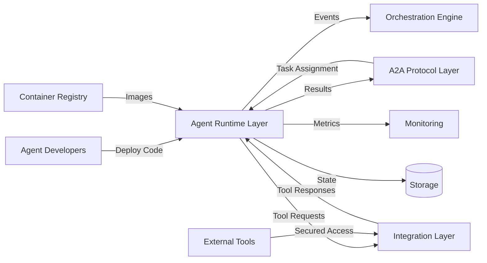
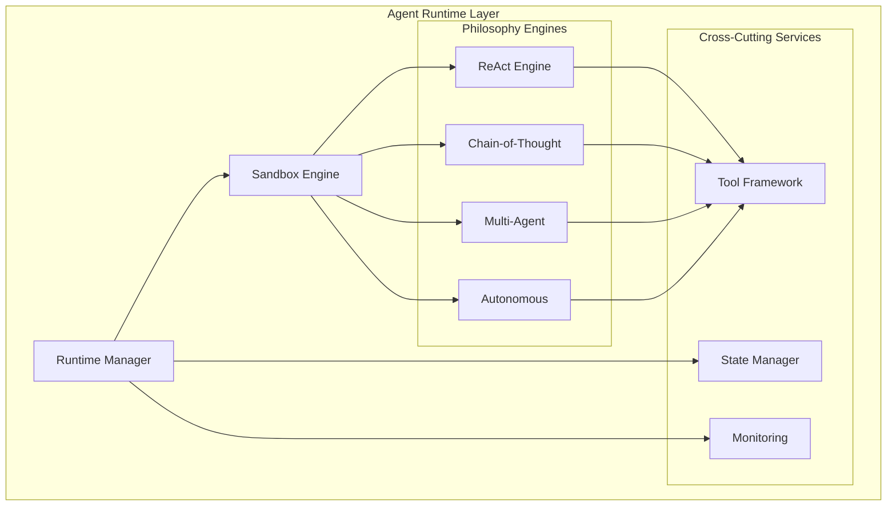

# Agent Runtime Layer - Technical Breakdown

**Created:** 2025-09-27
**Sources:** [spec](docs/specs/agent-runtime/spec.md) | [plan](docs/specs/agent-runtime/plan.md) | [tasks](docs/specs/agent-runtime/tasks.md)

---

## Quick Reference

```yaml
complexity: High
risk_level: High
team_size: 3-4 engineers (2 senior, 1-2 mid-level, 1 security specialist)
duration: 8-10 weeks
dependencies:
  - Docker 24.0+ (container isolation)
  - Kubernetes (orchestration)
  - A2A Protocol Layer (communication)
```

## Component Overview

**Purpose:** Secure, isolated execution environments for multi-philosophy AI agents supporting ReAct, Chain-of-Thought, Multi-Agent, and Autonomous paradigms with enterprise-grade sandboxing.

**Key Capabilities:**

- Multi-philosophy agent execution (ReAct, CoT, Multi-Agent, Autonomous)
- Container-based security sandboxing with Docker hardened images
- Tool integration framework with permission-based access control
- Agent lifecycle management with state persistence and migration
- Resource governance and performance optimization

**Success Metrics:**

- **Philosophy Support:** 4+ agent paradigms with 100% compatibility
- **Performance:** <100ms agent initialization, 1000+ concurrent agents per node
- **Security:** 99.95% sandbox isolation with zero privilege escalations
- **Reliability:** 99.9% agent execution success rate

## System Context



**Integration Points:**

1. **Upstream:** Agent code deployment, A2A protocol task assignments
2. **Downstream:** Tool execution via Integration Layer, workflow coordination
3. **Async:** Real-time monitoring, state persistence, resource scaling

## Architecture Design

### Component Structure



### Key Modules

**Module 1: Runtime Manager**

- **Responsibility:** Agent lifecycle management, resource allocation, scheduling
- **Dependencies:** Kubernetes client, Redis for state coordination
- **Complexity:** High

**Module 2: Sandbox Engine**

- **Responsibility:** Secure container isolation using Docker hardened images
- **Dependencies:** Docker Engine 24.0+, custom seccomp profiles
- **Complexity:** High

**Module 3: Philosophy Engines**

- **Responsibility:** Specialized execution frameworks for each agent paradigm
- **Dependencies:** LLM providers, internal state management
- **Complexity:** Medium (per engine)

**Module 4: Tool Framework**

- **Responsibility:** Secure tool execution with permission validation
- **Dependencies:** Integration Layer, OAuth providers
- **Complexity:** Medium

## Interface Contracts

### REST API

```yaml
POST /api/v1/agents:
  Request:
    - agent_id: string (required)
    - philosophy: enum (required)
    - configuration: AgentConfig (required)
    - code: base64 (required)
  Response:
    - agent_id: string
    - container_id: string
    - status: "initializing"
    - endpoints: object
  Errors:
    - 422: Invalid configuration
    - 507: Resource exhaustion
    - 503: Cluster unavailable

POST /api/v1/agents/{agent_id}/execute:
  Request:
    - input_data: object (required)
    - execution_parameters: object
    - timeout_seconds: number
  Response:
    - execution_id: string
    - status: "started"
    - stream_url: string
  Errors:
    - 404: Agent not found
    - 409: Already executing
    - 408: Timeout

GET /api/v1/agents/{agent_id}/status:
  Response:
    - agent_id: string
    - status: enum
    - current_step: string
    - performance_metrics: object
    - last_updated: timestamp
  Errors:
    - 404: Agent not found
    - 410: Agent terminated
```

### Agent Philosophy Interfaces

```yaml
ReAct Agent Pattern:
  Loop:
    - Thought: "I need to analyze the user's request"
    - Action: tool_call(parameters)
    - Observation: tool_response
    - Repeat until solved

Chain-of-Thought Pattern:
  Steps:
    - Step 1: "Let me break down this problem"
    - Step 2: "First, I should consider..."
    - Step 3: "Next, I need to..."
    - Final Answer: conclusion

Multi-Agent Pattern:
  Coordination:
    - Agent communication via A2A protocol
    - Consensus mechanisms for decisions
    - Shared state management
    - Conflict resolution strategies

Autonomous Pattern:
  Goal-Directed:
    - Self-directed goal pursuit
    - Long-term memory integration
    - Decision lineage tracking
    - Adaptive learning
```

### Container Security Profile

```yaml
SecurityProfile:
  base_image: "agentcore/hardened-python:3.11"
  user_namespace: true
  read_only_filesystem: true
  no_new_privileges: true
  dropped_capabilities:
    - ALL
  added_capabilities:
    - NET_BIND_SERVICE (if required)
  seccomp_profile: "custom-restricted"
  resource_limits:
    memory: "512Mi"
    cpu: "1000m"
    storage: "1Gi"
    file_descriptors: 100
```

### Data Models

```yaml
Entity: AgentExecution
Fields:
  - agent_id: string (indexed, FK)
  - execution_id: UUID (PK)
  - philosophy: enum (indexed)
  - status: enum (indexed)
  - container_id: string
  - current_step: string
  - execution_context: jsonb
  - performance_metrics: jsonb
  - created_at: timestamp (indexed)
Relations:
  - belongs_to: Agent
  - has_many: ToolExecutions
  - has_many: StateCheckpoints

Entity: ToolExecution
Fields:
  - execution_id: UUID (PK)
  - agent_id: string (FK)
  - tool_id: string (indexed)
  - parameters: jsonb
  - result: jsonb
  - execution_time_ms: integer
  - success: boolean (indexed)
Relations:
  - belongs_to: AgentExecution
```

## Implementation Details

### Technology Stack

**Containerization:** Docker 24.0+ with hardened security profiles and distroless base images
**Orchestration:** Kubernetes 1.28+ with Pod Security Standards and custom resource definitions
**Runtime:** Python 3.11+ with asyncio for concurrent agent management
**Security:** Custom seccomp profiles, user namespace remapping, read-only filesystems
**State Management:** Redis Cluster for coordination, PostgreSQL for persistence
**Rationale:** Research shows Docker hardened images provide 95% attack surface reduction, Kubernetes Pod Security Standards enforce container isolation, Python asyncio enables 1000+ concurrent agent execution

### Design Patterns

1. **Actor Model** - Each agent runs in isolated container with message-based communication
2. **Strategy Pattern** - Philosophy-specific execution engines with common interface
3. **Circuit Breaker** - Fail-fast tool execution with automatic recovery
4. **Command Pattern** - Agent actions as executable commands with undo capability
5. **Observer Pattern** - Real-time monitoring and event streaming

### Configuration

```yaml
# Environment variables
KUBERNETES_NAMESPACE: agentcore-runtime
CONTAINER_REGISTRY: agentcore.azurecr.io
AGENT_IMAGE_BASE: agentcore/hardened-python:3.11
MAX_CONCURRENT_AGENTS: 1000
AGENT_STARTUP_TIMEOUT: 30
TOOL_EXECUTION_TIMEOUT: 60
CHECKPOINT_INTERVAL: 300
RESOURCE_CLEANUP_INTERVAL: 60
```

## Testing Strategy

### Unit Tests (Target: 95% coverage)

**Critical Paths:**

- Agent lifecycle management (create, execute, terminate)
- Philosophy engine execution patterns and state transitions
- Container security profile enforcement
- Tool permission validation and execution
- Resource limit enforcement and monitoring

**Tools:** pytest with asyncio support, pytest-docker for container testing

### Integration Tests

**Scenarios:**

1. **Multi-Philosophy Execution:** Deploy all 4 agent types, verify execution patterns
2. **Security Isolation:** Attempt container escape, privilege escalation, resource exhaustion
3. **Tool Integration:** Secure tool execution with permission validation
4. **A2A Protocol Integration:** Agent communication via protocol layer
5. **State Persistence:** Agent checkpoint and recovery across container restarts

**Tools:** testcontainers-python, Kubernetes test clusters with kind

### End-to-End Tests

**User Flows:**

1. **ReAct Agent Workflow:** Deploy ReAct agent → Execute reasoning loop → Tool usage → Result delivery
2. **Multi-Agent Coordination:** Deploy multiple agents → Inter-agent communication → Collaborative task completion
3. **Autonomous Agent:** Deploy autonomous agent → Self-directed goal pursuit → Long-term memory usage
4. **Security Validation:** Malicious code execution → Container isolation verification → Security event logging

**Tools:** pytest-kubernetes, custom agent test harnesses

### Performance Tests

**Load Scenarios:**

- 1000+ concurrent agent containers
- Agent cold start performance (<500ms)
- Tool execution latency (<200ms p95)
- Memory usage per agent (<512MB)
- CPU utilization under load

**SLA Targets:**

- Agent initialization: <500ms cold start, <100ms warm start
- Tool execution: <200ms p95 latency
- Concurrent agents: 100+ per CPU core
- Resource efficiency: <50MB baseline memory per agent

**Tools:** k6 for load testing, Grafana for performance monitoring

### Security Tests

- Container escape attempts using known CVEs
- Privilege escalation testing with malicious agent code
- Resource exhaustion attacks (fork bombs, memory leaks)
- Tool permission bypass attempts
- Network isolation validation

## Operational Concerns

### Infrastructure

```yaml
Compute:
  - Node requirements: 16 vCPU, 64GB RAM for 1000 agents
  - Container runtime: Docker 24.0+ with security scanning
  - Auto-scaling: Based on agent queue depth and resource usage

Storage:
  - Agent state: 10GB per 1000 agents (compressed checkpoints)
  - Container images: Cached locally with automated updates
  - Logs: 30-day retention with structured JSON format

Networking:
  - Pod-to-pod: Calico with network policies
  - External access: Restricted via Integration Layer proxy
  - Service mesh: Istio for mTLS and traffic management
```

### Monitoring

**Metrics:**

- Agent Execution: startup_time, execution_duration, success_rate, failure_reasons
- Container Security: escape_attempts, privilege_violations, resource_breaches
- Philosophy Performance: reasoning_steps, tool_usage, memory_consumption
- System Resources: cpu_usage, memory_usage, disk_io, network_traffic

**Alerts:**

- Agent startup failure rate >5% for 5min
- Container security violation detected
- Resource usage >80% of limits for 10min
- Tool execution error rate >10% for 5min
- Agent execution timeout >5% for 10min

**Dashboards:**

- Agent Runtime Health: Real-time agent status, performance trends
- Security Monitoring: Container isolation metrics, security events
- Resource Utilization: CPU, memory, storage usage per philosophy

### Security

**Container Isolation:** Docker hardened images with 44+ blocked syscalls via custom seccomp profiles
**Access Control:** RBAC for agent management, tool permissions per agent type
**Data Protection:**

- Agent code encrypted at rest with AES-256
- Runtime state encrypted in Redis with automatic key rotation
- Audit logs for all agent actions and security events

**Compliance:**

- Container security scanning with zero critical CVE tolerance
- SOC2 compliance for agent execution audit trails
- GDPR compliance for agent data retention policies

### Scaling Strategy

**Horizontal:**

- Kubernetes HPA based on agent queue depth
- Multi-zone deployment with affinity rules
- Container image pre-pulling for faster startup

**Vertical:**

- Dynamic resource allocation per agent type
- Memory optimization with copy-on-write containers
- CPU throttling with fair scheduling

## Risk Analysis

### Technical Risks

| Risk | Impact | Likelihood | Mitigation |
|------|--------|------------|------------|
| Container escape vulnerabilities | High | Low | Docker hardened images, runtime monitoring with Falco, regular security updates |
| Resource exhaustion from malicious agents | High | Medium | Strict resource limits, monitoring, circuit breakers, auto-termination |
| Multi-agent coordination complexity | Medium | High | Incremental implementation, simplified coordination patterns, extensive testing |
| Philosophy engine bugs affecting execution | Medium | Medium | Isolated execution, comprehensive testing, rollback capabilities |
| Tool integration security breaches | High | Medium | OAuth validation, rate limiting, network segmentation, audit logging |

### Dependency Risks

| Dependency | Risk | Mitigation |
|------------|------|------------|
| Docker Engine | Security vulnerabilities | Automated updates, security scanning, hardened configurations |
| Kubernetes Cluster | Node failures | Multi-zone deployment, agent migration, persistent state |
| LLM Providers | API rate limits, downtime | Multiple provider support, local caching, graceful degradation |

### Operational Risks

| Risk | Impact | Likelihood | Mitigation |
|------|--------|------------|------------|
| Agent code quality issues | Medium | High | Code scanning, sandbox isolation, execution timeouts |
| Performance degradation under load | High | Medium | Load testing, auto-scaling, resource monitoring |

## Development Workflow

### Local Setup

```bash
# Setup local development environment
git clone <repo>
cd agentcore
uv sync

# Start local Kubernetes cluster with kind
kind create cluster --config configs/kind-cluster.yaml

# Deploy development infrastructure
kubectl apply -f k8s/dev/

# Build and deploy agent runtime
docker build -t localhost:5000/agentcore/agent-runtime:dev .
docker push localhost:5000/agentcore/agent-runtime:dev

# Start agent runtime service
uv run python -m src.agent_runtime.main --dev

# Verify installation
curl http://localhost:8001/health
kubectl get pods -n agentcore-dev
```

### Code Quality

- **Linting:** Ruff with security-focused rules (bandit integration)
- **Type Safety:** mypy strict mode with no Any types
- **Security:** Bandit for security scanning, safety for dependency vulnerabilities
- **Testing:** pytest with asyncio, 95% coverage requirement
- **Documentation:** Sphinx with philosophy engine documentation

### Deployment Pipeline

```yaml
Stages:
  1. Build: UV package build, multi-stage Docker build with security scanning
  2. Test: Unit tests (95% coverage), integration tests with real containers
  3. Security: Container vulnerability scanning, seccomp profile validation
  4. K8s Deploy: Staging deployment with Pod Security Standards
  5. E2E Tests: Multi-philosophy agent testing, security validation
  6. Performance: Load testing with 1000+ agents, resource monitoring
  7. Production: Blue-green deployment with health checks
```

## Implementation Checklist

**Phase 1: Foundation (Weeks 1-2)**

- [ ] Docker hardened images with custom seccomp profiles
- [ ] Kubernetes integration with Pod Security Standards
- [ ] Basic agent lifecycle management (create, execute, terminate)
- [ ] ReAct philosophy engine implementation
- [ ] Container resource limits and monitoring

**Phase 2: Multi-Philosophy (Weeks 3-4)**

- [ ] Chain-of-Thought engine with step-by-step reasoning
- [ ] Multi-Agent coordination framework with A2A protocol
- [ ] Autonomous agent framework with goal-directed execution
- [ ] Tool integration framework with secure execution
- [ ] State persistence and checkpoint recovery

**Phase 3: Security & Performance (Weeks 5-6)**

- [ ] Advanced security profiles with user namespace isolation
- [ ] Performance optimization for 1000+ concurrent agents
- [ ] Comprehensive monitoring with Prometheus metrics
- [ ] Security testing including container escape attempts
- [ ] A2A protocol integration for agent communication

**Phase 4: Production Readiness (Weeks 7-8)**

- [ ] Load testing validation with performance benchmarks
- [ ] Security hardening with penetration testing
- [ ] Production deployment with multi-zone configuration
- [ ] Monitoring dashboards and alerting setup
- [ ] Documentation and operational runbooks

## References

**Internal:**

- [Agent Runtime Specification](docs/specs/agent-runtime/spec.md)
- [Implementation Plan](docs/specs/agent-runtime/plan.md)
- [Task Breakdown](docs/specs/agent-runtime/tasks.md)

**External:**

- [Docker Container Security Hardening Guide](https://docs.docker.com/engine/security/seccomp/)
- [Kubernetes Pod Security Standards](https://kubernetes.io/docs/concepts/security/pod-security-standards/)
- [ReAct Framework Implementation Guide](https://www.promptingguide.ai/techniques/react)
- [Container Security Best Practices](https://cheatsheetseries.owasp.org/cheatsheets/Docker_Security_Cheat_Sheet.html)
- [Python Asyncio Performance Optimization](https://docs.python.org/3/library/asyncio-dev.html)
