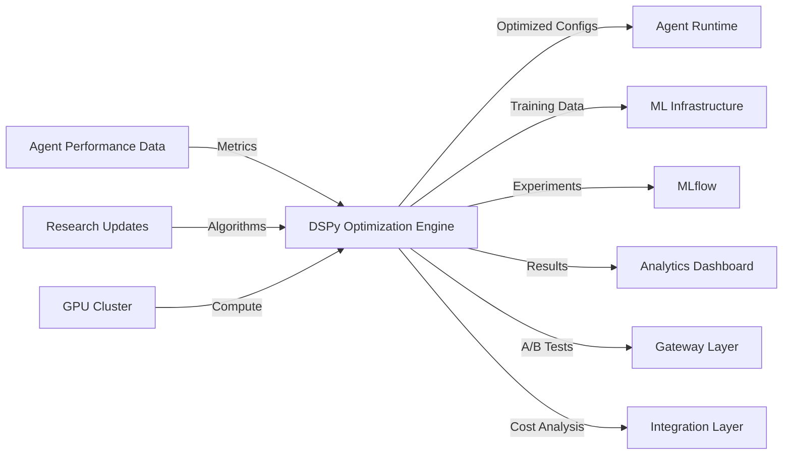
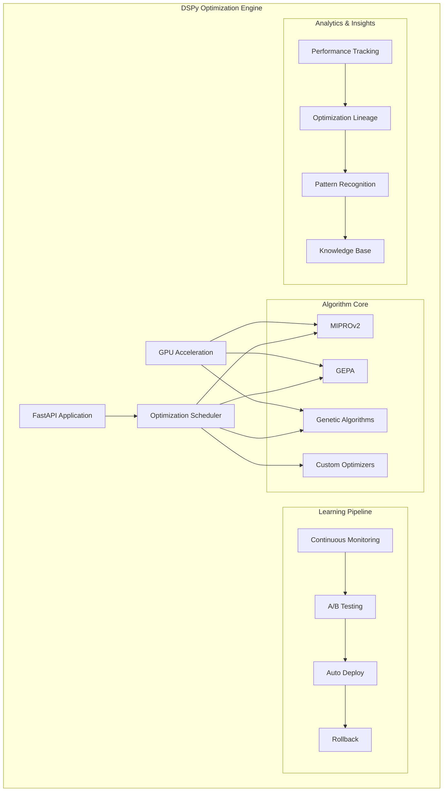

# DSPy Optimization Engine - Technical Breakdown

**Created:** 2025-09-27
**Sources:** [spec](docs/specs/dspy-optimization/spec.md) | [plan](docs/specs/dspy-optimization/plan.md) | [tasks](docs/specs/dspy-optimization/tasks.md)

---

## Quick Reference

```yaml
complexity: High
risk_level: High
team_size: 2-3 engineers
duration: 8 weeks
dependencies:
  - DSPy Framework (MIPROv2, GEPA algorithms)
  - MLflow (experiment tracking)
  - PyTorch (custom optimization models)
  - GPU infrastructure (optimization acceleration)
```

## Component Overview

**Purpose:** Systematic AI optimization using DSPy framework with advanced algorithms including MIPROv2 and GEPA, delivering automated 20-30% performance improvements through evolutionary optimization, self-reflection, and continuous learning.

**Key Capabilities:**

- DSPy framework integration with MIPROv2 and GEPA optimization algorithms
- Evolutionary agent optimization with genetic algorithms and Pareto frontier selection
- Continuous learning pipeline with automatic A/B testing and validation
- Self-reflection capabilities with LLM-as-judge for automated quality assessment
- Cross-agent knowledge transfer and optimization sharing

**Success Metrics:**

- **Performance Improvement:** 20-30% average improvement in agent task success rates
- **Optimization Speed:** Complete optimization cycles within 2 hours for typical workflows
- **Coverage:** Support for all agent philosophies and 95% of common tasks
- **Automation:** 90% of optimizations require no human intervention

## System Context



**Integration Points:**

1. **Upstream:** Agent performance data from runtime layer, research algorithm updates
2. **Downstream:** Optimized agent configurations, A/B test results, cost optimizations
3. **Async:** Continuous learning pipeline with automated optimization deployment

## Architecture Design

### Component Structure



### Key Modules

**Module 1: DSPy Algorithm Core**

- **Responsibility:** MIPROv2 and GEPA implementation, optimization algorithm orchestration
- **Dependencies:** DSPy framework, PyTorch for custom models, GPU acceleration
- **Complexity:** High

**Module 2: Evolutionary Optimization**

- **Responsibility:** Genetic algorithms, population management, Pareto frontier selection
- **Dependencies:** NumPy/SciPy for mathematical operations, statistical libraries
- **Complexity:** High

**Module 3: Continuous Learning Pipeline**

- **Responsibility:** Performance monitoring, A/B testing, automated deployment
- **Dependencies:** MLflow for experiment tracking, statistical testing libraries
- **Complexity:** Medium

**Module 4: Analytics & Insights Engine**

- **Responsibility:** Pattern recognition, optimization lineage, knowledge extraction
- **Dependencies:** Pandas for data analysis, visualization libraries
- **Complexity:** Medium

## Interface Contracts

### REST API

```yaml
POST /api/v1/optimize:
  Request:
    - target: OptimizationTarget (required)
    - objectives: array[OptimizationObjective] (required)
    - algorithms: array[string] (optional, defaults to ["miprov2", "gepa"])
    - constraints: OptimizationConstraints (optional)
  Response:
    - optimization_id: UUID
    - status: "queued"
    - estimated_completion: ISO8601
  Errors:
    - 422: Invalid optimization target
    - 507: GPU resources unavailable
    - 503: Optimization queue full

GET /api/v1/optimizations/{id}/status:
  Response:
    - optimization_id: UUID
    - status: enum ["queued", "running", "completed", "failed"]
    - progress: float (0.0-1.0)
    - results: OptimizationResult (if completed)
    - metrics: PerformanceMetrics
  Errors:
    - 404: Optimization not found
    - 410: Optimization expired

POST /api/v1/experiments:
  Request:
    - optimization_id: UUID (required)
    - baseline_config: AgentConfig (required)
    - optimized_config: AgentConfig (required)
    - traffic_split: float (default: 0.1)
  Response:
    - experiment_id: UUID
    - status: "running"
    - monitoring_url: string
  Errors:
    - 404: Optimization not found
    - 409: Experiment already running
    - 422: Invalid configuration
```

### WebSocket Protocol

```yaml
Connection: /ws/optimizations/{optimization_id}
Protocol: Real-time optimization progress streaming
Message Format:
  - type: "progress" | "result" | "error"
  - optimization_id: UUID
  - timestamp: ISO8601
  - data:
      progress: float
      current_iteration: int
      best_score: float
      algorithm: string
```

### Events Published

```yaml
EventName: optimization.completed
Schema:
  - optimization_id: UUID
  - improvement_percentage: float
  - algorithm_used: string
  - statistical_significance: float
  - timestamp: ISO8601

EventName: experiment.result
Schema:
  - experiment_id: UUID
  - optimization_id: UUID
  - winner: "baseline" | "optimized"
  - confidence: float
  - deployment_recommended: boolean
  - timestamp: ISO8601
```

### Data Models

```yaml
Entity: OptimizationRequest
Fields:
  - optimization_id: UUID (PK)
  - target_type: enum (indexed)
  - target_id: string (indexed)
  - objectives: jsonb
  - algorithms: array[string]
  - constraints: jsonb
  - status: enum (indexed)
  - created_at: timestamp (indexed)
Relations:
  - has_many: OptimizationResults
  - has_many: Experiments

Entity: OptimizationResult
Fields:
  - result_id: UUID (PK)
  - optimization_id: UUID (FK, indexed)
  - algorithm_used: string (indexed)
  - baseline_performance: jsonb
  - optimized_performance: jsonb
  - improvement_percentage: float (indexed)
  - statistical_significance: float
  - optimization_details: jsonb
  - completed_at: timestamp (indexed)
Relations:
  - belongs_to: OptimizationRequest
  - has_many: DeploymentEvents
```

## Implementation Details

### Technology Stack

**ML Framework:** DSPy latest version with MIPROv2 and GEPA algorithms
**Infrastructure:** PyTorch 2.0+ with CUDA support for GPU acceleration
**Experiment Tracking:** MLflow 2.8+ for comprehensive lifecycle management
**Statistical Computing:** SciPy/StatsModels for significance testing and analysis
**Database:** PostgreSQL 14+ with JSONB optimization for experiment data
**Rationale:** DSPy provides research-backed 20-30% improvements, PyTorch offers production deployment flexibility, MLflow enables comprehensive experiment lifecycle management with model versioning

### Design Patterns

1. **Strategy Pattern** - Pluggable optimization algorithms (MIPROv2, GEPA, genetic)
2. **Observer Pattern** - Real-time progress monitoring and event streaming
3. **Command Pattern** - Optimization requests with undo/rollback capabilities
4. **Factory Pattern** - Algorithm instantiation based on target characteristics
5. **Pipeline Pattern** - Sequential optimization stages with checkpointing

### Configuration

```yaml
# Environment variables
DSPY_CONFIG_PATH: /app/config/dspy.yaml
MLFLOW_TRACKING_URI: http://mlflow:5000
PYTORCH_CUDA_ALLOC_CONF: max_split_size_mb:512
GPU_MEMORY_FRACTION: 0.8
OPTIMIZATION_QUEUE_SIZE: 100
MAX_CONCURRENT_OPTIMIZATIONS: 10
EXPERIMENT_TIMEOUT_HOURS: 24
STATISTICAL_SIGNIFICANCE_THRESHOLD: 0.05
```

## Testing Strategy

### Unit Tests (Target: 95% coverage)

**Critical Paths:**

- MIPROv2 and GEPA algorithm implementations
- Genetic algorithm population management and selection
- Statistical significance testing and validation
- Performance improvement calculation and reporting
- A/B test traffic splitting and result analysis

**Tools:** pytest with asyncio support, pytest-cov for coverage, hypothesis for property-based testing

### Integration Tests

**Scenarios:**

1. End-to-end optimization with real agent performance data
2. MLflow experiment tracking and model artifact management
3. GPU acceleration with CUDA memory management
4. Cross-agent knowledge transfer and optimization sharing
5. A/B testing with statistical validation

**Tools:** pytest-asyncio, testcontainers for MLflow/PostgreSQL, pytest-gpu for CUDA testing

### End-to-End Tests

**User Flows:**

1. **Automatic Optimization:** Performance monitoring → Algorithm selection → Optimization → A/B testing → Deployment
2. **Multi-Objective Optimization:** Objective definition → Pareto frontier analysis → Trade-off evaluation → Selection
3. **Research Integration:** New algorithm → Validation → Comparison → Knowledge base update
4. **Failure Recovery:** Optimization failure → Rollback → Alternative algorithm → Recovery

**Tools:** pytest-benchmark for performance testing, locust for load testing

### Performance Tests

**Load Scenarios:**

- 100+ concurrent optimizations with GPU resource management
- 1000+ agent population evolutionary optimization
- Real-time A/B testing with traffic splitting
- Knowledge transfer across 500+ optimization patterns

**SLA Targets:**

- Optimization cycle completion: <2 hours for typical workflows
- Performance improvement detection: >20% for 80% of targets
- Statistical significance validation: <5 minutes
- A/B test result calculation: <1 minute

**Tools:** pytest-benchmark for algorithm performance, MLflow metrics for tracking

### Security Tests

- Optimization model tampering and poisoning attacks
- GPU memory isolation and resource exhaustion prevention
- MLflow experiment data access control validation
- Cross-tenant optimization knowledge isolation
- OWASP ML Security testing with adversarial inputs

## Operational Concerns

### Infrastructure

```yaml
Compute:
  - Container: 8 vCPU, 16GB RAM, 2x NVIDIA A100 GPUs
  - Auto-scaling: 2-6 instances based on optimization queue depth
  - Health checks: /health, /ready, /gpu-status endpoints

Storage:
  - MLflow Backend: 500GB for experiment artifacts and models
  - PostgreSQL: 100GB with automated backups
  - GPU Memory: 80GB shared across optimization workloads
  - Logs: 30-day retention with structured JSON format

Networking:
  - Load balancer: Optimization queue routing
  - GPU Fabric: High-speed interconnect for multi-GPU optimization
  - Internal mesh: gRPC for high-performance model serving
```

### Monitoring

**Metrics:**

- Optimization KPIs: improvement_rate, algorithm_success_rate, cycle_time
- GPU metrics: utilization, memory_usage, temperature, error_rate
- A/B test metrics: experiment_count, winner_detection_time, deployment_rate
- Infrastructure: CPU, memory, GPU cluster health, MLflow performance

**Alerts:**

- Optimization cycle time >4 hours for 2 consecutive cycles
- GPU utilization <50% during active optimization (inefficiency)
- A/B test statistical significance not reached within 7 days
- Performance improvement <10% for >20% of optimizations
- GPU memory exhaustion or CUDA errors

**Dashboards:**

- Optimization Performance: Real-time improvement rates and algorithm comparison
- Research Pipeline: Algorithm effectiveness, pattern discovery, knowledge growth
- GPU Resource Management: Utilization, scheduling, performance optimization

### Security

**Model Security:** AES-256-GCM encryption for optimization models and research IP
**Data Protection:** Anonymization of training data, secure handling of sensitive optimization parameters
**Access Control:** RBAC for optimization operations with tenant isolation
**Audit & Compliance:**

- Complete optimization decision audit trails
- Research data handling compliance (academic partnerships)
- GPU resource usage tracking for cost allocation

### Scaling Strategy

**Horizontal:**

- Distributed optimization across multiple GPU clusters
- Optimization queue partitioning by algorithm and resource requirements
- Load balancing with GPU-aware scheduling

**Vertical:**

- Multi-GPU optimization for large-scale agent populations
- Memory optimization for complex evolutionary algorithms
- GPU memory pooling and dynamic allocation

## Risk Analysis

### Technical Risks

| Risk | Impact | Likelihood | Mitigation |
|------|--------|------------|------------|
| DSPy framework breaking changes | High | Medium | Pin version, maintain compatibility layer, contribute upstream |
| GPU memory exhaustion during optimization | High | High | Memory monitoring, dynamic batching, graceful degradation |
| MIPROv2/GEPA algorithm implementation complexity | High | Medium | Extensive testing, research collaboration, fallback algorithms |
| Statistical significance false positives | Medium | Medium | Multiple testing correction, extended validation periods |
| Optimization model overfitting | Medium | High | Cross-validation, diverse training data, regularization |

### Dependency Risks

| Dependency | Risk | Mitigation |
|------------|------|------------|
| DSPy framework | Research project maintenance | Fork and maintain, active community engagement |
| MLflow | Feature gaps for optimization workflows | Custom plugins, alternative tracking solutions |
| GPU infrastructure | Hardware failures and availability | Redundant clusters, cloud failover, CPU fallback |

### Business Risks

| Risk | Impact | Likelihood | Mitigation |
|------|--------|------------|------------|
| Research algorithm improvements slower than expected | High | Medium | Multiple algorithm approaches, continuous research partnerships |
| Optimization benefits not meeting 20-30% targets | High | Low | Conservative targets, multiple success metrics, manual fallback |

## Development Workflow

### Local Setup

```bash
# Clone and setup environment
git clone <repo>
cd agentcore
uv sync

# Setup GPU environment
export CUDA_VISIBLE_DEVICES=0
nvidia-smi  # Verify GPU availability

# Start infrastructure dependencies
docker-compose -f docker-compose.dev.yml up -d mlflow postgres redis

# Run database migrations
uv run alembic upgrade head

# Start DSPy optimization engine
uv run uvicorn src.dspy_optimization.main:app --reload --port 8004

# Verify setup
curl http://localhost:8004/health
curl http://localhost:8004/api/v1/algorithms/available
```

### Code Quality

- **Linting:** Ruff with ML-specific rules, tensor shape validation
- **Type Safety:** mypy strict mode with PyTorch tensor annotations
- **Pre-commit:** Black formatting, isort, security scanning, GPU memory checks
- **Documentation:** Algorithm documentation, optimization lineage tracking

### Deployment Pipeline

```yaml
Stages:
  1. Build: UV package build, Docker with CUDA support
  2. Test: Unit, integration, algorithm validation (95% coverage)
  3. GPU Testing: CUDA functionality, memory management, multi-GPU coordination
  4. Algorithm Validation: MIPROv2/GEPA reference implementation comparison
  5. Performance Testing: Optimization benchmarks, statistical significance validation
  6. Deploy Staging: GPU cluster deployment with smoke tests
  7. Research Validation: Algorithm effectiveness against research baselines
  8. Deploy Production: Manual approval with A/B testing infrastructure
```

## Implementation Checklist

**Phase 1: Core Framework (Weeks 1-2)**

- [ ] DSPy framework integration with MIPROv2 and GEPA algorithms
- [ ] MLflow server setup with experiment tracking and model management
- [ ] Basic optimization pipeline with performance monitoring
- [ ] GPU acceleration setup with CUDA memory management
- [ ] PostgreSQL schema for optimization history and results

**Phase 2: Advanced Algorithms (Weeks 3-4)**

- [ ] Evolutionary optimization with genetic algorithms and population management
- [ ] A/B testing framework with traffic splitting and statistical analysis
- [ ] Continuous learning pipeline with automated optimization scheduling
- [ ] Cross-agent knowledge transfer and optimization sharing
- [ ] Multi-objective optimization with Pareto frontier selection

**Phase 3: Analytics & Insights (Weeks 5-6)**

- [ ] Performance analytics with 20-30% improvement validation
- [ ] Custom algorithm framework with plugin architecture
- [ ] Optimization insights and pattern recognition engine
- [ ] Research integration pipeline for latest DSPy advances
- [ ] Cost optimization analysis and recommendations

**Phase 4: Production Readiness (Weeks 7-8)**

- [ ] Security hardening with model encryption and audit trails
- [ ] Load testing validation with 1000+ concurrent optimizations
- [ ] Integration with all AgentCore components
- [ ] Production deployment automation with GPU cluster management
- [ ] Comprehensive monitoring dashboards and alerting

## References

**Internal:**

- [DSPy Optimization Specification](docs/specs/dspy-optimization/spec.md)
- [Implementation Plan](docs/specs/dspy-optimization/plan.md)
- [Task Breakdown](docs/specs/dspy-optimization/tasks.md)

**External:**

- [DSPy Framework Documentation](https://dspy-docs.vercel.app/)
- [MIPROv2 Research Paper](https://arxiv.org/abs/2406.11695)
- [GEPA Algorithm Implementation](https://github.com/stanfordnlp/dspy)
- [MLflow Production Deployment Guide](https://mlflow.org/docs/latest/production-deployment.html)
- [PyTorch Distributed Training Best Practices](https://pytorch.org/tutorials/intermediate/ddp_tutorial.html)
