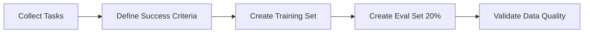

# Training Agents with GRPO

**Audience:** Developers, ML Engineers
**Prerequisites:** Familiarity with AgentCore, Python, basic RL concepts
**Version:** 1.0
**Last Updated:** 2025-10-17

---

## Table of Contents

1. [Introduction](#introduction)
2. [Concepts](#key-concepts)
3. [Quick Start](#quick-start)
4. [Training Workflow](#training-workflow)
5. [Configuration](#configuration)
6. [Monitoring & Metrics](#monitoring-and-metrics)
7. [Troubleshooting](#troubleshooting)
8. [Best Practices](#best-practices)

---

## Introduction

AgentCore's training infrastructure uses **GRPO (Group Refined Policy Optimization)** to improve agent performance through reinforcement learning. This guide walks you through training your first agent and understanding the training process.

### What is GRPO?

GRPO is a policy gradient algorithm that:
- Generates multiple trajectories per query
- Computes advantages using group normalization
- Updates policies for high-advantage trajectories
- Optimizes agent behavior through iterative improvement

### When to Use Training

✅ **Use Training When:**
- Agent performance is below expectations
- You have 100+ representative task examples
- Task success criteria are well-defined
- Budget allows for training costs

❌ **Don't Use Training When:**
- Agent already performs well (>90% success rate)
- Task requirements frequently change
- Limited training data (<100 examples)
- Cost constraints are tight

---

## Key Concepts

### 1. Trajectories

A **trajectory** is a complete execution path for a query:

```
Query: "Sort this list: [3,1,2]"
 ↓
Step 1: Plan → "I'll use Python's sorted() function"
Step 2: Execute → sorted([3,1,2])
Step 3: Verify → Check output [1,2,3]
 ↓
Result: Success (reward: 1.0)
```

**Key Properties:**
- Each trajectory has N steps (default max: 20)
- Multiple trajectories per query (default: 8)
- Trajectories capture state, action, result at each step

### 2. Rewards

**Outcome-Based Rewards:**
- Success = 1.0
- Failure = 0.0

**Shaped Rewards (optional):**
- Tool usage: +0.1 per successful tool call
- Verification: +0.05 per verification step
- Length penalty: -0.01 per step

**Normalized Rewards:**
- Computed using group statistics (mean, std)
- Enables fair comparison across trajectories

### 3. Advantage

**Advantage = Normalized Reward**

Trajectories with positive advantage (above average) are used to update the policy. This ensures the agent learns from better-than-average executions.

### 4. Policy Updates

The agent's policy (prompts, context) is updated based on patterns from high-advantage trajectories:

```
High-Advantage Pattern Detected:
"Always verify output before returning"

Policy Update:
Add to system prompt: "Verify all outputs before completion"
```

---

## Quick Start

### Step 1: Prepare Training Data

Create 100+ training queries with expected outcomes:

```python
training_data = [
    {
        "query": "Sort the list [5, 2, 8, 1]",
        "expected_outcome": {
            "result": [1, 2, 5, 8],
            "test_passed": True
        }
    },
    {
        "query": "Find the maximum value in [10, 3, 7]",
        "expected_outcome": {
            "result": 10,
            "test_passed": True
        }
    },
    # ... 98+ more examples
]
```

**Data Quality Guidelines:**
- Representative of production tasks
- Clear success criteria
- Diverse task types
- Balanced difficulty

### Step 2: Configure Training

```python
from agentcore.training import GRPOConfig

config = GRPOConfig(
    n_iterations=500,           # Number of training iterations
    batch_size=16,              # Queries per iteration
    n_trajectories_per_query=8, # Trajectories to generate per query
    learning_rate=0.0001,       # Policy gradient learning rate
    max_budget_usd=50.00,       # Training cost limit
    checkpoint_interval=10,     # Save checkpoint every N iterations
)
```

### Step 3: Start Training

```python
from agentcore.sdk import TrainingClient

client = TrainingClient(
    base_url="https://api.agentcore.ai",
    api_key=os.getenv("AGENTCORE_API_KEY")
)

# Start training job
job = client.start_training(
    agent_id="my-agent-v1",
    config=config,
    training_data=training_data,
    evaluation_data=eval_data  # 20% held-out for validation
)

print(f"Training job started: {job['job_id']}")
```

### Step 4: Monitor Progress

```python
import time

while True:
    status = client.get_status(job["job_id"])

    print(f"Progress: {status['progress_percent']}%")
    print(f"Current Loss: {status['metrics']['train_loss']:.3f}")
    print(f"Validation Accuracy: {status['metrics']['validation_accuracy']:.2%}")
    print(f"Budget Used: ${status['cost_usd']} / ${status['budget_usd']}")

    if status["status"] in ["completed", "failed", "cancelled"]:
        break

    time.sleep(60)  # Poll every minute
```

### Step 5: Evaluate Results

```python
# Run evaluation on best checkpoint
eval_result = client.evaluate(job["job_id"])

print(f"Success Rate: {eval_result['metrics']['success_rate']:.2%}")
print(f"Improvement: +{eval_result['baseline_comparison']['success_rate_improvement']:.2%}")

if eval_result['baseline_comparison']['statistically_significant']:
    print("✅ Improvement is statistically significant!")
```

---

## Training Workflow

### Phase 1: Data Preparation



**Checklist:**
- [ ] 100+ training queries
- [ ] 20+ evaluation queries  
- [ ] Clear success criteria
- [ ] Expected outcomes defined

### Phase 2: Configuration

**Key Parameters:**

| Parameter | Typical Range | Impact |
|-----------|--------------|--------|
| `n_iterations` | 100-1000 | Training duration |
| `batch_size` | 8-32 | Memory usage, stability |
| `n_trajectories_per_query` | 4-16 | Exploration vs cost |
| `learning_rate` | 0.00001-0.001 | Convergence speed |

**Start Conservative:**
```python
config = GRPOConfig(
    n_iterations=100,    # Start small
    batch_size=8,        # Lower memory
    n_trajectories_per_query=4,  # Reduce cost
    learning_rate=0.0001
)
```

### Phase 3: Training Execution

```python
# 1. Start job
job = client.start_training(...)

# 2. Monitor (automated with webhooks)
client.subscribe_webhook(
    events=["training.job.progress", "training.budget.warning"],
    url="https://myapp.com/webhooks/training"
)

# 3. Check convergence
status = client.get_status(job_id)
if status["metrics"]["train_loss"] < 0.1:
    print("Training converged!")
```

### Phase 4: Evaluation

```python
# Evaluate on held-out data
eval_metrics = client.evaluate(job_id)

# Key metrics
success_rate = eval_metrics["metrics"]["success_rate"]
avg_reward = eval_metrics["metrics"]["avg_reward"]
improvement = eval_metrics["baseline_comparison"]["success_rate_improvement"]

# Statistical significance
p_value = eval_metrics["baseline_comparison"]["p_value"]
significant = p_value < 0.05
```

### Phase 5: Deployment

```python
# 1. Get best checkpoint
best_checkpoint = status["best_checkpoint_id"]

# 2. Deploy to production (example)
client.deploy_checkpoint(
    agent_id="my-agent-v1",
    checkpoint_id=best_checkpoint,
    environment="production"
)

# 3. A/B test (recommended)
client.configure_ab_test(
    agent_id="my-agent-v1",
    baseline_checkpoint=None,  # Current production
    experiment_checkpoint=best_checkpoint,
    traffic_split=0.1  # 10% to new version
)
```

---

## Configuration

### Basic Configuration

```python
config = GRPOConfig(
    n_iterations=500,
    batch_size=16,
    n_trajectories_per_query=8,
    learning_rate=0.0001,
    max_budget_usd=100.00
)
```

### Advanced Configuration

```python
config = GRPOConfig(
    # Training duration
    n_iterations=1000,
    batch_size=32,

    # Exploration
    n_trajectories_per_query=12,  # More exploration
    max_steps_per_trajectory=30,   # Allow longer trajectories

    # Optimization
    learning_rate=0.0001,
    gamma=0.99,  # Discount factor for multi-step credit

    # Resource limits
    max_budget_usd=200.00,
    checkpoint_interval=20,  # Save less frequently
)
```

### Custom Reward Functions

```python
from agentcore.training import get_global_registry

# Register custom reward
registry = get_global_registry()

def my_custom_reward(trajectory):
    """Domain-specific reward logic."""
    reward = 0.5 if trajectory.success else 0.0

    # Custom logic
    if has_optimal_solution(trajectory):
        reward += 0.3

    return reward

registry.register("my_reward", my_custom_reward)
registry.set_agent_strategy("my-agent-type", "my_reward")
```

See [Custom Rewards Guide](./custom_rewards.md) for details.

---

## Monitoring and Metrics

### Training Metrics

**Loss:**
- Policy gradient loss
- Should decrease over time
- Convergence: loss < 0.1

**Validation Metrics:**
- `success_rate`: % of queries completed successfully
- `avg_reward`: Average reward across queries
- `avg_steps`: Average trajectory length
- `tool_accuracy`: Tool call success rate

**Resource Metrics:**
- `cost_usd`: Accumulated training cost
- `budget_remaining_percent`: % of budget left
- `trajectories_generated`: Total trajectories
- `estimated_completion`: ETA for job completion

### Prometheus Metrics

```yaml
# Training job metrics
training_jobs_created_total
training_jobs_completed_total
training_jobs_failed_total

# Performance metrics
training_trajectory_generation_duration_seconds
training_policy_update_duration_seconds

# Budget metrics
training_budget_usage_dollars
training_budget_limit_dollars
```

**Grafana Dashboard:**

```bash
# Import training dashboard
curl -X POST http://grafana:3000/api/dashboards/import \
  -H "Content-Type: application/json" \
  -d @k8s/monitoring/training-dashboard.json
```

### Real-Time Monitoring

```python
# WebSocket connection for live updates
import websockets

async def monitor_training(job_id):
    uri = f"wss://api.agentcore.ai/training/ws/{job_id}"

    async with websockets.connect(uri) as ws:
        async for message in ws:
            event = json.loads(message)

            if event["type"] == "progress":
                print(f"Iteration {event['iteration']}/{event['total']}")
                print(f"Loss: {event['loss']:.4f}")

            elif event["type"] == "checkpoint":
                print(f"Checkpoint saved: {event['checkpoint_id']}")

asyncio.run(monitor_training(job_id))
```

---

## Troubleshooting

### Issue: Training Not Converging

**Symptoms:**
- Loss plateaus above 0.5
- Validation accuracy not improving
- No significant difference from baseline

**Solutions:**

1. **Increase Learning Rate:**
   ```python
   config.learning_rate = 0.0005  # 5x increase
   ```

2. **More Exploration:**
   ```python
   config.n_trajectories_per_query = 16  # Double trajectories
   ```

3. **Better Reward Signal:**
   - Add shaped rewards
   - Use custom reward functions
   - Verify reward computation logic

### Issue: Budget Exhausted Too Quickly

**Symptoms:**
- Job stops at 75% budget warning
- Cost per iteration higher than expected

**Solutions:**

1. **Reduce Batch Size:**
   ```python
   config.batch_size = 8  # Half the size
   ```

2. **Fewer Trajectories:**
   ```python
   config.n_trajectories_per_query = 4
   ```

3. **Use Cheaper Model:**
   Configure agent to use GPT-4-mini instead of GPT-4

### Issue: Overfitting

**Symptoms:**
- High training accuracy (>95%)
- Low validation accuracy (<70%)
- Large gap between train/val metrics

**Solutions:**

1. **More Training Data:**
   - Increase diversity
   - Add edge cases

2. **Early Stopping:**
   ```python
   # Stop when validation plateaus
   if no_improvement_for_N_iterations(20):
       client.cancel(job_id)
   ```

3. **Regularization:**
   - Lower learning rate
   - Increase batch size

### Issue: Out of Memory

**Symptoms:**
- Worker crashes
- `OutOfMemoryError` in logs

**Solutions:**

1. **Reduce Parallel Trajectories:**
   ```python
   config.n_trajectories_per_query = 4
   ```

2. **Limit Trajectory Length:**
   ```python
   config.max_steps_per_trajectory = 10
   ```

3. **Scale Workers:**
   - Add more worker pods
   - Reduce trajectories per worker

---

## Best Practices

### 1. Data Quality Over Quantity

❌ **Bad:** 500 low-quality, ambiguous queries
✅ **Good:** 150 clear, representative queries

### 2. Start Small, Iterate

```python
# Iteration 1: Quick validation
config = GRPOConfig(n_iterations=50, batch_size=8)

# Iteration 2: Full training
config = GRPOConfig(n_iterations=500, batch_size=16)

# Iteration 3: Fine-tuning
config = GRPOConfig(n_iterations=1000, batch_size=32)
```

### 3. Monitor Continuously

- Set up Grafana dashboards
- Configure budget alerts (75%, 90%)
- Use webhooks for notifications
- Check metrics every 10 iterations

### 4. Version Control Everything

```python
# Tag training runs
job = client.start_training(
    agent_id="my-agent-v1",
    config=config,
    training_data=training_data,
    metadata={
        "git_commit": "abc123",
        "data_version": "v2.1",
        "experiment": "increase_trajectories"
    }
)
```

### 5. A/B Test Before Full Deployment

```python
# 1. Deploy to 10% of traffic
client.configure_ab_test(
    baseline_checkpoint=current,
    experiment_checkpoint=new,
    traffic_split=0.1
)

# 2. Monitor for 24 hours

# 3. Gradual rollout
if success_rate_improvement > 0.05:
    client.configure_ab_test(..., traffic_split=0.5)
    # Eventually: traffic_split=1.0
```

### 6. Document Everything

```markdown
## Training Run: 2025-10-17

**Goal:** Improve code generation success rate
**Data:** 150 Python tasks, 30 eval queries
**Config:** n_iterations=500, batch_size=16
**Results:** Success rate 75% → 87% (+12%)
**Cost:** $45.20 / $50.00 budget
**Notes:** Converged at iteration 380, early stopped
**Checkpoint:** abc-123-def
```

---

## Example: Complete Training Pipeline

```python
#!/usr/bin/env python3
"""
Complete training pipeline example.
"""

import os
import json
import time
from agentcore.sdk import TrainingClient
from agentcore.training import GRPOConfig

def main():
    # 1. Load training data
    with open("training_data.json") as f:
        data = json.load(f)

    training_data = data["train"]
    eval_data = data["eval"]

    # 2. Configure training
    config = GRPOConfig(
        n_iterations=500,
        batch_size=16,
        n_trajectories_per_query=8,
        learning_rate=0.0001,
        max_budget_usd=50.00,
        checkpoint_interval=10
    )

    # 3. Initialize client
    client = TrainingClient(
        base_url=os.getenv("AGENTCORE_URL"),
        api_key=os.getenv("AGENTCORE_API_KEY")
    )

    # 4. Start training
    job = client.start_training(
        agent_id="code-generator-v2",
        config=config,
        training_data=training_data,
        evaluation_data=eval_data
    )

    print(f"Training started: {job['job_id']}")

    # 5. Monitor progress
    while True:
        status = client.get_status(job["job_id"])

        print(f"\n=== Iteration {status['current_iteration']}/{status['total_iterations']} ===")
        print(f"Progress: {status['progress_percent']:.1f}%")
        print(f"Loss: {status['metrics']['train_loss']:.4f}")
        print(f"Val Accuracy: {status['metrics']['validation_accuracy']:.2%}")
        print(f"Budget: ${status['cost_usd']} / ${status['budget_usd']}")

        if status["status"] == "completed":
            print("\n✅ Training completed successfully!")
            break
        elif status["status"] in ["failed", "cancelled"]:
            print(f"\n❌ Training {status['status']}")
            break

        time.sleep(60)

    # 6. Evaluate
    eval_result = client.evaluate(job["job_id"])

    print("\n=== Evaluation Results ===")
    print(f"Success Rate: {eval_result['metrics']['success_rate']:.2%}")
    print(f"Improvement: +{eval_result['baseline_comparison']['success_rate_improvement']:.2%}")
    print(f"Statistical Significance: {eval_result['baseline_comparison']['statistically_significant']}")

    # 7. Export data (optional)
    trajectories = client.export_trajectories(
        job_id=job["job_id"],
        success_only=True,
        min_reward=0.7,
        limit=100
    )

    print(f"\nExported {len(trajectories['trajectories'])} high-quality trajectories")

if __name__ == "__main__":
    main()
```

---

## Further Reading

- [API Reference](../api/training-api.md)
- [Custom Rewards Guide](./custom_rewards.md)
- [Operational Runbook](../ops/training-runbook.md)
- [Architecture Overview](../architecture/training-system.md)

---

**Questions or Issues?**

- Slack: `#training-support`
- Email: training-help@agentcore.ai
- Docs: https://docs.agentcore.ai/training
