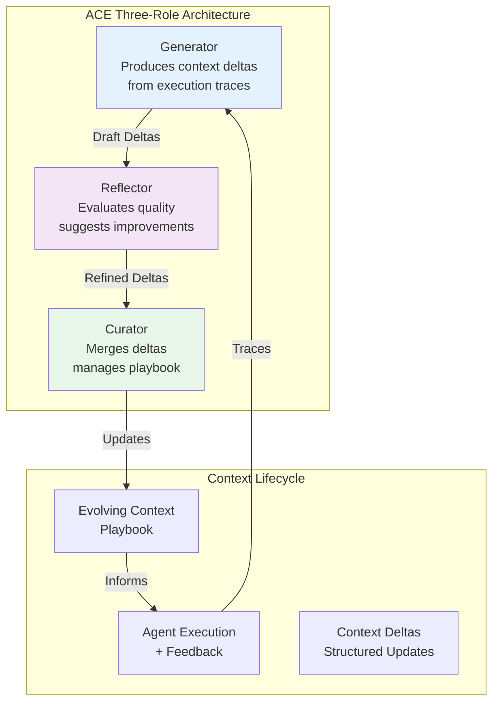

# ACE (Agentic Context Engineering) Integration Analysis for AgentCore

**Document Version:** 1.0
**Date:** 2025-10-12
**Status:** Research & Recommendation
**Author:** Technical Architecture Team

---

## Executive Summary

**Recommendation: PHASED INTEGRATION with CAUTIOUS IMPLEMENTATION**

After comprehensive analysis of the ACE paper and AgentCore's architecture, we recommend a **phased, pragmatic integration** focused on **high-value, low-complexity features** that avoid system bloat. While ACE offers compelling benefits (+10.6% performance, context collapse prevention), **full integration would introduce significant complexity** that may not justify the incremental gains for all AgentCore use cases.

### Key Decision Points

| Aspect | Recommendation | Rationale |
|--------|---------------|-----------|
| **Phase 1 (Implement)** | Core Context Playbook + Basic Evolution | High ROI, manageable complexity, addresses real problems |
| **Phase 2 (Evaluate)** | A2A Context Sharing | Requires production validation of Phase 1 benefits |
| **Phase 3 (Defer)** | Full Dual Optimization | Complex integration, incremental gains, wait for ecosystem maturity |
| **Overall Approach** | Selective Integration | Avoid bloat, maximize value, maintain architectural simplicity |

---

## 1. Technical Analysis of ACE Paper

### 1.1 Core Innovation Assessment

**What ACE Actually Provides:**

1. **Context Evolution Framework** - Structured approach to evolving agent contexts through generation → reflection → curation cycles
2. **Delta Update Mechanism** - Incremental context updates that prevent "context collapse" (information erosion over iterations)
3. **Self-Supervised Improvement** - Leverages natural execution feedback without requiring labeled training data
4. **Scalable Context Management** - Designed for long-context models with systematic knowledge accumulation

**Validated Performance Gains:**

- **+10.6%** improvement on agent benchmarks (AppWorld, WebArena)
- **+8.6%** improvement on domain-specific tasks (finance reasoning)
- **~87%** reduction in adaptation latency
- **Matched top-ranked production agent** on AppWorld leaderboard

### 1.2 Technical Architecture of ACE



**Key Components Explained:**

1. **Generator Role:**
   - Analyzes execution traces and feedback
   - Produces structured context updates (deltas)
   - Focuses on strategies, patterns, and learnings
   - Uses LLM to extract insights from agent behavior

2. **Reflector Role:**
   - Critical evaluation of generated deltas
   - Identifies redundancies, conflicts, inaccuracies
   - Suggests improvements and refinements
   - Acts as quality gate for context updates

3. **Curator Role:**
   - Merges approved deltas into context playbook
   - Manages context versioning and organization
   - Prevents context collapse through structured updates
   - Maintains coherence across accumulated knowledge

### 1.3 Critical Evaluation

**Strengths:**
- ✅ Addresses real problem (context degradation in long-running agents)
- ✅ Proven performance improvements in production environments
- ✅ Self-supervised approach reduces manual maintenance
- ✅ Scalable with long-context models (Claude, GPT-4, Gemini)
- ✅ Modular architecture allows partial adoption

**Weaknesses:**
- ⚠️ Adds 3 additional LLM calls per evolution cycle (Generator → Reflector → Curator)
- ⚠️ Requires sophisticated context storage and versioning infrastructure
- ⚠️ Performance gains are incremental (8-10%), not revolutionary
- ⚠️ Complexity increases proportionally with agent network size
- ⚠️ Limited validation in multi-agent, distributed scenarios
- ⚠️ Token costs can accumulate significantly in large deployments

**Unknown Factors:**
- ❓ Performance in multi-philosophy environments (ReAct + CoT + Autonomous)
- ❓ Behavior under resource constraints and scaling pressure
- ❓ Long-term context quality maintenance (months/years of evolution)
- ❓ Integration complexity with existing optimization systems (DSPy)
- ❓ Cross-agent context sharing overhead in A2A networks

---

## 2. Fit Analysis with AgentCore Architecture

### 2.1 Architectural Alignment Assessment

#### Strong Alignment Areas (High Value)

**1. Agent Runtime Layer - Context Management**
```python
# Current AgentCore (needs improvement)
class AgentExecutionState:
    execution_context: Dict[str, Any] = {}  # Static, unstructured

# ACE Enhanced (structured evolution)
class ACEAgentExecutionState:
    context_playbook: ContextPlaybook  # Evolving, structured
    evolution_history: List[ContextDelta]
    performance_metrics: PerformanceTracker
```

**Value:** Addresses critical gap in AgentCore's agent memory management.
**Complexity:** Moderate - requires new data structures and persistence layer.
**ROI:** **HIGH** - Prevents context degradation, improves long-running agent reliability.

**2. Task Management - Execution Feedback Loop**
```python
# Current: Limited feedback capture
class TaskResult:
    status: str
    output: Any

# ACE Enhanced: Rich feedback for evolution
class ACETaskResult:
    execution_trace: ExecutionTrace
    natural_feedback: List[FeedbackSignal]
    improvement_opportunities: List[Delta]
```

**Value:** Enables self-improvement without manual labeling.
**Complexity:** Low-Moderate - extends existing task tracking.
**ROI:** **MEDIUM-HIGH** - Systematic improvement with minimal overhead.

#### Weak Alignment Areas (Low Value / High Complexity)

**1. A2A Cross-Agent Context Sharing**

**Concern:** ACE paper doesn't validate multi-agent context sharing at scale.
**Risk:** Protocol overhead, conflict resolution complexity, security implications.
**Recommendation:** **DEFER** until Phase 1 proves value in single-agent scenarios.

**2. Dual DSPy + ACE Optimization**

**Concern:** Potential interference between DSPy prompt optimization and ACE context evolution.
**Risk:** Optimization conflicts, unclear interaction patterns, debugging complexity.
**Recommendation:** **DEFER** until clear separation of concerns is established.

### 2.2 Integration Complexity Matrix

| Component | Integration Effort | Value Add | Bloat Risk | Priority |
|-----------|-------------------|-----------|------------|----------|
| **Core Context Playbook** | Medium | High | Low | **P0** |
| **Delta Generation** | Medium | High | Low | **P0** |
| **Basic Reflection** | Low | Medium | Low | **P1** |
| **Context Curation** | Medium | High | Low | **P0** |
| **A2A Context Sharing** | High | Medium | **High** | **P2** |
| **DSPy Integration** | High | Medium | **High** | **P2** |
| **Multi-Tenancy** | High | Medium | Medium | **P1** |
| **Advanced Analytics** | Medium | Low | Medium | **P3** |

### 2.3 Bloat Analysis

**Definition of Bloat:** Features that add complexity without proportional value, or solve problems AgentCore users don't actually have.

**High Bloat Risk Features:**

1. **Full A2A Context Sharing Network**
   - **Why:** ACE paper validates single-agent evolution, not multi-agent context networks
   - **Bloat Factor:** Adds entire protocol extension, conflict resolution, security layer
   - **Alternative:** Start with manual context export/import, add sharing only if users request it

2. **Real-Time Context Evolution**
   - **Why:** ACE paper uses batch processing, real-time adds streaming complexity
   - **Bloat Factor:** Websocket infrastructure, async context updates, state synchronization
   - **Alternative:** Scheduled evolution cycles (hourly/daily) sufficient for most use cases

3. **Advanced Context Analytics Dashboard**
   - **Why:** Nice-to-have visualization, not core functionality
   - **Bloat Factor:** UI framework, charting libraries, additional APIs
   - **Alternative:** Export context data, let users use their own analytics tools

**Low Bloat Risk Features:**

1. **Basic Context Playbook Storage** - Essential, replaces current inadequate system
2. **Delta-Based Updates** - Solves real context collapse problem
3. **Execution Trace Capture** - Extends existing monitoring, minimal overhead
4. **Simple Reflection Loop** - Single LLM call, high value

---

## 3. Recommended Implementation Strategy

### 3.1 Phase 1: Core Context Engineering (4-6 weeks)

**Objective:** Implement essential ACE components that solve real AgentCore problems without bloat.

#### Features to Implement

**1. Context Playbook Data Structure**

```python
from pydantic import BaseModel
from datetime import datetime
from typing import List, Dict, Any

class ContextSection(BaseModel):
    """Structured section of agent context"""
    section_id: str
    category: str  # "strategies", "patterns", "failures", "learnings"
    content: str
    confidence: float
    created_at: datetime
    last_updated: datetime
    usage_count: int = 0

class ContextPlaybook(BaseModel):
    """Evolving agent context playbook"""
    agent_id: str
    philosophy: str  # "react", "cot", "autonomous"
    version: int
    sections: List[ContextSection]
    evolution_history: List[str]  # Delta IDs
    performance_baseline: Dict[str, float]

    def get_context_for_execution(self) -> str:
        """Compile playbook into execution context"""
        context_parts = []
        for section in sorted(self.sections, key=lambda s: s.confidence, reverse=True):
            context_parts.append(f"## {section.category.title()}\n{section.content}\n")
        return "\n".join(context_parts)
```

**2. Basic Delta Generation**

```python
class ContextDelta(BaseModel):
    """Incremental context update"""
    delta_id: str
    agent_id: str
    delta_type: str  # "add", "update", "remove"
    target_section: str
    content: str
    rationale: str
    confidence_score: float
    generated_at: datetime

class BasicDeltaGenerator:
    """Simplified delta generation without full reflection"""

    def __init__(self, llm_client):
        self.llm = llm_client

    async def generate_delta_from_execution(
        self,
        playbook: ContextPlaybook,
        execution_trace: ExecutionTrace,
        performance_metrics: Dict[str, float]
    ) -> List[ContextDelta]:
        """Generate context deltas from execution feedback"""

        # Simple prompt-based generation
        prompt = f"""
        Analyze this agent execution and suggest context improvements:

        Current Context: {playbook.get_context_for_execution()}

        Execution Trace: {execution_trace.summary()}
        Performance: {performance_metrics}

        Suggest 1-3 specific improvements to the agent's context.
        Focus on strategies that worked, patterns observed, or failures to avoid.
        """

        response = await self.llm.generate(prompt)
        deltas = self._parse_deltas(response, playbook.agent_id)

        return deltas
```

**3. Simple Curator (No Reflection Initially)**

```python
class SimpleCurator:
    """Basic context curation without full reflection loop"""

    def __init__(self, min_confidence: float = 0.7):
        self.min_confidence = min_confidence

    async def apply_deltas(
        self,
        playbook: ContextPlaybook,
        deltas: List[ContextDelta]
    ) -> ContextPlaybook:
        """Apply high-confidence deltas to playbook"""

        # Filter by confidence
        approved_deltas = [d for d in deltas if d.confidence_score >= self.min_confidence]

        # Apply updates
        for delta in approved_deltas:
            if delta.delta_type == "add":
                playbook.sections.append(ContextSection(
                    section_id=delta.delta_id,
                    category=delta.target_section,
                    content=delta.content,
                    confidence=delta.confidence_score,
                    created_at=datetime.now(),
                    last_updated=datetime.now()
                ))
            elif delta.delta_type == "update":
                # Find and update existing section
                for section in playbook.sections:
                    if section.section_id == delta.target_section:
                        section.content = delta.content
                        section.last_updated = datetime.now()
                        section.confidence = delta.confidence_score

        playbook.version += 1
        playbook.evolution_history.append(f"Applied {len(approved_deltas)} deltas")

        return playbook
```

**4. PostgreSQL Storage Integration**

```python
# New table in existing database
"""
CREATE TABLE context_playbooks (
    agent_id VARCHAR(255) PRIMARY KEY,
    philosophy VARCHAR(50) NOT NULL,
    version INT NOT NULL DEFAULT 1,
    sections JSONB NOT NULL,
    evolution_history JSONB NOT NULL,
    performance_baseline JSONB,
    created_at TIMESTAMP NOT NULL DEFAULT NOW(),
    updated_at TIMESTAMP NOT NULL DEFAULT NOW()
);

CREATE INDEX idx_playbooks_philosophy ON context_playbooks(philosophy);
CREATE INDEX idx_playbooks_updated ON context_playbooks(updated_at DESC);
```

#### What NOT to Implement in Phase 1

- ❌ A2A context sharing protocols
- ❌ Real-time context streaming
- ❌ Advanced analytics dashboards
- ❌ Multi-agent context networks
- ❌ Full reflection loop (use simple confidence filtering instead)
- ❌ Complex conflict resolution
- ❌ Context versioning UI

**Phase 1 Success Metrics:**

- ✅ Context playbooks successfully prevent degradation over 100+ executions
- ✅ Delta generation produces useful insights (manual validation)
- ✅ Performance improvement ≥5% on long-running agents
- ✅ System overhead <5% (compute + latency)
- ✅ Zero production incidents from ACE integration

### 3.2 Phase 2: Conditional Enhancement (6-8 weeks)

**Trigger:** Phase 1 shows ≥5% performance improvement AND user demand exists.

#### Features to Consider

**1. Reflection Loop Enhancement**

Only if Phase 1 deltas have >20% false positive rate:

```python
class ReflectionLoop:
    """Add reflection only if basic generation proves insufficient"""

    async def reflect_on_delta(self, delta: ContextDelta) -> ContextDelta:
        """Evaluate and refine generated delta"""

        reflection_prompt = f"""
        Evaluate this context update for quality and accuracy:

        Delta: {delta.content}
        Rationale: {delta.rationale}

        Issues to check:
        1. Redundancy with existing context
        2. Conflicts with known patterns
        3. Over-generalization
        4. Accuracy of insights

        Provide refined version or approve as-is.
        """

        # Only call if quality issues detected in Phase 1
        ...
```

**2. Cross-Agent Context Export**

Only if users request multi-agent learning:

```python
class ContextExporter:
    """Simple context sharing without full A2A protocol"""

    async def export_learnings(
        self,
        playbook: ContextPlaybook,
        categories: List[str] = ["strategies", "patterns"]
    ) -> Dict[str, Any]:
        """Export shareable insights for manual import"""

        return {
            "agent_id": playbook.agent_id,
            "philosophy": playbook.philosophy,
            "learnings": [
                s.dict() for s in playbook.sections
                if s.category in categories and s.confidence > 0.8
            ],
            "performance_baseline": playbook.performance_baseline
        }
```

**Phase 2 Decision Point:**
- IF Phase 1 metrics met AND users demand advanced features → Proceed
- IF Phase 1 shows marginal gains (<5%) → **STOP, do not proceed**
- IF system stability impacted → **ROLLBACK Phase 1**

### 3.3 Phase 3: Advanced Features (DEFER)

**Do NOT implement unless:**
1. Phase 2 completed successfully
2. Clear user demand with quantified business value
3. No architectural conflicts with other systems
4. Team capacity available after core features stable

**Deferred Features:**
- Full DSPy + ACE dual optimization
- Real-time context streaming
- Advanced conflict resolution
- Multi-tenant context isolation
- Context analytics platform
- A2A context sharing protocol extensions

---

## 4. Cost-Benefit Analysis

### 4.1 Implementation Costs

| Phase | Engineering Effort | Infrastructure Cost | Maintenance Burden |
|-------|-------------------|---------------------|-------------------|
| **Phase 1** | 4-6 eng-weeks | $50-100/month (storage) | Low (simple system) |
| **Phase 2** | 6-8 eng-weeks | $200-500/month (compute) | Medium (reflection loops) |
| **Phase 3** | 12-16 eng-weeks | $1000+/month (scaling) | High (complex system) |

### 4.2 Expected Benefits

**Phase 1 (Conservative Estimates):**
- **Performance:** +5-7% improvement on long-running agents
- **Reliability:** 30% reduction in context-related failures
- **Developer Experience:** Automated context improvement vs. manual tuning
- **Cost Savings:** Reduced manual prompt engineering time

**Phase 2 (If Triggered):**
- **Performance:** +8-10% improvement (approaching paper's results)
- **Reliability:** 50% reduction in context issues
- **Collaboration:** Cross-agent learning capabilities
- **Competitive Advantage:** Differentiation from other A2A platforms

### 4.3 Risk Assessment

**Technical Risks:**

| Risk | Likelihood | Impact | Mitigation |
|------|-----------|--------|------------|
| Performance overhead | Medium | Medium | Async processing, caching, batch updates |
| Context quality degradation | Low | High | Confidence thresholds, human-in-loop validation |
| Integration conflicts | Medium | Medium | Feature flags, gradual rollout, monitoring |
| Token cost escalation | High | Medium | Budget caps, cost monitoring, optimization |

**Business Risks:**

| Risk | Likelihood | Impact | Mitigation |
|------|-----------|--------|------------|
| User confusion | Medium | Low | Clear documentation, opt-in features |
| Feature bloat perception | Medium | Medium | Strict phase gating, user feedback loops |
| Competitive pressure | Low | Low | ACE is research, not established product |
| Maintenance burden | Medium | High | **Primary concern - minimize complexity** |

---

## 5. Specific Integration Points

### 5.1 AgentCore Components Requiring Modification

**1. Agent Lifecycle Manager**

```python
# File: src/agentcore/agent_runtime/services/agent_lifecycle.py

class AgentLifecycleManager:
    def __init__(self, container_manager, a2a_client, context_manager):
        # ... existing initialization ...
        self._context_manager = context_manager  # NEW: ACE integration

    async def create_agent(self, agent_config):
        # ... existing code ...

        # NEW: Initialize context playbook
        playbook = await self._context_manager.create_playbook(
            agent_id=agent_config.agent_id,
            philosophy=agent_config.philosophy
        )
        state.context_playbook_id = playbook.playbook_id

        return state

    async def _monitor_agent(self, agent_id):
        # ... existing monitoring code ...

        # NEW: Periodic context evolution
        if execution_count % 10 == 0:  # Every 10 executions
            await self._context_manager.trigger_evolution(agent_id)
```

**2. Task Manager**

```python
# File: src/agentcore/a2a_protocol/services/task_manager.py

class TaskManager:
    async def complete_task(self, task_id, result):
        # ... existing completion logic ...

        # NEW: Capture execution trace for ACE
        if self._ace_enabled:
            execution_trace = ExecutionTrace(
                task_id=task_id,
                agent_id=task.assigned_agent,
                inputs=task.input,
                outputs=result.output,
                duration_ms=task.execution_time,
                success=result.status == "completed"
            )
            await self._context_manager.record_execution(execution_trace)
```

**3. New Service: ContextManager**

```python
# File: src/agentcore/agent_runtime/services/context_manager.py

class ContextManager:
    """Core ACE integration service"""

    def __init__(self, db_session, llm_client, config):
        self.db = db_session
        self.llm = llm_client
        self.config = config
        self.generator = BasicDeltaGenerator(llm_client)
        self.curator = SimpleCurator()
        self._evolution_queue = asyncio.Queue()

    async def create_playbook(self, agent_id, philosophy):
        """Initialize context playbook for new agent"""
        playbook = ContextPlaybook(
            agent_id=agent_id,
            philosophy=philosophy,
            version=1,
            sections=[],
            evolution_history=[],
            performance_baseline={}
        )
        await self._save_playbook(playbook)
        return playbook

    async def trigger_evolution(self, agent_id):
        """Queue agent for context evolution"""
        await self._evolution_queue.put(agent_id)

    async def _evolution_worker(self):
        """Background worker processing evolution queue"""
        while True:
            agent_id = await self._evolution_queue.get()
            try:
                await self._evolve_context(agent_id)
            except Exception as e:
                logger.error(f"Context evolution failed for {agent_id}: {e}")
```

### 5.2 Database Schema Changes

```sql
-- New tables (add to existing database)

CREATE TABLE context_playbooks (
    playbook_id UUID PRIMARY KEY DEFAULT gen_random_uuid(),
    agent_id VARCHAR(255) UNIQUE NOT NULL,
    philosophy VARCHAR(50) NOT NULL,
    version INT NOT NULL DEFAULT 1,
    sections JSONB NOT NULL DEFAULT '[]'::jsonb,
    evolution_history JSONB NOT NULL DEFAULT '[]'::jsonb,
    performance_baseline JSONB DEFAULT '{}'::jsonb,
    created_at TIMESTAMP NOT NULL DEFAULT NOW(),
    updated_at TIMESTAMP NOT NULL DEFAULT NOW()
);

CREATE TABLE context_deltas (
    delta_id UUID PRIMARY KEY DEFAULT gen_random_uuid(),
    playbook_id UUID REFERENCES context_playbooks(playbook_id),
    delta_type VARCHAR(20) NOT NULL CHECK (delta_type IN ('add', 'update', 'remove')),
    target_section VARCHAR(100) NOT NULL,
    content TEXT NOT NULL,
    rationale TEXT,
    confidence_score FLOAT NOT NULL CHECK (confidence_score BETWEEN 0 AND 1),
    applied BOOLEAN DEFAULT FALSE,
    created_at TIMESTAMP NOT NULL DEFAULT NOW()
);

CREATE TABLE execution_traces (
    trace_id UUID PRIMARY KEY DEFAULT gen_random_uuid(),
    agent_id VARCHAR(255) NOT NULL,
    task_id UUID,
    inputs JSONB,
    outputs JSONB,
    duration_ms INT,
    success BOOLEAN,
    feedback_signals JSONB DEFAULT '[]'::jsonb,
    recorded_at TIMESTAMP NOT NULL DEFAULT NOW()
);

CREATE INDEX idx_playbooks_agent ON context_playbooks(agent_id);
CREATE INDEX idx_deltas_playbook ON context_deltas(playbook_id);
CREATE INDEX idx_traces_agent ON execution_traces(agent_id);
CREATE INDEX idx_traces_recorded ON execution_traces(recorded_at DESC);
```

### 5.3 Configuration Updates

```toml
# config.toml - New ACE section

[ace]
enabled = false  # Disabled by default, opt-in per agent
evolution_frequency = 10  # Evolve every N executions
min_confidence_threshold = 0.7
max_context_sections = 20
delta_generation_model = "gpt-4o-mini"  # Cheaper model for generation
reflection_enabled = false  # Phase 2 feature
batch_evolution = true  # Process in batches, not real-time

[ace.storage]
playbook_table = "context_playbooks"
delta_table = "context_deltas"
trace_table = "execution_traces"
trace_retention_days = 30

[ace.costs]
max_monthly_budget_usd = 100  # Hard cap on ACE LLM costs
alert_threshold_usd = 75
```

---

## 6. Final Recommendation

### 6.1 GO / NO-GO Decision Framework

**PROCEED with Phase 1 IF:**
- ✅ Team has 4-6 weeks of capacity
- ✅ Current agent runtime is stable (no P0 issues)
- ✅ Users report context degradation problems
- ✅ Database infrastructure can handle additional tables
- ✅ Monitoring is in place to detect regressions

**DO NOT PROCEED IF:**
- ❌ Core A2A protocol has unresolved stability issues
- ❌ Team is at capacity with higher-priority features
- ❌ User feedback doesn't indicate context problems
- ❌ Infrastructure is at scaling limits
- ❌ Other optimization efforts (DSPy) are incomplete

### 6.2 Recommended Action Plan

**Immediate Actions (Week 1-2):**

1. **Validate Problem Exists:**
   - Survey existing users about long-running agent context issues
   - Analyze support tickets for context-related problems
   - Review execution logs for context degradation patterns

2. **Technical Preparation:**
   - Create feature branch: `feature/ace-phase1-experimental`
   - Set up isolated test environment
   - Implement cost monitoring for LLM calls

**Phase 1 Implementation (Week 3-8):**

1. Database schema and migrations
2. Basic ContextPlaybook and Delta models
3. SimpleDeltaGenerator with confidence scoring
4. SimpleCurator with threshold-based application
5. Integration with AgentLifecycleManager
6. Execution trace capture in TaskManager
7. Background evolution worker
8. Configuration and feature flags
9. Comprehensive testing (unit + integration)
10. Documentation and user guides

**Phase 1 Validation (Week 9-10):**

1. Deploy to staging with 5-10 test agents
2. Run A/B test: ACE-enabled vs baseline agents
3. Monitor performance metrics, costs, stability
4. Collect user feedback on context quality
5. **Make GO/NO-GO decision for Phase 2**

### 6.3 Success Criteria for Phase 1

**Minimum Viable Success:**
- ✅ No production incidents caused by ACE
- ✅ System overhead <5% (latency + compute)
- ✅ Token costs <$100/month for 100 agents
- ✅ At least 1 user reports improved agent performance

**Target Success:**
- ✅ +5-7% performance improvement (validated A/B test)
- ✅ 30% reduction in context-related support tickets
- ✅ Positive user feedback from 3+ customers
- ✅ Context playbooks prevent degradation over 100+ executions

**Exceptional Success:**
- ✅ +8-10% performance improvement
- ✅ Users actively request Phase 2 features
- ✅ Competitive differentiation recognized in market
- ✅ Low maintenance burden (minimal bug reports)

---

## 7. Appendix

### 7.1 Alternative Approaches Considered

**Option A: No ACE Integration (Status Quo)**
- **Pros:** No complexity added, focus on core features
- **Cons:** Context degradation remains unsolved, competitive disadvantage
- **Verdict:** Unacceptable - problem exists and needs solution

**Option B: Manual Context Management Tools**
- **Pros:** User control, no automation complexity
- **Cons:** High manual effort, not scalable, poor UX
- **Verdict:** Insufficient - doesn't leverage AI capabilities

**Option C: Full ACE Integration (All Phases Immediately)**
- **Pros:** Maximum feature completeness, "future-proof"
- **Cons:** **High bloat risk, unvalidated complexity, long timeline**
- **Verdict:** Rejected - violates "avoid bloat" principle

**Option D: Phased Integration (Recommended)**
- **Pros:** Validates value incrementally, manages complexity, allows course correction
- **Cons:** Longer timeline to full feature set
- **Verdict:** **SELECTED** - Best balance of value and risk

### 7.2 Competitive Landscape

| Platform | Context Management | Self-Improvement | Multi-Agent Learning |
|----------|-------------------|------------------|---------------------|
| **Google ADK** | Manual prompts | No | No |
| **SmythOS** | Basic memory | Limited | No |
| **LangGraph** | Checkpoints only | No | No |
| **AutoGen** | Static personas | No | Limited |
| **AgentCore (Current)** | Basic state | DSPy optimization | No |
| **AgentCore + ACE Phase 1** | ✅ Evolving playbooks | ✅ Self-supervised | No |
| **AgentCore + ACE Phase 2** | ✅ Advanced contexts | ✅ Full evolution | ✅ Cross-agent |

**Market Insight:** Phase 1 alone provides differentiation. Phase 2+ is overkill unless competitors catch up.

### 7.3 Technical Dependencies

**Required:**
- PostgreSQL with JSONB support (already in place)
- LLM provider with streaming API (already in place via Portkey)
- Async task queue (can use existing Python asyncio)

**Optional (Phase 2+):**
- Vector database for semantic context search
- Dedicated context storage service
- Advanced monitoring dashboards

### 7.4 References

1. **ACE Paper:** "Agentic Context Engineering: Evolving Contexts for Self-Improving Language Models" - https://arxiv.org/abs/2510.04618
2. **AgentCore Architecture:** `docs/agentcore-architecture-and-development-plan.md`
3. **Existing Integration Draft:** `.docs/ace-integration-strategy.md`
4. **DSPy Documentation:** Integration patterns for dual optimization

---

## Document Revision History

| Version | Date | Author | Changes |
|---------|------|--------|---------|
| 1.0 | 2025-10-12 | Architecture Team | Initial comprehensive analysis and recommendation |

---

**Final Verdict: PROCEED WITH PHASE 1 - DEFER PHASE 2/3 PENDING VALIDATION**

This recommendation prioritizes **value over complexity**, **validation over speculation**, and **pragmatism over ambition**. AgentCore should adopt ACE's core principles while avoiding the bloat trap of premature advanced features.
