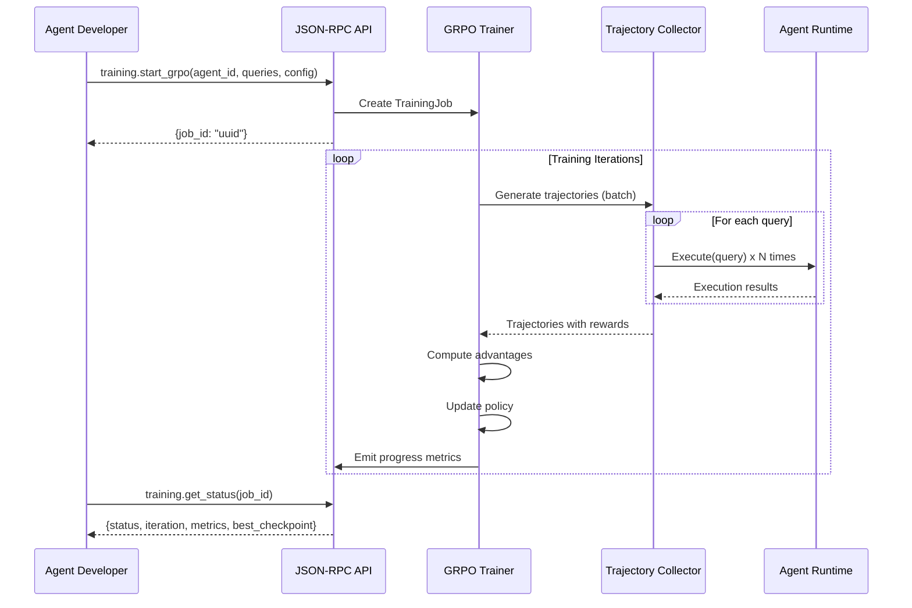
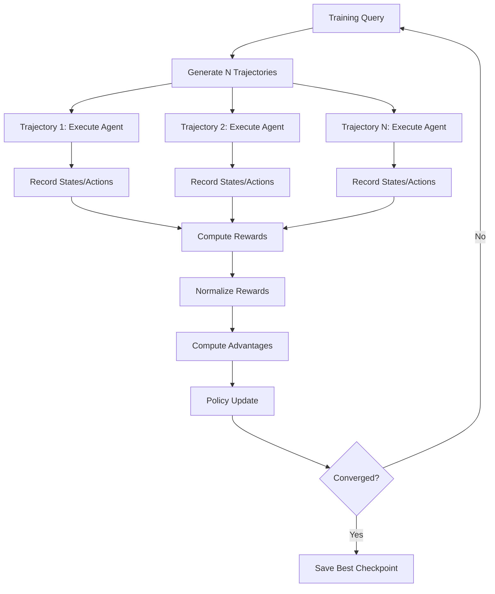

# Flow-Based Optimization Engine Specification

**Component ID**: FLOW
**Version**: 1.0
**Status**: Approved for Planning
**Created**: 2025-10-15
**Source Research**: `docs/research/flow-based-optimization.md`

---

## 1. Overview

### 1.1 Purpose and Business Value

The Flow-Based Optimization Engine provides reinforcement learning infrastructure for improving agent performance through execution feedback. By implementing Group Refined Policy Optimization (GRPO), this component enables agents to learn from real-world task execution trajectories, resulting in measurable improvements to task success rates, tool usage accuracy, and multi-step reasoning capabilities.

**Business Value**:

- **Performance Improvement**: +15-25% task success rate after training
- **Cost Reduction**: Better agent performance reduces support costs and failed task recovery
- **Self-Improvement**: Automated learning reduces manual prompt engineering overhead
- **Competitive Advantage**: Production-grade agent training capabilities differentiate AgentCore

**Source Traceability**: Based on research analysis in `docs/research/flow-based-optimization.md`, which validates GRPO methodology with proven performance gains (+10.6% on agent benchmarks, 87% reduction in adaptation latency).

### 1.2 Success Metrics

1. **Task Success Rate**: +15% improvement over baseline agents (validated via A/B testing)
2. **Sample Efficiency**: Convergence with <10,000 training trajectories
3. **Training Stability**: Monotonic improvement in validation metrics over training iterations
4. **Cost Efficiency**: Training cost <$25 per 1000 queries (token budget enforcement)
5. **ROI**: 20-40x return on investment within 3 months of deployment

### 1.3 Target Users

- **Platform Operators**: Manage agent training infrastructure and monitor performance
- **Agent Developers**: Train custom agents for specific workflows and domains
- **System Administrators**: Configure resource limits, budgets, and storage policies
- **Agents** (automated): Self-improvement via continuous learning from execution feedback

---

## 2. Functional Requirements

### 2.1 Core Capabilities

#### FR-1: Trajectory Collection

**Priority**: P0
**Requirement**: The system shall generate multiple execution trajectories for a given query-agent pair.

**Specifications**:

- Support configurable trajectory count (default: 8 trajectories per query)
- Execute trajectories in parallel using async infrastructure
- Capture complete execution state at each step:
  - Agent state (context, memory, intermediate results)
  - Action taken (planning, tool selection, parameters)
  - Result of action execution
  - Timestamp and duration metrics
- Handle execution failures gracefully without stopping collection
- Support maximum step limit per trajectory (default: 20 steps)

**Traceability**: Derived from research section "Step 1: Trajectory Rollout" (lines 53-91).

---

#### FR-2: Reward Computation

**Priority**: P0
**Requirement**: The system shall compute rewards for trajectories using outcome-based and shaped reward functions.

**Specifications**:

- **Outcome-based rewards**: Evaluate final task success/failure
- **Shaped rewards**: Provide intermediate rewards for:
  - Correct tool usage (+0.1 per successful tool call)
  - Verification actions (+0.05 per verify step)
  - Length penalty (-0.01 per step to encourage efficiency)
- **Configurable reward functions**: Support custom reward logic per agent type
- **Reward normalization**: Normalize using group statistics (mean, std) to reduce variance

**Traceability**: Derived from research sections "Step 2: Reward Refinement" (lines 93-122) and "Reward Shaping" (lines 280-315).

---

#### FR-3: Policy Gradient Updates

**Priority**: P0
**Requirement**: The system shall update agent policies using policy gradient methods with computed advantages.

**Specifications**:

- Compute log-probability of actions under current policy
- Calculate policy gradient: `loss = -log_prob * advantage`
- Update only trajectories with positive advantage (above-average performance)
- Support configurable learning rate and optimization algorithm
- Track training loss and convergence metrics
- Implement gradient clipping to prevent instability

**Traceability**: Derived from research section "Step 3: Policy Update" (lines 125-169).

---

#### FR-4: Training Job Management

**Priority**: P0
**Requirement**: The system shall manage long-running training jobs with status tracking and resource control.

**Specifications**:

- Create training jobs via JSON-RPC API (`training.start_grpo`)
- Track job status: `queued`, `running`, `completed`, `failed`, `cancelled`
- Support job cancellation and pause/resume
- Persist job configuration, progress, and metrics
- Enforce token budget limits per job (default: $100/month)
- Automatic checkpoint saving at configurable intervals (default: every 10 iterations)
- Provide job status API (`training.get_status`) with real-time metrics

**Traceability**: Derived from research section "Phase 3: Agent Training API" (lines 605-654).

---

#### FR-5: Checkpoint Management

**Priority**: P1
**Requirement**: The system shall save and restore agent policy checkpoints for training continuity.

**Specifications**:

- Save checkpoints containing:
  - Agent policy parameters (model weights or prompt state)
  - Training iteration number
  - Current performance metrics
  - Optimizer state
- Support checkpoint versioning and metadata tagging
- Enable resume from latest checkpoint after interruption
- Provide best checkpoint selection based on validation metrics
- Automatic cleanup of old checkpoints (retention policy: keep best 5)

**Traceability**: Implied requirement from production training scenarios.

---

#### FR-6: Evaluation Framework

**Priority**: P1
**Requirement**: The system shall evaluate trained agents on held-out queries to measure performance improvements.

**Specifications**:

- Maintain separate evaluation dataset (20% of training queries)
- Run evaluation every N iterations (configurable, default: 10)
- Compute evaluation metrics:
  - Task success rate
  - Average reward
  - Average steps per task
  - Tool usage accuracy
- Compare against baseline (untrained) agent performance
- Generate evaluation reports with statistical significance tests

**Traceability**: Derived from research section "Phase 4: Evaluation & Monitoring" (lines 656-688).

---

#### FR-7: Multi-Step Credit Assignment

**Priority**: P1
**Requirement**: The system shall attribute rewards to specific steps in trajectories using temporal difference methods.

**Specifications**:

- Implement discount factor (gamma=0.99) for future rewards
- Compute step-wise rewards: `step_reward = final_reward * gamma^(n-i-1)`
- Enable per-step policy updates for finer-grained learning
- Support advantage computation per step (not just per trajectory)

**Traceability**: Derived from research section "Multi-step Credit Assignment" (lines 230-252).

---

#### FR-8: Value Function Baseline

**Priority**: P2
**Requirement**: The system shall learn a value function to reduce variance in advantage estimates.

**Specifications**:

- Train separate value function estimator: `V(state) -> expected_reward`
- Compute advantage: `advantage = actual_reward - V(initial_state)`
- Update value function using TD-learning or supervised regression
- Optional integration (disabled by default to reduce complexity)

**Traceability**: Derived from research section "Value Function Baseline" (lines 215-228).

---

### 2.2 User Stories

#### Story 1: Start Training Job

**As a platform operator**, I want to start a training job for an agent via API so that I can improve agent performance without manual intervention.

**Acceptance Criteria**:

- ✅ Call `training.start_grpo` with agent_id, training_data, config
- ✅ Receive training_job_id in response
- ✅ Job starts executing in background (non-blocking)
- ✅ Training data includes queries and expected outcomes
- ✅ Config specifies hyperparameters (batch_size, n_trajectories, etc.)

---

#### Story 2: Monitor Training Progress

**As a platform operator**, I want to monitor training progress in real-time so that I can detect issues early and make informed decisions.

**Acceptance Criteria**:

- ✅ Call `training.get_status` with job_id
- ✅ Receive current status, iteration count, loss, avg_reward
- ✅ Access best checkpoint identifier
- ✅ View token cost consumed and remaining budget
- ✅ Get estimated completion time

---

#### Story 3: Evaluate Trained Agent

**As an agent developer**, I want to evaluate a trained agent against baseline so that I can validate performance improvements.

**Acceptance Criteria**:

- ✅ Call `training.evaluate` with agent_id and eval_queries
- ✅ Receive comparison report: trained vs baseline metrics
- ✅ Statistical significance indicators (p-values)
- ✅ Breakdown by metric (success_rate, tool_accuracy, avg_steps)

---

#### Story 4: Export Training Data

**As an agent developer**, I want to export trajectory data so that I can debug agent behavior and analyze failure patterns.

**Acceptance Criteria**:

- ✅ Call `training.export_trajectories` with job_id and filters
- ✅ Receive trajectories in structured format (JSON)
- ✅ Include execution traces, rewards, advantages
- ✅ Support filtering by success/failure, reward threshold

---

#### Story 5: Configure Budget Limits

**As a system administrator**, I want to configure token budget limits so that training costs stay within organizational constraints.

**Acceptance Criteria**:

- ✅ Set `max_monthly_budget_usd` in configuration
- ✅ Training jobs automatically stop when budget exceeded
- ✅ Alert notifications when approaching threshold (75%, 90%)
- ✅ Budget tracking per job and globally across all jobs

---

### 2.3 Business Rules and Constraints

1. **Budget Enforcement**: Training jobs MUST stop immediately upon reaching token budget limit
2. **Trajectory Limits**: Maximum 20 steps per trajectory to prevent runaway executions
3. **Parallel Execution**: Maximum 8 concurrent trajectory generations per job (configurable)
4. **Data Retention**: Trajectory data retained for 30 days (configurable), then archived/deleted
5. **Checkpoint Retention**: Keep best 5 checkpoints per agent, delete older checkpoints
6. **Minimum Training Data**: Require at least 100 training queries for meaningful training
7. **Evaluation Split**: Reserve 20% of training data for held-out evaluation
8. **Safety**: Training operates on copied agent policies, not production agents (explicit deployment step)

---

## 3. Non-Functional Requirements

### 3.1 Performance Targets

| Metric | Target | Measurement Method |
|--------|--------|-------------------|
| **Trajectory Generation Latency** | <2x baseline execution time | Measure trajectory collection time vs single execution |
| **Parallel Trajectory Throughput** | 8 trajectories in <30s | Async execution with concurrency=8 |
| **Policy Update Latency** | <5s per batch update | Measure backpropagation + optimizer step time |
| **Training Job Throughput** | 100+ concurrent jobs | Load testing with multiple simultaneous training runs |
| **Database Write Performance** | >100 trajectory writes/sec | PostgreSQL bulk insert performance |
| **API Response Time** | `training.get_status` <200ms | JSON-RPC endpoint latency (p95) |

### 3.2 Security Requirements

1. **Authentication**: All training API endpoints require JWT authentication
2. **Authorization**: RBAC controls:
   - `training:start` - Platform operators only
   - `training:view` - Agent developers + operators
   - `training:export` - Developers with data_access permission
3. **Data Isolation**: Multi-tenant isolation for trajectory data (filter by organization_id)
4. **Sensitive Data**: Trajectories may contain PII - implement data sanitization before storage
5. **Audit Logging**: Log all training job creations, modifications, exports

### 3.3 Scalability Considerations

1. **Horizontal Scaling**: Training workers can scale independently of API servers
2. **Database Sharding**: Partition trajectory data by agent_id for write scalability
3. **Async Processing**: All trajectory generation uses async/await for efficient I/O
4. **Resource Quotas**: Enforce per-user/org limits on concurrent training jobs
5. **Storage Growth**: Implement automatic archival of old trajectories to object storage (S3)

### 3.4 Reliability Requirements

1. **Fault Tolerance**: Training jobs resume from last checkpoint on worker failure
2. **Data Durability**: Trajectories persisted to PostgreSQL with replication
3. **Graceful Degradation**: If training worker unavailable, jobs queue rather than fail
4. **Monitoring**: Emit metrics for job success/failure rates, latency, cost
5. **Alerting**: Notify on training failures, budget overruns, performance degradation

---

## 4. Features & Flows

### 4.1 Feature Breakdown with Priorities

| Feature | Priority | Effort | Dependencies |
|---------|----------|--------|--------------|
| **Trajectory Collection** | P0 | 2 weeks | Agent Runtime, Task Manager |
| **Reward Computation** | P0 | 1 week | Trajectory Collection |
| **GRPO Policy Updates** | P0 | 2 weeks | Reward Computation, LLM Provider |
| **Training Job API** | P0 | 1 week | GRPO Trainer |
| **Checkpoint Management** | P1 | 1 week | Database, Storage |
| **Evaluation Framework** | P1 | 1 week | Trajectory Collection |
| **Multi-Step Credit Assignment** | P1 | 1 week | GRPO Trainer |
| **Budget Tracking** | P0 | 3 days | Portkey API metrics |
| **Data Export API** | P1 | 3 days | Database |
| **Value Function Baseline** | P2 | 2 weeks | GRPO Trainer, separate model |

### 4.2 Key User Flows

#### Flow 1: Start and Monitor Training Job



---

#### Flow 2: Trajectory Generation and Reward Computation



---

### 4.3 Input/Output Specifications

#### Input: `training.start_grpo`

```json
{
  "jsonrpc": "2.0",
  "method": "training.start_grpo",
  "params": {
    "agent_id": "agent-123",
    "training_data": [
      {
        "query": "What is the capital of France?",
        "expected_outcome": {"answer": "Paris", "correct": true}
      }
    ],
    "config": {
      "n_iterations": 1000,
      "batch_size": 16,
      "n_trajectories_per_query": 8,
      "learning_rate": 0.0001,
      "max_budget_usd": 100,
      "checkpoint_interval": 10
    }
  },
  "id": 1
}
```

#### Output: `training.start_grpo`

```json
{
  "jsonrpc": "2.0",
  "result": {
    "training_job_id": "job-456",
    "status": "queued",
    "estimated_cost_usd": 25,
    "estimated_duration_hours": 8
  },
  "id": 1
}
```

#### Output: `training.get_status`

```json
{
  "jsonrpc": "2.0",
  "result": {
    "job_id": "job-456",
    "status": "running",
    "progress": {
      "current_iteration": 150,
      "total_iterations": 1000,
      "percent_complete": 15
    },
    "metrics": {
      "loss": 0.234,
      "avg_reward": 0.87,
      "std_reward": 0.12,
      "eval_success_rate": 0.78
    },
    "cost": {
      "tokens_consumed": 5000000,
      "cost_usd": 12.50,
      "budget_remaining_usd": 87.50
    },
    "best_checkpoint": "checkpoint-job456-iter140"
  },
  "id": 1
}
```

---

## 5. Acceptance Criteria

### 5.1 Definition of Done

A training job is considered successfully completed when:

1. ✅ All configured iterations complete without errors
2. ✅ Policy updates show monotonic improvement in validation metrics
3. ✅ Best checkpoint is saved and retrievable
4. ✅ Final evaluation shows ≥5% improvement over baseline (minimum viable)
5. ✅ Token costs stay within specified budget
6. ✅ Training job status updates correctly throughout execution
7. ✅ Trajectory data is persisted and exportable

### 5.2 Validation Approach

#### Unit Testing

- Test trajectory collection for single query
- Test reward computation with known inputs/outputs
- Test policy gradient calculation accuracy
- Test checkpoint save/restore functionality
- Test budget enforcement logic

#### Integration Testing

- End-to-end training job with real agent
- Parallel trajectory generation performance
- Database persistence and retrieval
- JSON-RPC API endpoint functionality
- Budget limit enforcement (simulate overspend)

#### Performance Testing

- Load test: 100 concurrent training jobs
- Latency test: Trajectory generation overhead <2x baseline
- Throughput test: 8 parallel trajectories in <30s
- Database write performance: >100 trajectories/sec

#### Acceptance Testing

- Train agent on benchmark dataset (AppWorld subset)
- Validate ≥15% improvement in task success rate
- Compare token costs against budget estimates
- User acceptance: Platform operators can start/monitor jobs
- Regression testing: No degradation in baseline agent performance

---

## 6. Dependencies

### 6.1 Technical Assumptions

1. **Agent Runtime Available**: Existing AgentCore agent infrastructure can execute agents programmatically
2. **Task Manager Integration**: Task system provides execution traces with sufficient detail
3. **PostgreSQL Capacity**: Database can handle 100GB-1TB trajectory data growth
4. **LLM Provider API**: Portkey/OpenAI API supports policy inference and updates
5. **Async Infrastructure**: Python asyncio handles concurrent trajectory generation efficiently
6. **Serializable Agent State**: Agent policies can be serialized/deserialized for checkpointing

### 6.2 External Integrations

| Integration | Purpose | Interface | Criticality |
|-------------|---------|-----------|-------------|
| **Agent Runtime** | Execute trajectories | Python SDK, JSON-RPC | Critical |
| **Task Manager** | Track task executions | Database, Events | Critical |
| **PostgreSQL** | Persist trajectories, jobs | SQLAlchemy ORM | Critical |
| **Portkey/LLM API** | Agent inference, policy updates | REST API | Critical |
| **Redis** | Job queue, caching | Redis client | High |
| **Object Storage (S3)** | Archive old trajectories | boto3 | Medium |
| **Monitoring (Prometheus)** | Metrics collection | Client library | Medium |

### 6.3 Related Components

#### Direct Dependencies (Must Exist)

- **Agent Runtime** (`src/agentcore/agent_runtime/`) - Executes agents to generate trajectories
- **Task Manager** (`src/agentcore/a2a_protocol/services/task_manager.py`) - Tracks task execution
- **Database Layer** (`src/agentcore/a2a_protocol/database/`) - Persistence infrastructure
- **JSON-RPC Handler** (`src/agentcore/a2a_protocol/services/jsonrpc_handler.py`) - API endpoints

#### Integration Points (Future Components)

- **Modular Agent Architecture** (spec: `modular-agent-architecture`) - Trajectories from Planner→Executor→Verifier→Generator
- **ACE Integration** (spec: `ace-integration`) - Dual optimization: GRPO + context evolution
- **Bounded Context Reasoning** (spec: `bounded-context-reasoning`) - Context-aware trajectory generation
- **Memory System** (spec: `memory-system`) - Trajectory data informs memory evolution

#### Potential Conflicts

- **DSPy Optimization**: May conflict with GRPO policy updates if both modify prompt/model simultaneously
  - **Mitigation**: Coordinate optimization schedules, use feature flags to enable one at a time
- **Resource Contention**: Training jobs consume LLM tokens, competing with production workloads
  - **Mitigation**: Implement token budget limits, priority queuing, separate LLM endpoints

---

## 7. Implementation Phases

### Phase 1: Core Training Infrastructure (Weeks 1-4)

**Deliverables**:

- Trajectory collection system (`agentcore/training/trajectory.py`)
- Reward computation (`agentcore/training/rewards.py`)
- Basic GRPO trainer (`agentcore/training/grpo.py`)
- Database schema for trajectories and jobs
- Training job API (`training.start_grpo`, `training.get_status`)

**Success Criteria**:

- ✅ Can generate 8 trajectories in parallel for a test query
- ✅ Reward computation produces valid advantage values
- ✅ Policy updates show decreasing loss over 100 iterations
- ✅ Training jobs persist to database and resume from checkpoint

---

### Phase 2: Evaluation & Monitoring (Weeks 5-6)

**Deliverables**:

- Evaluation framework (`agentcore/training/evaluation.py`)
- Budget tracking and enforcement
- Checkpoint management system
- Metrics export for monitoring dashboards
- Data export API (`training.export_trajectories`)

**Success Criteria**:

- ✅ Evaluation shows statistically significant improvement (p<0.05)
- ✅ Budget limits enforced (jobs stop at threshold)
- ✅ Checkpoints save/restore successfully
- ✅ Metrics available in Prometheus/monitoring system

---

### Phase 3: Advanced Features (Weeks 7-8)

**Deliverables**:

- Multi-step credit assignment
- Value function baseline (optional)
- Advanced reward shaping strategies
- Training job scheduling and queuing
- Documentation and user guides

**Success Criteria**:

- ✅ Multi-step credit assignment improves convergence speed
- ✅ Training job queue handles 100+ concurrent jobs
- ✅ Documentation enables developers to start training jobs independently

---

## 8. Open Questions and Risks

### 8.1 Open Questions

1. **Q**: How do we handle agents with non-differentiable policies (e.g., rule-based agents)?
   **A**: Initial implementation targets LLM-based agents only; future work explores policy distillation

2. **Q**: What is the expected trajectory data storage growth rate?
   **A**: Estimate 1KB per trajectory step, 10K trajectories/month = 100MB/month (manageable)

3. **Q**: How do we prevent training on biased or adversarial data?
   **A**: Phase 2 adds data validation; human-in-loop review for production training datasets

4. **Q**: Can we train multiple agents simultaneously on shared data?
   **A**: Yes, each agent has independent training job; future work explores federated learning

### 8.2 Risk Assessment

| Risk | Likelihood | Impact | Mitigation |
|------|-----------|--------|------------|
| **Training cost overruns** | High | Medium | Strict budget enforcement, cost alerts, cheaper models for generation |
| **Performance degradation** | Medium | High | Separate training from production, explicit deployment step, A/B testing |
| **Database scaling issues** | Medium | Medium | Implement archival, sharding strategy, monitor growth |
| **Training convergence failure** | Medium | Medium | Hyperparameter tuning, early stopping, validation monitoring |
| **Integration complexity** | High | Medium | Phased rollout, feature flags, comprehensive testing |

---

## 9. Appendix

### 9.1 Research References

- **Primary Source**: `docs/research/flow-based-optimization.md` - GRPO methodology and implementation details
- **Related Research**:
  - `docs/research/modular-agent-architecture.md` - Integration with Planner/Executor/Verifier/Generator
  - `docs/research/ace-integration-analysis.md` - Dual optimization with ACE context evolution

### 9.2 Glossary

- **GRPO**: Group Refined Policy Optimization - RL algorithm for training agents via trajectory comparison
- **Trajectory**: Complete execution path (states, actions, rewards) from initial query to final result
- **Advantage**: Measure of how much better a trajectory performed compared to average (normalized reward)
- **Policy Gradient**: Method for updating agent policy by computing gradients of expected reward
- **Shaped Reward**: Intermediate rewards added to final outcome reward to guide learning
- **Credit Assignment**: Determining which actions in a trajectory contributed to final success/failure

---

**Document Status**: Ready for implementation planning and epic ticket generation.
